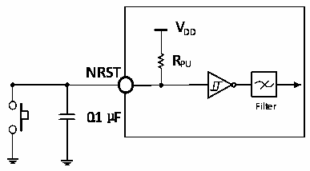

<!-- source-page: 37 -->

[← p.36](0036.md) · [index](../README.md) · [PDF p.37](https://ch32-riscv-ug.github.io/CH32V20x/datasheet_en/CH32V208DS0.PDF#page=37) · [p.38 →](0038.md)

> ⚠ 7 subscript glyph(s) on this page appear as `*` because the PDF's text layer maps them to `*` (broken ToUnicode); the printed page shows the real subscripts -- read [the PDF, p.37](https://ch32-riscv-ug.github.io/CH32V20x/datasheet_en/CH32V208DS0.PDF#page=37).

<!-- header: CH32V208 Datasheet http://wch-ic.com -->

> ⬆ **Table continued** — rendered in full at [page 36](0036.md). <!-- p37-table-001 -->

<em>Note: 1. V* in the above table can be expressed as VIO or VDD according to the specific pin.</em>  
<em>2. When PC13, PC14 and PC15 are used as GPIO output pins, they can only work below 2MHz, and</em>  
<em>the maximum driving load is 30pF.</em>  
<em>3. The USB interface I/O complies only with the parameter MODEx[1:0]=10b or 01b.</em>  

### 4.3.11 NRST pin characteristics

<!-- p37-table-002 (table-4-22@1) -->
<table><caption>Table 4-22 External reset pin characteristics</caption><tr><th>Symbol</th><th>Parameter</th><th>Condition</th><th>Min.</th><th>Typ.</th><th>Max.</th><th>Unit</th></tr><tr><td style="text-align:left">VIL(NRST)</td><td style="text-align:left">NRST input low-level voltage</td><td></td><td>-0.3</td><td></td><td style="text-align:left">0.28*(V -1.8)+0.6DD</td><td>V</td></tr><tr><td style="text-align:left">VIH(NRST)</td><td style="text-align:left">NRST input high-level voltage</td><td></td><td style="text-align:left">0.41*(V -1.8)+1.3DD</td><td></td><td style="text-align:left">V +0.3DD</td><td>V</td></tr><tr><td style="text-align:left">V hys(NRST)</td><td style="text-align:left">NRST Schmitt Trigger voltage hysteresis</td><td></td><td>150</td><td></td><td></td><td>mV</td></tr><tr><td style="text-align:left">R (1) PU</td><td style="text-align:left">Weak pull-up equivalent resistance</td><td></td><td>30</td><td>40</td><td>50</td><td>kΩ</td></tr><tr><td style="text-align:left">VF(NRST)</td><td style="text-align:left">NRST input filtered pulse width</td><td></td><td></td><td></td><td>100</td><td>ns</td></tr><tr><td style="text-align:left">VNF(NRST)</td><td style="text-align:left">NRST input not filtered pulse width</td><td></td><td>300</td><td></td><td></td><td>ns</td></tr></table>

<em>Note: 1. The pull-up resistor is a real resistor in series with a switchable PMOS implementation. The</em>  
<em>resistance of this PMOS/NMOS switch is very small (approximately 10%).</em>  
Circuit reference design and requirements:  

Figure 4-7 Typical circuit of external reset pin  
 <!-- rendered from the PDF; verify at https://ch32-riscv-ug.github.io/CH32V20x/datasheet_en/CH32V208DS0.PDF#page=37 -->

🖼 Text parsed from the figure above

<strong>VDD</strong>  
<strong>RPU</strong>  
<strong>NRST</strong>  
<strong>Filter</strong>  
<strong>0.1μF</strong>  

<!-- image: p37-draw-image-00001 bbox=[498.0, 780.84, 517.56, 791.4] -->
<!-- footer: V2.7 35 -->
