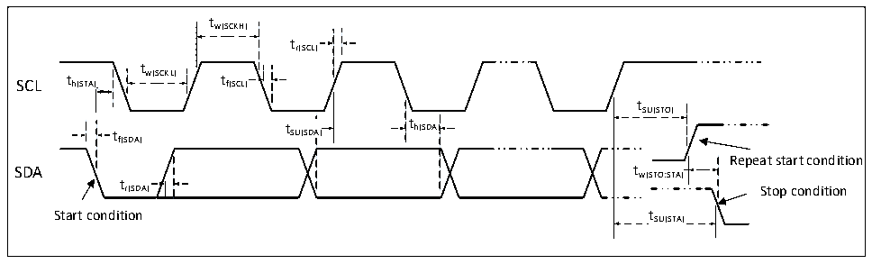

<!-- source-page: 38 -->

[← p.37](0037.md) · [index](../README.md) · [PDF p.38](https://ch32-riscv-ug.github.io/CH32V20x/datasheet_en/CH32V208DS0.PDF#page=38) · [p.39 →](0039.md)

<!-- header: CH32V208 Datasheet http://wch-ic.com -->

### 4.3.12 TIM timer characteristics

<!-- p38-table-001 (table-4-23-1@1) -->
<table><caption>Table 4-23-1 TIM1/2/3/4 characteristics</caption><tr><th>Symbol</th><th>Parameter</th><th>Condition</th><th>Min.</th><th>Max.</th><th>Unit</th></tr><tr><td rowspan="2" style="text-align:left">t res(TIM)</td><td rowspan="2">Timer reference clock</td><td></td><td>1</td><td></td><td style="text-align:left">t TIMxCLK</td></tr><tr><td style="text-align:left">f = 72MHz TIMxCLK</td><td>13.9</td><td></td><td>ns</td></tr><tr><td rowspan="2" style="text-align:left">FEXT</td><td rowspan="2" style="text-align:left">Timer external clock frequency on CH1 to CH4</td><td></td><td>0</td><td style="text-align:left">f /2TIMxCLK</td><td>MHz</td></tr><tr><td style="text-align:left">f = 72MHz TIMxCLK</td><td>0</td><td>36</td><td>MHz</td></tr><tr><td style="text-align:left">R esTIM</td><td>Timer resolution</td><td></td><td></td><td>16</td><td>bit</td></tr><tr><td rowspan="2" style="text-align:left">t COUNTER</td><td rowspan="2" style="text-align:left">16-bit counter clock cycle when the internal clock is selected</td><td></td><td>1</td><td>65536</td><td style="text-align:left">t TIMxCLK</td></tr><tr><td style="text-align:left">f = 72MHz TIMxCLK</td><td>0.0139</td><td>910</td><td>us</td></tr><tr><td rowspan="2" style="text-align:left">t MAX_COUNT</td><td rowspan="2">Maximum possible count</td><td></td><td></td><td>65536</td><td style="text-align:left">t TIMxCLK</td></tr><tr><td style="text-align:left">f = 72MHz TIMxCLK</td><td></td><td>59.6</td><td>s</td></tr></table>

<!-- p38-table-002 (table-4-23-2@1) -->
<table><caption>Table 4-23-2 TIM1/2/3/4 characteristics</caption><tr><th>Symbol</th><th>Parameter</th><th>Condition</th><th>Min.</th><th>Max.</th><th>Unit</th></tr><tr><td rowspan="2" style="text-align:left">t res(TIM)</td><td rowspan="2">Timer reference clock</td><td></td><td>1</td><td></td><td style="text-align:left">t TIMxCLK</td></tr><tr><td style="text-align:left">f = 72MHz TIMxCLK</td><td>13.9</td><td></td><td>ns</td></tr><tr><td rowspan="2" style="text-align:left">FEXT</td><td rowspan="2" style="text-align:left">Timer external clock frequency on CH1 to CH4</td><td></td><td>0</td><td style="text-align:left">f /2TIMxCLK</td><td>MHz</td></tr><tr><td style="text-align:left">f = 72MHz TIMxCLK</td><td>0</td><td>36</td><td>MHz</td></tr><tr><td style="text-align:left">R esTIM</td><td>Timer resolution</td><td></td><td></td><td>32</td><td>位</td></tr><tr><td rowspan="2" style="text-align:left">t COUNTER</td><td rowspan="2" style="text-align:left">32-bit counter clock cycle when the internal clock is selected</td><td></td><td>1</td><td>232</td><td style="text-align:left">t TIMxCLK</td></tr><tr><td style="text-align:left">f = 72MHz TIMxCLK</td><td>0.0139</td><td>232/72</td><td>us</td></tr><tr><td rowspan="2" style="text-align:left">t MAX_COUNT</td><td rowspan="2">Maximum possible count</td><td></td><td></td><td>232</td><td style="text-align:left">t TIMxCLK</td></tr><tr><td style="text-align:left">f = 72MHz TIMxCLK</td><td></td><td>232*232/72</td><td>us</td></tr></table>

### 4.3.13 I2C interface characteristics

Figure 4-8 I²C bus timing diagram  
 <!-- rendered from the PDF; verify at https://ch32-riscv-ug.github.io/CH32V20x/datasheet_en/CH32V208DS0.PDF#page=38 -->

🖼 Text parsed from the figure above

tw(SCKH)  
tr(SCL)  
t  
SCL t h(STA) w(SCKL) t f(SCL)  
tSU(STO)  
t t SU(SDA) t h(SDA)  
th(SDA)  
f(SDA)  
Repeat start condition  
t  
r(SDA) Stop condition  
Start condition tSU(STA)  

<!-- p38-table-004 (table-4-24@1) pages 38-39 -->
<table><caption>Table 4-24 I²C interface characteristics</caption><tr><th rowspan="2">Symbol</th><th rowspan="2">Parameter</th><th colspan="2">Standard I2C</th><th colspan="2">Fast I2C</th><th rowspan="2">Unit</th></tr><tr><td>Min.</td><td>Max.</td><td>Min.</td><td>Max.</td></tr><tr><td style="text-align:left">t w(SCKL)</td><td>SCL clock low time</td><td>4.7</td><td></td><td>1.2</td><td></td><td>us</td></tr><tr><td style="text-align:left">t w(SCKH)</td><td>SCL clock high time</td><td>4.0</td><td></td><td>0.6</td><td></td><td>us</td></tr><tr><td style="text-align:left">t SU(SDA)</td><td>SDA data setup time</td><td>250</td><td></td><td>100</td><td></td><td>ns</td></tr><tr><td style="text-align:left">t h(SDA)</td><td>SDA data hold time</td><td>0</td><td></td><td>0</td><td>900</td><td>ns</td></tr><tr><td style="text-align:left">t /t r(SDA) r(SCL)</td><td>SDA and SCL rise time</td><td></td><td>1000</td><td>20</td><td></td><td>ns</td></tr><tr><td style="text-align:left">t /t f(SDA) f(SCL)</td><td>SDA and SCL fall time</td><td></td><td>300</td><td></td><td></td><td>ns</td></tr><tr><td style="text-align:left">t h(STA)</td><td>Start condition hold time</td><td>4.0</td><td></td><td>0.6</td><td></td><td>us</td></tr><tr><td style="text-align:left">t SU(STA)</td><td>Repeated start condition setup time</td><td>4.7</td><td></td><td>0.6</td><td></td><td>us</td></tr><tr><td style="text-align:left">t SU(STO)</td><td>Stop condition setup time</td><td>4.0</td><td></td><td>0.6</td><td></td><td>us</td></tr><tr><td style="text-align:left">t w(STO:STA)</td><td style="text-align:left">Time from stop condition to start condition (bus free)</td><td>4.7</td><td></td><td>1.2</td><td></td><td>us</td></tr><tr><td style="text-align:left">C b</td><td>Capacitive load for each bus</td><td></td><td>400</td><td></td><td>400</td><td>pF</td></tr></table>

<!-- image: p38-draw-image-00001 bbox=[498.0, 780.84, 517.56, 791.4] -->
<!-- footer: V2.7 36 -->
