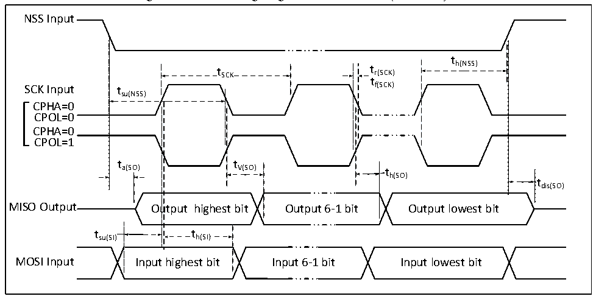
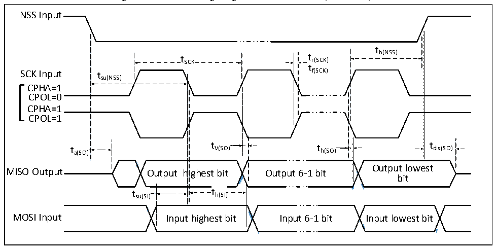

<!-- source-page: 40 -->

[← p.39](0039.md) · [index](../README.md) · [PDF p.40](https://ch32-riscv-ug.github.io/CH32V20x/datasheet_en/CH32V208DS0.PDF#page=40) · [p.41 →](0041.md)

<!-- header: CH32V208 Datasheet http://wch-ic.com -->

Figure 4-10 SPI timing diagram in Slave mode (CPHA=0)  
 <!-- rendered from the PDF; verify at https://ch32-riscv-ug.github.io/CH32V20x/datasheet_en/CH32V208DS0.PDF#page=40 -->

🖼 Text parsed from the figure above

NSS Input  
t  
t SCK t r(SCK) h(NSS)  
t  
SCK Input tsu(NSS) f(SCK)  
CPHA=0  
CPOL=0  
CPHA=0  
CPOL=1  
t t  
a(SO) V(SO) t  
h(SO)  
tdis(SO)  
MISO Output Output highest bit Output 6-1 bit Output lowest bit  
t h(SI)  t h(SI)  )  th(SI)  
tsu(SI) th(SI)  
MOSI Input Input highest bit Input 6-1 bit Input lowest bit  

Figure 4-11 SPI timing diagram in Slave mode (CPHA=1)  
 <!-- rendered from the PDF; verify at https://ch32-riscv-ug.github.io/CH32V20x/datasheet_en/CH32V208DS0.PDF#page=40 -->

🖼 Text parsed from the figure above

NSS Input  
t  
t SCK t r(SCK) h(NSS)  
t  
SCK Input tsu(NSS) f(SCK)  
CPHA=1  
CPOL=0  
CPHA=1  
CPOL=1  
t a(SO) t V(SO) t h(SO) t dis(SO)  
<!-- image: p40-draw-image-00008 inside the figure -->
<!-- image: p40-draw-image-00002 inside the figure -->
<!-- image: p40-draw-image-00003 inside the figure -->
Output lowest  
MISO Output Output highest bit Output 6-1 bit  
bit  
t su(SI)  
h(SI)  h(SI)  
<!-- image: p40-draw-image-00004 inside the figure -->
<!-- image: p40-draw-image-00005 inside the figure -->
<!-- image: p40-draw-image-00006 inside the figure -->
<!-- image: p40-draw-image-00007 inside the figure -->
MOSI Input Input highest bit Input 6-1 bit Input lowest bit  

<!-- p40-table-004 (table-4-25@1) pages 40-41 -->
<table><caption>Table 4-25 SPI interface characteristics</caption><tr><th>Symbol</th><th>Parameter</th><th>Condition</th><th>Min.</th><th>Max.</th><th>Unit</th></tr><tr><td rowspan="2" style="text-align:left">f /t SCK SCK</td><td rowspan="2">SPI clock frequency</td><td>Master mode</td><td></td><td>36</td><td>MHz</td></tr><tr><td>Slave mode</td><td></td><td>36</td><td>MHz</td></tr><tr><td style="text-align:left">t /t r(SCK) f(SCK)</td><td>SPI clock rise and fall time</td><td>Load capacitance:C = 30pF</td><td></td><td>20</td><td>ns</td></tr><tr><td style="text-align:left">t SU(NSS)</td><td>NSS setup time</td><td>Slave mode</td><td style="text-align:left">2t PCLK</td><td></td><td>ns</td></tr><tr><td style="text-align:left">t h(NSS)</td><td>NSS hold time</td><td>Slave mode</td><td style="text-align:left">2t PCLK</td><td></td><td>ns</td></tr><tr><td style="text-align:left">t /t w(SCKH) w(SCKL)</td><td>SCK high and low time</td><td style="text-align:left">Master mode, f = 36MHz, PCLK Prescaler factor = 4</td><td>40</td><td>60</td><td>ns</td></tr><tr><td style="text-align:left">t SU(MI)</td><td rowspan="2">Data input setup time</td><td>Master mode</td><td>5</td><td></td><td>ns</td></tr><tr><td style="text-align:left">t SU(SI)</td><td>Slave mode</td><td>5</td><td></td><td>ns</td></tr><tr><td style="text-align:left">t h(MI)</td><td rowspan="2">Data input hold time</td><td>Master mode</td><td>5</td><td></td><td>ns</td></tr><tr><td style="text-align:left">t h(SI)</td><td>Slave mode</td><td>4</td><td></td><td>ns</td></tr><tr><td style="text-align:left">t a(SO)</td><td>Data output access time</td><td style="text-align:left">Slave mode, f = 20MHz PCLK</td><td>0</td><td style="text-align:left">1t PCLK</td><td>ns</td></tr><tr><td style="text-align:left">t dis(SO)</td><td>Data output disable time</td><td>Slave mode</td><td>0</td><td>10</td><td>ns</td></tr><tr><td style="text-align:left">t V(SO)</td><td rowspan="2">Data output valid time</td><td>Slave mode (After enable edge)</td><td></td><td>25</td><td>ns</td></tr><tr><td style="text-align:left">t V(MO)</td><td>Master mode (After enable edge)</td><td></td><td>5</td><td>ns</td></tr><tr><td style="text-align:left">t h(SO)</td><td rowspan="2">Data output hold time</td><td>Slave mode (After enable edge)</td><td>15</td><td></td><td>ns</td></tr><tr><td style="text-align:left">t h(MO)</td><td>Master mode (After enable edge)</td><td>0</td><td></td><td>ns</td></tr></table>

<!-- image: p40-draw-image-00001 bbox=[498.0, 780.84, 517.56, 791.4] -->
<!-- footer: V2.7 38 -->
