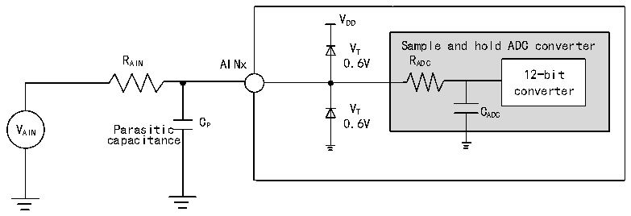
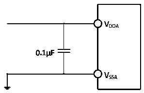

<!-- source-page: 43 -->

[← p.42](0042.md) · [index](../README.md) · [PDF p.43](https://ch32-riscv-ug.github.io/CH32V20x/datasheet_en/CH32V208DS0.PDF#page=43) · [p.44 →](0044.md)

<!-- header: CH32V208 Datasheet http://wch-ic.com -->

Figure 4-12 ADC typical connection diagram  
 <!-- rendered from the PDF; verify at https://ch32-riscv-ug.github.io/CH32V20x/datasheet_en/CH32V208DS0.PDF#page=43 -->

🖼 Text parsed from the figure above

VDD  
VT Sample and hold ADC converter  
R AIN AINx 0.6V R ADC  
12-bit  
converter  
V Parasitic C P 0 V . T 6V C ADC  
AIN capacitance  

Figure 4-13 Analog power supply and decoupling circuit reference  
 <!-- rendered from the PDF; verify at https://ch32-riscv-ug.github.io/CH32V20x/datasheet_en/CH32V208DS0.PDF#page=43 -->

🖼 Text parsed from the figure above

<!-- image: p43-draw-image-00002 inside the figure -->
<!-- image: p43-draw-image-00003 inside the figure -->
<!-- image: p43-draw-image-00006 inside the figure -->
<!-- image: p43-draw-image-00008 inside the figure -->
<!-- image: p43-draw-image-00010 inside the figure -->
<!-- image: p43-draw-image-00009 inside the figure -->
<!-- image: p43-draw-image-00007 inside the figure -->
<!-- image: p43-draw-image-00004 inside the figure -->
<!-- image: p43-draw-image-00005 inside the figure -->

### 4.3.17 Temperature sensor characteristics

<!-- p43-table-001 (table-4-30@1) -->
<table><caption>Table 4-30 Temperature sensor characteristics</caption><tr><th>Symbol</th><th>Parameter</th><th>Condition</th><th>Min.</th><th>Typ.</th><th>Max.</th><th>Unit</th></tr><tr><td style="text-align:left">RTS</td><td style="text-align:left">Measurement range of temperature sensor</td><td></td><td>-40</td><td></td><td>85</td><td></td></tr><tr><td style="text-align:left">ATSC</td><td style="text-align:left">Measurement range of temperature sensor after software calibration</td><td></td><td></td><td>±12</td><td></td><td></td></tr><tr><td>Avg_Slope</td><td style="text-align:left">Average slope (negative temperature coefficient)</td><td></td><td>3.8</td><td>4.3</td><td>4.7</td><td>mV/℃</td></tr><tr><td style="text-align:left">V25</td><td>Voltage at 25℃</td><td></td><td>1.34</td><td>1.40</td><td>1.46</td><td>V</td></tr><tr><td style="text-align:left">TS_temp</td><td style="text-align:left">ADC sampling time when reading temperature</td><td style="text-align:left">f = 14MHz ADC</td><td></td><td></td><td>17.1</td><td>us</td></tr></table>

### 4.3.18 OPA characteristics

<!-- p43-table-002 (table-4-31@1) pages 43-44 -->
<table><caption>Table 4-31 OPA characteristics</caption><tr><th>Symbol</th><th>Parameter</th><th>Condition</th><th>Min.</th><th>Typ.</th><th>Max.</th><th>Unit</th></tr><tr><td style="text-align:left">VDDA</td><td>Supply voltage</td><td></td><td>2.4</td><td>3.3</td><td>3.6</td><td>V</td></tr><tr><td style="text-align:left">CMIR</td><td>Common mode input voltage</td><td></td><td>0</td><td></td><td style="text-align:left">V -0.9DDA</td><td>V</td></tr><tr><td style="text-align:left">VIOFFSET</td><td>Input offset voltage</td><td></td><td></td><td>±2.5</td><td>±8</td><td>mV</td></tr><tr><td style="text-align:left">ILOAD</td><td>Drive current</td><td></td><td></td><td></td><td>600</td><td>uA</td></tr><tr><td style="text-align:left">IDDOPAMP</td><td>Current consumption</td><td>No load, static mode</td><td></td><td>195</td><td></td><td>uA</td></tr><tr><td style="text-align:left">C (1) MRR</td><td>Common mode rejection ratio</td><td>@1KHz</td><td></td><td>96</td><td></td><td>dB</td></tr><tr><td style="text-align:left">P (1) SRR</td><td>Power supply rejection ratio</td><td>@1KHz</td><td></td><td>86</td><td></td><td>dB</td></tr><tr><td style="text-align:left">A (1) V</td><td>Open loop gain</td><td style="text-align:left">C =5pFLOAD</td><td></td><td>136</td><td></td><td>dB</td></tr><tr><td style="text-align:left">G (1) BW</td><td>Unit gain bandwidth</td><td style="text-align:left">C =5pFLOAD</td><td></td><td>19</td><td></td><td>MHz</td></tr><tr><td style="text-align:left">P (1) M</td><td>Phase margin</td><td style="text-align:left">C =5pFLOAD</td><td></td><td>93</td><td></td><td></td></tr><tr><td style="text-align:left">S (1) R</td><td>Slew rate limited</td><td style="text-align:left">C =5pFLOAD</td><td></td><td>8</td><td></td><td>V/us</td></tr><tr><td style="text-align:left">t (1) WAKUP</td><td style="text-align:left">Setup time from shutdown to wake up, 0.1%</td><td style="text-align:left">Input V /2, C =5pF,R =4kΩ DDA LOAD LOAD</td><td></td><td></td><td>368</td><td>ns</td></tr><tr><td style="text-align:left">RLOAD</td><td>Resistive load</td><td></td><td>4</td><td></td><td></td><td>kΩ</td></tr><tr><td style="text-align:left">CLOAD</td><td>Capacitive load</td><td></td><td></td><td></td><td>50</td><td>pF</td></tr><tr><td rowspan="2" style="text-align:left">V (2) OHSAT</td><td rowspan="2">High saturation output voltage</td><td style="text-align:left">R =4kΩ, input LOADVDDA</td><td style="text-align:left">V -45DDA</td><td></td><td></td><td rowspan="2">mV</td></tr><tr><td style="text-align:left">R =20kΩ, input LOADVDDA</td><td style="text-align:left">V -10DDA</td><td></td><td></td></tr><tr><td rowspan="2" style="text-align:left">V (2) OLSAT</td><td rowspan="2">Low saturation output voltage</td><td style="text-align:left">R =4kΩ, input 0LOAD</td><td></td><td></td><td>0.5</td><td rowspan="2">mV</td></tr><tr><td style="text-align:left">R =20kΩ, input 0LOAD</td><td></td><td></td><td>0.5</td></tr><tr><td rowspan="2">EN(1)</td><td rowspan="2">Equivalent input voltage noise</td><td style="text-align:left">R =4kΩ,@1KHz LOAD</td><td></td><td>83</td><td></td><td rowspan="2" style="text-align:left">nv Hz</td></tr><tr><td style="text-align:left">R =4kΩ,@10KHz LOAD</td><td></td><td>42</td><td></td></tr></table>

<!-- image: p43-draw-image-00001 bbox=[498.0, 780.84, 517.56, 791.4] -->
<!-- footer: V2.7 41 -->
