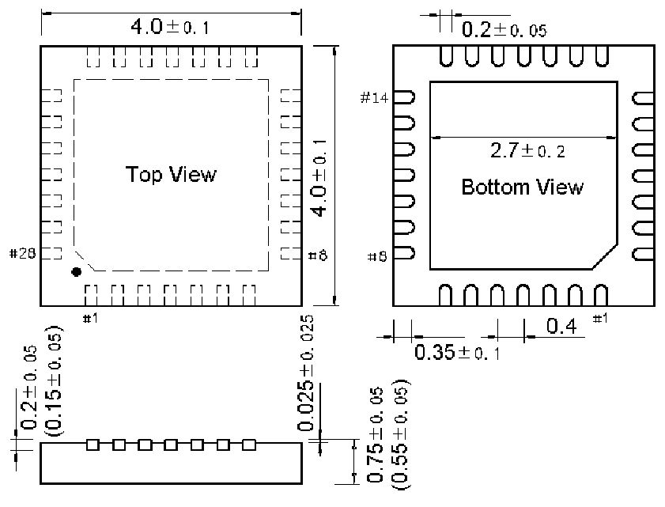

<!-- source-page: 46 -->

[← p.45](0045.md) · [index](../README.md) · [PDF p.46](https://ch32-riscv-ug.github.io/CH32V20x/datasheet_en/CH32V208DS0.PDF#page=46) · [p.47 →](0047.md)

<!-- header: CH32V208 Datasheet http://wch-ic.com -->
<em>Note: All dimensions are in millimeters. The pin center spacing values are nominal values, with no error.</em>  
<em>Other than that, the dimensional error is not greater than the greater of ±0.2mm or 10%.</em>  

## 5.1 QFN28 Package

 <!-- p46-draw-image-00002 rendered from the PDF -->

<!-- image: p46-draw-image-00001 bbox=[501.0, 780.84, 520.56, 791.4] -->
<!-- footer: V2.7 44 -->
