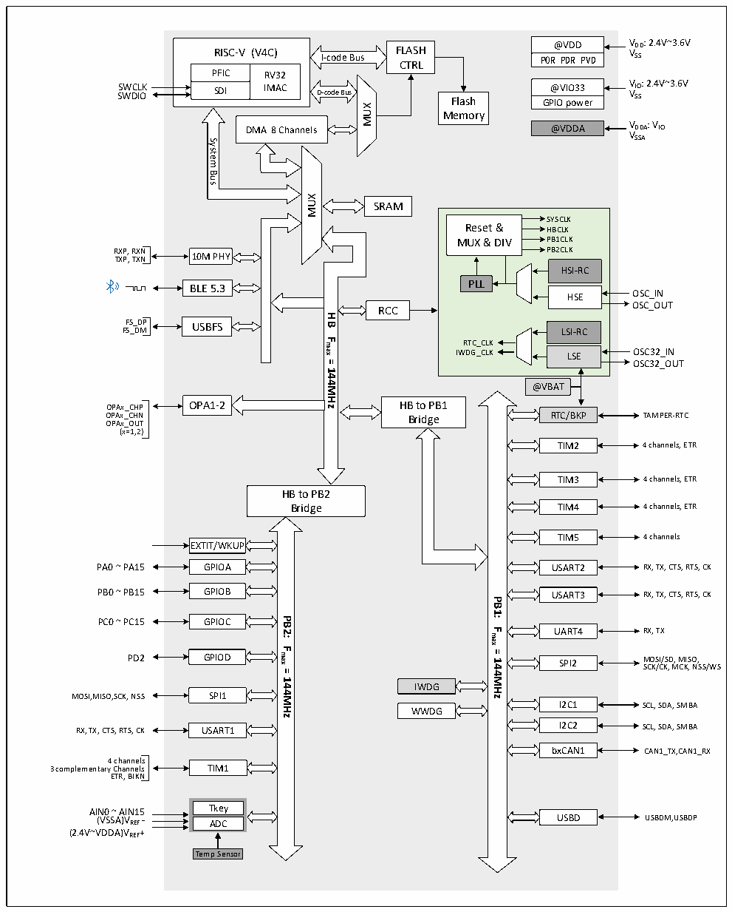

<!-- source-page: 5 -->

[← p.4](0004.md) · [index](../README.md) · [PDF p.5](https://ch32-riscv-ug.github.io/CH32V20x/datasheet_zh/CH32V208DS0.PDF#page=5) · [p.6 →](0006.md)

<!-- header: CH32V208数据手册 https://wch.cn -->

## 2.2 系统架构

微控制器基于RISC-V指令集设计，其架构中将内核、仲裁单元、DMA模块、SRAM存储等部分通过  
多组总线实现交互。设计中集成通用DMA控制器以减轻CPU负担、提高访问效率，应用多级时钟管理  
机制降低了外设的运行功耗，同时兼有数据保护机制，时钟自动切换保护等措施增加了系统稳定性。  
下图是系列产品内部总体架构框图。  

图2-1 系统框图  
 <!-- rendered from the PDF; verify at https://ch32-riscv-ug.github.io/CH32V20x/datasheet_zh/CH32V208DS0.PDF#page=5 -->

🖼 Text parsed from the figure above

@VDD VDD: 2.4V~3.6V POR PDR PVD VSS  
<!-- image: p5-draw-image-00002 inside the figure -->
RISC-V (V4C) FLASH I-code Bus  
RISC-V (V4C)  PFICSDI  RV32IMAC  
CTRL  
SWCLK @VIO33 VIO: 2.4V~3.6V SWDIO VSS GPIO power  
SDI IMAC D-code Bus Flash  
MUX  
Memory  
@VDDA VDDA: VIO  
DMA 8 Channels  
VSSA  
System  
<!-- image: p5-draw-image-00003 inside the figure -->
Bus  
MUX  
SRAM  
SYSCLK  
Reset &amp; HBCLK  
MUX &amp; DIV PB1CLK  
PB2CLK 10M PHY  
RXP, RXN TXP, TXN  
HSI-RCHSE  LSE  
BLE 5.3 PLL  
OSC_OUT  
RCC  
<strong>HB</strong>  
FS_DP USBFS  
FS_DM  
<strong>Fmax</strong>  
RTC_CLK  
<strong>=</strong>  
OSC32_OUT  
<strong>144MHz</strong>  
@VBAT  
HB to PB1  
OPAx_CHP OPA1-2  
RTC/BKP TAMPER-RTC  
OPAx_CHN  
Bridge  
OPAx_OUT  
(x=1,2)  
TIM2 4 channels, ETR  
TIM3 4 channels, ETR  
HB to PB2  
TIM4 4 channels, ETR  
Bridge  
TIM5 4 channels  
EXTIT/WKUP  
PA0 ~ PA15 GPIOA  
USART2 RX, TX, CTS, RTS, CK  
GPIOB  
PB0 ~ PB15  
USART3 RX, TX, CTS, RTS, CK  
<strong>PB1:</strong>  
<strong>PB2:</strong>  
PC0 ~ PC15  
GPIOC  
<strong>Fmax</strong>  
UART4 RX, TX  
<strong>Fmax</strong>  
<strong>=144MHz</strong>  
GPIOD  
PD2 SPI2 M SC O K S /C I/ K S , D M , M CK IS , O N , S S/WS  
<strong>=</strong>  
<strong>144MHz</strong>  
IWDG  
MOSI,MISO,SCK, NSS SPI1  
I2C1 SCL, SDA, SMBA  
WWDG  
RX, TX, CTS, RTS, CK USART1 I2C2 SCL, SDA, SMBA  
bxCAN1 CAN1_TX,CAN1_RX  
4 channels  
3 complementary Channels TIM1  
ETR, BIKN  
AIN0 ~ AIN15 Tkey  
USBD USBDM,USBDP  
(VSSA)VREF - ADC  
(2.4V~VDDA)VREF+  
Temp Sensor  

<!-- image: p5-draw-image-00001 bbox=[515.64, 779.28, 535.08, 789.6] -->
<!-- footer: V2.7 4 -->
