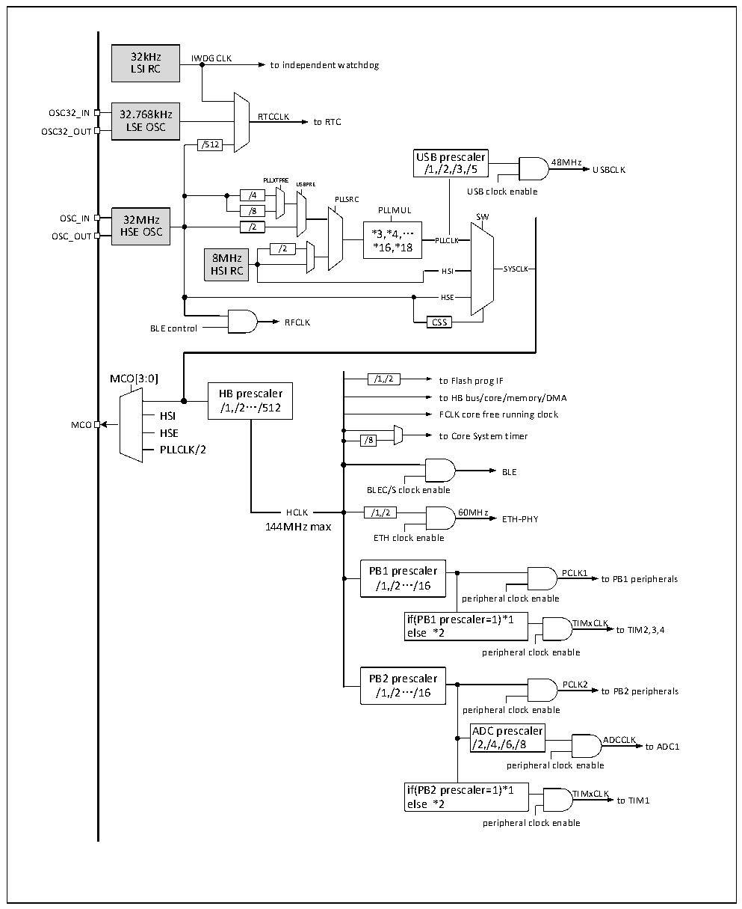

<!-- source-page: 7 -->

[← p.6](0006.md) · [index](../README.md) · [PDF p.7](https://ch32-riscv-ug.github.io/CH32V20x/datasheet_zh/CH32V208DS0.PDF#page=7) · [p.8 →](0008.md)

<!-- header: CH32V208数据手册 https://wch.cn -->

## 2.4 时钟树

系统中引入4组时钟源：内部高频RC振荡器（HSI）、内部低频RC振荡器(LSI)、外接高频振荡器  
(HSE)、外接低频振荡器(LSE)。其中，低频时钟源为RTC和独立看门狗提供了时钟基准。高频时钟源  
直接或者间接通过PLL倍频后输出为系统总线时钟（SYSCLK），系统时钟再由各预分频器提供了HB域、  
PB1域、PB2域外设控制时钟及采样或接口输出时钟，部分模块工作需要由PLL时钟直接提供。  

图2-3 时钟树框图  
 <!-- rendered from the PDF; verify at https://ch32-riscv-ug.github.io/CH32V20x/datasheet_zh/CH32V208DS0.PDF#page=7 -->

🖼 Text parsed from the figure above

32kHz IWDGCLK  
LSI RC to independent watchdog  
OSC32_IN 32.768kHz RTCCLK  
LSE OSC to RTC  
OSC32_OUT  
/512  
USB prescaler  
48MHz  
/1,/2,/3,/5 USBCLK  
PLLXTPRE  
USBPRE  
/4 PLLSRC USB clock enable  
/4 /8  
/8 PLLMUL  
32MHz HSE OSC  
HSE OSC /2 *3,*4,…  
OSC_OUT  
PLLCLK  
/2 *16,*18  
8MHz  
HSI RC HSI SYSCLK  
HSE  
RFCLK CSS  
BLE control  
MCO[3:0] /1,/2 to Flash prog IF  
HB prescaler  
to HB bus/core/memory/DMA  
/1,/2…/512  
HSI FCLK core free running clock  
MCO  
HSE to Core System timer  
/8  
PLLCLK/2  
BLE  
BLEC/S clock enable  
HCLK  HCLK  
HCLK /1,/2 60MHz  
ETH-PHY  
144MHz max  
ETH clock enable  
PB1 prescaler PCLK1  
/1,/2…/16 to PB1 peripherals  
peripheral clock enable  
if(PB1 prescaler=1)*1 TIMxCLK  
else *2 to TIM2,3,4  
peripheral clock enable  
PB2 prescaler  
PCLK2  
/1,/2…/16 to PB2 peripherals  
peripheral clock enable  
ADC prescaler  
/2,/4,/6,/8 ADCCLK to ADC1  
peripheral clock enable  
if(PB2 prescaler=1)*1 TIMxCLK  
else *2 to TIM1  
peripheral clock enable  

注：1.当使用USB功能时，CPU的频率必须是48MHz或96MHz或144MHz。当系统从停机或待机状态唤  
醒时，系统会自动切换为 HSI 做主频。如果同时使用 USB 和 ETH 功能，需选择 USBPRE=5DIV,将  
<!-- image: p7-draw-image-00001 bbox=[513.36, 779.28, 532.8, 789.6] -->
<!-- footer: V2.7 6 -->
