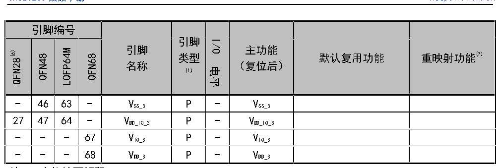

<!-- source-page: 19 -->

[← p.18](0018.md) · [index](../README.md) · [PDF p.19](https://ch32-riscv-ug.github.io/CH32V20x/datasheet_zh/CH32V208DS0.PDF#page=19) · [p.20 →](0020.md)

<!-- header: CH32V208数据手册 https://wch.cn -->

 <!-- p19-cluster-01 uncaptioned graphics, rendered from the PDF; verify at https://ch32-riscv-ug.github.io/CH32V20x/datasheet_zh/CH32V208DS0.PDF#page=19 -->

🖼 Text parsed from the figure above

> ⬆ **Table continued** — rendered in full at [page 16](0016.md). <!-- p19-table-001 -->

注1：表格缩写解释：  
I = TTL/CMOS 电平斯密特输入；O = CMOS 电平三态输出；A = 模拟信号输入或输出；  
P = 电源；FT = 耐受5V；ANT = 射频信号输入输出（天线）；  
注2：PC13，PC14和PC15引脚通过电源开关进行供电，而这个电源开关只能够通过有限的电流(3mA)。PC13  
可以作为TAMPER引脚、RTC闹钟或秒输出；PC14和PC15只能用作LSE引脚；作为输出脚时只能工作在2MHz  
模式下，最大驱动负载为30pF，并且不能作为电流源(如驱动LED)。  
注3：这些引脚在备份区域第一次上电时处于主功能状态下，之后即使复位，这些引脚的状态由备份区  
域寄存器控制（这些寄存器不会被主复位系统所复位）。关于如何控制这些IO口的具体信息，请参考  
CH32FV2x_V3xRM手册的电池备份区域和BKP寄存器的相关章节。  
注4：BOOT0和BOOT1/PB2引脚都未引出的芯片，在内部BOOT0引脚已短接到GND，BOOT1/PB2引脚浮空，低  
功耗情况下，建议配置PB2为下拉输入模式，以防止产生额外电流。  
BOOT1/PB2引脚引出但BOOT0引脚未引出的芯片，在内部BOOT0引脚已短接到GND。  
BOOT0引脚引出但BOOT1/PB2引脚未引出的芯片，在内部BOOT1/PB2引脚已短接到GND，低功耗情况下，建  
议配置PB2下拉输入模式，以防止产生额外电流。  
注5：BOOT0和PB8引脚合封芯片，建议外接4.7K下拉电阻，确保上电期间BOOT0为低电平，以便进入程序  
闪存存储器自举模式。正常工作后，PB8引脚根据需要可以用于输出。  
注6：28引脚封装芯片有许多合封引脚（至少2个IO功能引脚物理合为一个引脚），此时驱动不要同时配  
置输出功能，否则可能损坏引脚。有功耗要求的注意引脚状态。  
注7：重映射功能下划线后的数值表示AFIO寄存器中相对应位的配置值。例如：UART4_RX_3表示AFIO  
寄存器相应位配置为11b。  
注8：TIM2_CH1和TIM2_ETR共用一个引脚，但不能同时使用。  
<!-- image: p19-draw-image-00001 bbox=[502.92, 779.28, 522.36, 789.6] -->
<!-- footer: V2.7 18 -->
