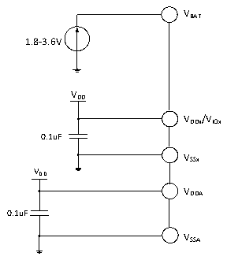

<!-- source-page: 22 -->

[← p.21](0021.md) · [index](../README.md) · [PDF p.22](https://ch32-riscv-ug.github.io/CH32V20x/datasheet_zh/CH32V208DS0.PDF#page=22) · [p.23 →](0023.md)

<!-- header: CH32V208数据手册 https://wch.cn -->

# 第 4 章 电气特性

## 4.1 测试条件

除非特殊说明和标注，所有电压都以VSS 为基准。  
所有最小值和最大值将在最坏的环境温度、供电电压和时钟频率条件下得到保证。典型数值是基  
于常温25℃和VDD= 3.3V环境下用于设计指导。  
对于通过综合评估、设计模拟或工艺特性得到的数据，不会在生产线进行测试。在综合评估的基  
础上，最小和最大值是通过样本测试后统计得到。除非特殊说明为实测值，否则特性参数以综合评估  
或设计保证。  
供电方案：  

图4-1 常规供电典型电路  
 <!-- rendered from the PDF; verify at https://ch32-riscv-ug.github.io/CH32V20x/datasheet_zh/CH32V208DS0.PDF#page=22 -->

🖼 Text parsed from the figure above

VBAT  
1.8-3.6V  
VDD  
VDDx/VIOx  
0.1uF  
VSSx  
VDD  
VDDA  
0.1uF  
VSSA  

## 4.2 绝对最大值

临界或者超过绝对最大值将可能导致芯片工作不正常甚至损坏。  

<!-- p22-table-001 (table-4-1@1) pages 22-23 -->
<table><caption>表4-1 绝对最大值参数表</caption><tr><th>符号</th><th>描述</th><th>最小值</th><th>最大值</th><th>单位</th></tr><tr><td style="text-align:left">TA</td><td>工作时的环境温度</td><td>-40</td><td>85</td><td>℃</td></tr><tr><td style="text-align:left">TS</td><td>存储时的环境温度</td><td>-40</td><td>125</td><td>℃</td></tr><tr><td style="text-align:left">V -V DD SS</td><td style="text-align:left">外部主供电电压（包含V 和V ） DDA DD</td><td>-0.3</td><td>4.0</td><td>V</td></tr><tr><td style="text-align:left">V -V IO SS</td><td>IO域端供电电压</td><td>-0.3</td><td>4.0</td><td>V</td></tr><tr><td rowspan="2" style="text-align:left">VIN</td><td>FT（耐受5V）引脚上的输入电压</td><td style="text-align:left">V -0.3SS</td><td>5.5</td><td>V</td></tr><tr><td>其他引脚上的输入电压</td><td style="text-align:left">V -0.3SS</td><td style="text-align:left">V +0.3DD</td><td></td></tr><tr><td style="text-align:left">|△V | DD_x</td><td>不同主供电引脚之间的电压差</td><td></td><td>50</td><td>mV</td></tr><tr><td style="text-align:left">|△V | IO_x</td><td>不同IO端供电引脚之间的电压差</td><td></td><td>50</td><td>mV</td></tr><tr><td style="text-align:left">|△V | SS_x</td><td>不同接地引脚之间的电压差</td><td></td><td>50</td><td>mV</td></tr><tr><td rowspan="2" style="text-align:left">VESD(HBM)</td><td>ESD静电放电电压（人体模型，非接触式）</td><td>4K</td><td></td><td>V</td></tr><tr><td>USB引脚（PA11、PA12）</td><td>3K</td><td></td><td>V</td></tr><tr><td style="text-align:left">IVDD</td><td style="text-align:left">经过V /V /V 电源线的总电流（供应电流） DD DDA IO</td><td></td><td>150</td><td rowspan="5">mA</td></tr><tr><td style="text-align:left">IVss</td><td style="text-align:left">经过V 地线的总电流（流出电流） SS</td><td></td><td>150</td></tr><tr><td rowspan="2" style="text-align:left">IIO</td><td>任意I/O和控制引脚上的灌电流</td><td></td><td>25</td></tr><tr><td>任意I/O和控制引脚上的输出电流</td><td></td><td>-25</td></tr><tr><td style="text-align:left">IINJ(PIN)</td><td>NRST引脚注入电流</td><td></td><td>+/-5</td></tr><tr><td rowspan="2"></td><td>HSE的OSC_IN引脚和LSE的OSC_IN引脚注入电流</td><td></td><td>+/-5</td><td rowspan="3"></td></tr><tr><td>其他引脚的注入电流</td><td></td><td>+/-5</td></tr><tr><td style="text-align:left">∑IINJ(PIN)</td><td>所有IO和控制引脚的总注入电流</td><td></td><td>+/-25</td></tr></table>

<!-- image: p22-draw-image-00001 bbox=[502.92, 779.28, 522.36, 789.6] -->
<!-- footer: V2.7 21 -->
