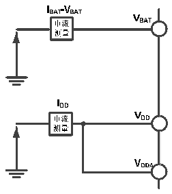

<!-- source-page: 24 -->

[← p.23](0023.md) · [index](../README.md) · [PDF p.24](https://ch32-riscv-ug.github.io/CH32V20x/datasheet_zh/CH32V208DS0.PDF#page=24) · [p.25 →](0025.md)

<!-- header: CH32V208数据手册 https://wch.cn -->

> ⬆ **Table continued** — rendered in full at [page 23](0023.md). <!-- p24-table-001 -->

注：1.常温测试值。  

### 4.3.3 内置的参考电压

<!-- p24-table-002 (table-4-5@1) -->
<table><caption>表4-5 内置参考电压</caption><tr><th>符号</th><th>参数</th><th>条件</th><th>最小值</th><th></th><th>最大值</th><th>单位</th></tr><tr><td style="text-align:left">VREFINT</td><td>内置参考电压</td><td style="text-align:left">T = -40℃～85℃ A</td><td>1.17</td><td>1.2</td><td>1.23</td><td>V</td></tr><tr><td style="text-align:left">TS_vrefint</td><td style="text-align:left">当读出内部参考电压时，ADC的采样时间</td><td></td><td>17.1</td><td></td><td></td><td>us</td></tr></table>

### 4.3.4 供电电流特性

电流消耗是多种参数和因素的综合指标，这些参数和因素包括工作电压、环境温度、I/O 引脚的  
负载、产品的软件配置、工作频率、I/O 脚的翻转速率、程序在存储器中的位置以及执行的代码等。  
电流消耗测量方法如下图：  

图4-2 电流消耗测量  
 <!-- rendered from the PDF; verify at https://ch32-riscv-ug.github.io/CH32V20x/datasheet_zh/CH32V208DS0.PDF#page=24 -->

🖼 Text parsed from the figure above

<!-- image: p24-draw-image-00002 inside the figure -->
<!-- image: p24-draw-image-00005 inside the figure -->
<!-- image: p24-draw-image-00004 inside the figure -->
<!-- image: p24-draw-image-00003 inside the figure -->
<!-- image: p24-draw-image-00006 inside the figure -->
<!-- image: p24-draw-image-00007 inside the figure -->
<!-- image: p24-draw-image-00008 inside the figure -->
<!-- image: p24-draw-image-00017 inside the figure -->
<!-- image: p24-draw-image-00018 inside the figure -->
<!-- image: p24-draw-image-00013 inside the figure -->
<!-- image: p24-draw-image-00014 inside the figure -->
<!-- image: p24-draw-image-00009 inside the figure -->
<!-- image: p24-draw-image-00010 inside the figure -->
<!-- image: p24-draw-image-00015 inside the figure -->
<!-- image: p24-draw-image-00016 inside the figure -->
<!-- image: p24-draw-image-00011 inside the figure -->
<!-- image: p24-draw-image-00012 inside the figure -->

微控制器处于下列条件：  
常温VDD= 3.3V情况下，测试时：所有IO端口配置下拉输入，HSE或HSI只开1个，HSE=32M，  
HSI=8M（已校准），FPLCK1=FHCLK/2，FPLCK2=FHCLK，当 FHCLK&gt;8MHz 时，PLL 打开。使能或关闭所有外设时钟的  
功耗。  

<!-- p24-table-003 (table-4-6-1@1) pages 24-25 -->
<table><caption>表4-6-1运行模式下典型的电流消耗，数据处理代码从内部闪存中运行</caption><tr><th rowspan="2">符号</th><th rowspan="2">参数</th><th rowspan="2" colspan="2">条件</th><th colspan="2">典型值</th><th rowspan="2">单位</th></tr><tr><td>使能所有外设</td><td>关闭所有外设(2)</td></tr><tr><td rowspan="3" style="text-align:left">I (1) DD</td><td rowspan="3" style="text-align:left">运行模式下的供应电流</td><td rowspan="3">外部时钟</td><td style="text-align:left">F = 144MHz HCLK</td><td>16.21</td><td>11.46</td><td rowspan="3">mA</td></tr><tr><td style="text-align:left">F = 72MHz HCLK</td><td>8.44</td><td>5.99</td></tr><tr><td style="text-align:left">F = 48MHz HCLK</td><td>5.84</td><td>4.20</td></tr><tr><td rowspan="15"></td><td rowspan="15"></td><td rowspan="6"></td><td style="text-align:left">F = 36MHz HCLK</td><td>4.50</td><td>3.31</td><td rowspan="15"></td></tr><tr><td style="text-align:left">F = 24MHz HCLK</td><td>3.24</td><td>2.44</td></tr><tr><td style="text-align:left">F = 16MHz HCLK</td><td>2.37</td><td>1.83</td></tr><tr><td style="text-align:left">F = 8MHz HCLK</td><td>1.38</td><td>1.12</td></tr><tr><td style="text-align:left">F = 4MHz HCLK</td><td>0.97</td><td>0.83</td></tr><tr><td style="text-align:left">F = 500KHz HCLK</td><td>0.60</td><td>0.58</td></tr><tr><td rowspan="9" style="text-align:left">运行于高速内部RC振荡器（HSI）， 使用 HB 预分频以减低频率</td><td style="text-align:left">F = 144MHz HCLK</td><td>15.61</td><td>10.65</td></tr><tr><td style="text-align:left">F = 72MHz HCLK</td><td>8.06</td><td>5.60</td></tr><tr><td style="text-align:left">F = 48MHz HCLK</td><td>5.56</td><td>3.92</td></tr><tr><td style="text-align:left">F = 36MHz HCLK</td><td>4.31</td><td>3.07</td></tr><tr><td style="text-align:left">F = 24MHz HCLK</td><td>3.07</td><td>2.24</td></tr><tr><td style="text-align:left">F = 16MHz HCLK</td><td>2.24</td><td>1.69</td></tr><tr><td style="text-align:left">F = 8MHz HCLK</td><td>1.28</td><td>1.02</td></tr><tr><td style="text-align:left">F = 4MHz HCLK</td><td>0.88</td><td>0.76</td></tr><tr><td style="text-align:left">F = 500KHz HCLK</td><td>0.53</td><td>0.51</td></tr></table>

<!-- image: p24-draw-image-00001 bbox=[502.92, 779.28, 522.36, 789.6] -->
<!-- footer: V2.7 23 -->
