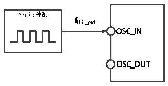
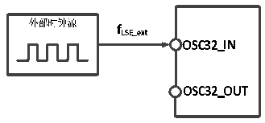

<!-- source-page: 27 -->

[← p.26](0026.md) · [index](../README.md) · [PDF p.27](https://ch32-riscv-ug.github.io/CH32V20x/datasheet_zh/CH32V208DS0.PDF#page=27) · [p.28 →](0028.md)

<!-- header: CH32V208数据手册 https://wch.cn -->

图4-3 外部提供高频时钟源电路  
 <!-- rendered from the PDF; verify at https://ch32-riscv-ug.github.io/CH32V20x/datasheet_zh/CH32V208DS0.PDF#page=27 -->

🖼 Text parsed from the figure above

<!-- image: p27-draw-image-00002 inside the figure -->
<!-- image: p27-draw-image-00009 inside the figure -->
<!-- image: p27-draw-image-00010 inside the figure -->
<!-- image: p27-draw-image-00012 inside the figure -->
<!-- image: p27-draw-image-00011 inside the figure -->
<!-- image: p27-draw-image-00006 inside the figure -->
<!-- image: p27-draw-image-00008 inside the figure -->
<!-- image: p27-draw-image-00007 inside the figure -->
<!-- image: p27-draw-image-00003 inside the figure -->
<!-- image: p27-draw-image-00005 inside the figure -->
<!-- image: p27-draw-image-00004 inside the figure -->

<!-- p27-table-001 (table-4-10@1) -->
<table><caption>表4-10 来自外部低速时钟</caption><tr><th>符号</th><th>参数</th><th>条件</th><th>最小值</th><th>典型值</th><th>最大值</th><th>单位</th></tr><tr><td style="text-align:left">FLSE_ext</td><td>用户外部时钟频率</td><td></td><td></td><td>32.768</td><td>1000</td><td>KHz</td></tr><tr><td style="text-align:left">VLSEH</td><td>OSC32_IN输入引脚高电平电压</td><td></td><td style="text-align:left">0.8VDD</td><td></td><td style="text-align:left">VDD</td><td>V</td></tr><tr><td style="text-align:left">VLSEL</td><td>OSC32_IN输入引脚低电平电压</td><td></td><td>0</td><td></td><td style="text-align:left">0.2VDD</td><td>V</td></tr><tr><td style="text-align:left">C in(LSE)</td><td>OSC32_IN输入电容</td><td></td><td></td><td>5</td><td></td><td>pF</td></tr><tr><td style="text-align:left">DuCy (LSE)</td><td>占空比</td><td></td><td></td><td>50</td><td></td><td>%</td></tr><tr><td style="text-align:left">IL</td><td>OSC32_IN输入漏电流</td><td></td><td></td><td></td><td>±1</td><td>uA</td></tr></table>

图4-4 外部提供低频时钟源电路  
 <!-- rendered from the PDF; verify at https://ch32-riscv-ug.github.io/CH32V20x/datasheet_zh/CH32V208DS0.PDF#page=27 -->

🖼 Text parsed from the figure above

<!-- image: p27-draw-image-00013 inside the figure -->
<!-- image: p27-draw-image-00022 inside the figure -->
<!-- image: p27-draw-image-00023 inside the figure -->
<!-- image: p27-draw-image-00025 inside the figure -->
<!-- image: p27-draw-image-00024 inside the figure -->
<!-- image: p27-draw-image-00018 inside the figure -->
<!-- image: p27-draw-image-00019 inside the figure -->
<!-- image: p27-draw-image-00021 inside the figure -->
<!-- image: p27-draw-image-00020 inside the figure -->
<!-- image: p27-draw-image-00014 inside the figure -->
<!-- image: p27-draw-image-00015 inside the figure -->
<!-- image: p27-draw-image-00017 inside the figure -->
<!-- image: p27-draw-image-00016 inside the figure -->

<!-- p27-table-002 (table-4-11@1) -->
<table><caption>表4-11 使用一个晶体/陶瓷谐振器产生的高速外部时钟</caption><tr><th>符号</th><th>参数</th><th>条件</th><th>最小值</th><th>典型值</th><th>最大值</th><th>单位</th></tr><tr><td style="text-align:left">FOSC_IN</td><td>谐振器频率</td><td></td><td></td><td>32(3)</td><td></td><td>MHz</td></tr><tr><td style="text-align:left">RF</td><td>反馈电阻</td><td></td><td></td><td>250</td><td></td><td>kΩ</td></tr><tr><td>C</td><td style="text-align:left">建议的负载电容与对应晶体串行阻抗RS</td><td style="text-align:left">R=60Ω(1) S</td><td></td><td>20</td><td></td><td>pF</td></tr><tr><td style="text-align:left">I2</td><td>HSE驱动电流</td><td></td><td></td><td>0.53</td><td></td><td>mA</td></tr><tr><td style="text-align:left">g m</td><td>振荡器的跨导</td><td>启动</td><td></td><td>17</td><td></td><td>mA/V</td></tr><tr><td style="text-align:left">t SU(HSE)</td><td>启动时间</td><td style="text-align:left">V 稳定，8M晶体DD</td><td></td><td>2.5(2)</td><td></td><td>ms</td></tr></table>

注：1.建议晶体ESR不超过80欧姆，优先选择ESR较小的晶体，负载电容参考晶体手册要求。  
2.启动时间指从HSEON开启到HSERDY被置位的时间差。  
3.无需外部负载电容。  
电路参考设计及要求：  
晶体的负载电容以晶体厂商建议为准，通常情况CL1=CL2。  
CH32V208x芯片外接32M晶体，芯片内置了负载电容，外部电路可省。  
<!-- image: p27-draw-image-00001 bbox=[502.92, 779.28, 522.36, 789.6] -->
<!-- footer: V2.7 26 -->
