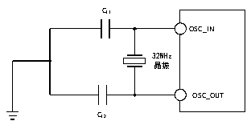
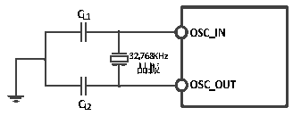

<!-- source-page: 28 -->

[← p.27](0027.md) · [index](../README.md) · [PDF p.28](https://ch32-riscv-ug.github.io/CH32V20x/datasheet_zh/CH32V208DS0.PDF#page=28) · [p.29 →](0029.md)

<!-- header: CH32V208数据手册 https://wch.cn -->

图4-5 外接32M晶体典型电路  
 <!-- rendered from the PDF; verify at https://ch32-riscv-ug.github.io/CH32V20x/datasheet_zh/CH32V208DS0.PDF#page=28 -->

🖼 Text parsed from the figure above

CL1  
OSC_IN  
32MHz  
晶振  
OSC_OUT  
CL2  

<!-- p28-table-001 (table-4-12@1) -->
<table><caption>表4-12 使用一个晶体/陶瓷谐振器产生的低速外部时钟（fLSE=32.768KHz）</caption><tr><th>符号</th><th>参数</th><th>条件</th><th>最小值</th><th>典型值</th><th>最大值</th><th>单位</th></tr><tr><td style="text-align:left">RF</td><td>反馈电阻</td><td></td><td></td><td>5</td><td></td><td>MΩ</td></tr><tr><td>C</td><td style="text-align:left">建议的负载电容与对应晶体串行阻抗RS</td><td style="text-align:left">R&lt;70kΩS</td><td></td><td></td><td>15</td><td>pF</td></tr><tr><td style="text-align:left">i 2</td><td>LSE驱动电流</td><td>VDD = 3.3V</td><td></td><td>0.35</td><td></td><td>uA</td></tr><tr><td style="text-align:left">g m</td><td>振荡器的跨导</td><td>启动</td><td></td><td>25.3</td><td></td><td>uA/V</td></tr><tr><td style="text-align:left">t SU(LSE)</td><td>启动时间</td><td>VDD是稳定的</td><td></td><td>800</td><td></td><td>mS</td></tr></table>

电路参考设计及要求：  
晶体的负载电容以晶体厂商建议为准，通常情况CL1=CL2，可选12pF左右。  

图4-6 外接32.768K晶体典型电路  
 <!-- rendered from the PDF; verify at https://ch32-riscv-ug.github.io/CH32V20x/datasheet_zh/CH32V208DS0.PDF#page=28 -->

🖼 Text parsed from the figure above

<!-- image: p28-draw-image-00007 inside the figure -->
<!-- image: p28-draw-image-00008 inside the figure -->
<!-- image: p28-draw-image-00009 inside the figure -->
<!-- image: p28-draw-image-00013 inside the figure -->
<!-- image: p28-draw-image-00015 inside the figure -->
<!-- image: p28-draw-image-00014 inside the figure -->
<!-- image: p28-draw-image-00002 inside the figure -->
<!-- image: p28-draw-image-00004 inside the figure -->
<!-- image: p28-draw-image-00005 inside the figure -->
<!-- image: p28-draw-image-00003 inside the figure -->
<!-- image: p28-draw-image-00006 inside the figure -->
<!-- image: p28-draw-image-00016 inside the figure -->
<!-- image: p28-draw-image-00018 inside the figure -->
<!-- image: p28-draw-image-00017 inside the figure -->
<!-- image: p28-draw-image-00010 inside the figure -->
<!-- image: p28-draw-image-00011 inside the figure -->
<!-- image: p28-draw-image-00012 inside the figure -->

注：负载电容CL由下式计算：CL= CL1 x CL2/ (CL1+ CL2) + Cstray，其中Cstray 是引脚的电容和PCB板或  
PCB相关的电容，它的典型值是介于2pF至7pF之间。  

### 4.3.6 内部时钟源特性

<!-- p28-table-002 (table-4-13@1) -->
<table><caption>表4-13 内部高速(HSI)RC振荡器特性</caption><tr><th>符号</th><th>参数</th><th>条件</th><th>最小值</th><th>典型值</th><th>最大值</th><th>单位</th></tr><tr><td style="text-align:left">FHSI</td><td>频率(校准后)</td><td></td><td></td><td>8</td><td></td><td>MHz</td></tr><tr><td style="text-align:left">DuCy HSI</td><td>占空比</td><td></td><td>45</td><td>50</td><td>55</td><td>%</td></tr><tr><td rowspan="2" style="text-align:left">ACCHSI</td><td rowspan="2">HSI振荡器的精度（校准后）</td><td style="text-align:left">T = 0℃～70℃ A</td><td>-1.6</td><td></td><td>1.6</td><td>%</td></tr><tr><td style="text-align:left">T = -40℃～85℃ A</td><td>-2.2</td><td></td><td>2.2</td><td>%</td></tr><tr><td style="text-align:left">t SU(HSI)</td><td>HSI振荡器启动稳定时间</td><td></td><td></td><td>10</td><td></td><td>us</td></tr><tr><td style="text-align:left">IDD(HSI)</td><td>HSI振荡器功耗</td><td></td><td>120</td><td>180</td><td>270</td><td>uA</td></tr></table>

<!-- p28-table-003 (table-4-14@1) pages 28-29 -->
<table><caption>表4-14 内部低速(LSI)RC振荡器特性</caption><tr><th>符号</th><th>参数</th><th>条件</th><th>最小值</th><th>典型值</th><th>最大值</th><th>单位</th></tr><tr><td style="text-align:left">FLSI</td><td>频率</td><td></td><td>25</td><td>32</td><td>45</td><td>KHz</td></tr><tr><td style="text-align:left">DuCy LSI</td><td>占空比</td><td></td><td>45</td><td>50</td><td>55</td><td>%</td></tr><tr><td style="text-align:left">ACCLSI</td><td style="text-align:left">LSI振荡器的精度 （校准后）</td><td style="text-align:left">恒温±1℃内，建议 10s 校准一次</td><td></td><td>±500</td><td></td><td>ppm</td></tr><tr><td style="text-align:left">t SU(LSI)</td><td>LSI振荡器启动稳定时间</td><td></td><td></td><td>100</td><td></td><td>us</td></tr><tr><td style="text-align:left">IDD(LSI)</td><td>LSI振荡器功耗</td><td></td><td></td><td>0.6</td><td></td><td>uA</td></tr></table>

<!-- image: p28-draw-image-00001 bbox=[502.92, 779.28, 522.36, 789.6] -->
<!-- footer: V2.7 27 -->
