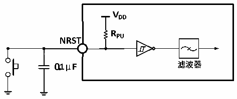

<!-- source-page: 32 -->

[← p.31](0031.md) · [index](../README.md) · [PDF p.32](https://ch32-riscv-ug.github.io/CH32V20x/datasheet_zh/CH32V208DS0.PDF#page=32) · [p.33 →](0033.md)

<!-- header: CH32V208数据手册 https://wch.cn -->
电路参考设计及要求：  

图4-7 外部复位引脚典型电路  
 <!-- rendered from the PDF; verify at https://ch32-riscv-ug.github.io/CH32V20x/datasheet_zh/CH32V208DS0.PDF#page=32 -->

🖼 Text parsed from the figure above

<!-- image: p32-draw-image-00010 inside the figure -->
<!-- image: p32-draw-image-00011 inside the figure -->
<!-- image: p32-draw-image-00008 inside the figure -->
<!-- image: p32-draw-image-00009 inside the figure -->
<!-- image: p32-draw-image-00007 inside the figure -->
<!-- image: p32-draw-image-00012 inside the figure -->
<!-- image: p32-draw-image-00002 inside the figure -->
<!-- image: p32-draw-image-00004 inside the figure -->
<!-- image: p32-draw-image-00006 inside the figure -->
<!-- image: p32-draw-image-00005 inside the figure -->
<!-- image: p32-draw-image-00003 inside the figure -->

### 4.3.12 TIM定时器特性

<!-- p32-table-002 (table-4-23-1@1) -->
<table><caption>表4-23-1 TIM1/2/3/4特性</caption><tr><th>符号</th><th>参数</th><th>条件</th><th>最小值</th><th>最大值</th><th>单位</th></tr><tr><td rowspan="2" style="text-align:left">t res(TIM)</td><td rowspan="2">定时器基准时钟</td><td></td><td>1</td><td></td><td style="text-align:left">t TIMxCLK</td></tr><tr><td style="text-align:left">f = 72MHz TIMxCLK</td><td>13.9</td><td></td><td>ns</td></tr><tr><td rowspan="2" style="text-align:left">FEXT</td><td rowspan="2">CH1至CH4的定时器外部时钟频率</td><td></td><td>0</td><td style="text-align:left">f /2TIMxCLK</td><td>MHz</td></tr><tr><td style="text-align:left">f = 72MHz TIMxCLK</td><td>0</td><td>36</td><td>MHz</td></tr><tr><td style="text-align:left">R esTIM</td><td>定时器分辨率</td><td></td><td></td><td>16</td><td>位</td></tr><tr><td rowspan="2" style="text-align:left">t COUNTER</td><td rowspan="2" style="text-align:left">当选择了内部时钟时，16 位计数器时钟周期</td><td></td><td>1</td><td>65536</td><td style="text-align:left">t TIMxCLK</td></tr><tr><td style="text-align:left">f = 72MHz TIMxCLK</td><td>0.0139</td><td>910</td><td>us</td></tr><tr><td rowspan="2" style="text-align:left">t MAX_COUNT</td><td rowspan="2">最大可能的计数</td><td></td><td></td><td>65536</td><td style="text-align:left">t TIMxCLK</td></tr><tr><td style="text-align:left">f = 72MHz TIMxCLK</td><td></td><td>59.6</td><td>s</td></tr></table>

<!-- p32-table-003 (table-4-23-2@1) -->
<table><caption>表4-23-2 TIM5特性（仅适用于CH32V203RBx）</caption><tr><th>符号</th><th>参数</th><th>条件</th><th>最小值</th><th>最大值</th><th>单位</th></tr><tr><td rowspan="2" style="text-align:left">t res(TIM)</td><td rowspan="2">定时器基准时钟</td><td></td><td>1</td><td></td><td style="text-align:left">t TIMxCLK</td></tr><tr><td style="text-align:left">f = 72MHz TIMxCLK</td><td>13.9</td><td></td><td>ns</td></tr><tr><td rowspan="2" style="text-align:left">FEXT</td><td rowspan="2">CH1至CH4的定时器外部时钟频率</td><td></td><td>0</td><td style="text-align:left">f /2TIMxCLK</td><td>MHz</td></tr><tr><td style="text-align:left">f = 72MHz TIMxCLK</td><td>0</td><td>36</td><td>MHz</td></tr><tr><td style="text-align:left">R esTIM</td><td>定时器分辨率</td><td></td><td></td><td>32</td><td>位</td></tr><tr><td rowspan="2" style="text-align:left">t COUNTER</td><td rowspan="2" style="text-align:left">当选择了内部时钟时，32 位计数器时钟周期</td><td></td><td>1</td><td>232</td><td style="text-align:left">t TIMxCLK</td></tr><tr><td style="text-align:left">f = 72MHz TIMxCLK</td><td>0.0139</td><td>232/72</td><td>us</td></tr><tr><td rowspan="2" style="text-align:left">t MAX_COUNT</td><td rowspan="2">最大可能的计数</td><td></td><td></td><td>232</td><td style="text-align:left">t TIMxCLK</td></tr><tr><td style="text-align:left">f = 72MHz TIMxCLK</td><td></td><td>232*232/72</td><td>us</td></tr></table>

<!-- image: p32-draw-image-00001 bbox=[502.92, 779.28, 522.36, 789.6] -->
<!-- footer: V2.7 31 -->
