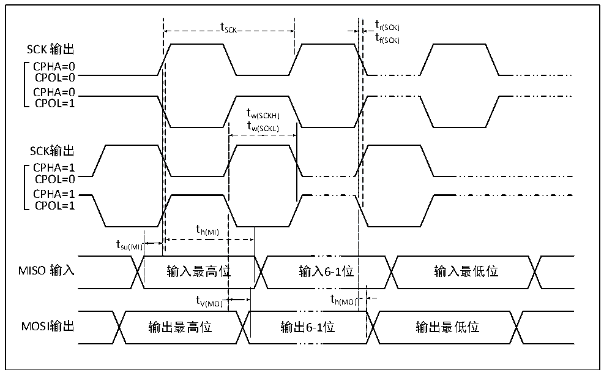
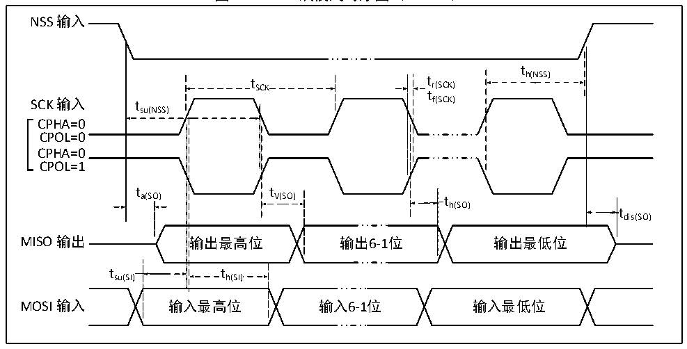

<!-- source-page: 34 -->

[← p.33](0033.md) · [index](../README.md) · [PDF p.34](https://ch32-riscv-ug.github.io/CH32V20x/datasheet_zh/CH32V208DS0.PDF#page=34) · [p.35 →](0035.md)

<!-- header: CH32V208数据手册 https://wch.cn -->

### 4.3.14 SPI接口特性

图4-9 SPI主模式时序图  
 <!-- rendered from the PDF; verify at https://ch32-riscv-ug.github.io/CH32V20x/datasheet_zh/CH32V208DS0.PDF#page=34 -->

🖼 Text parsed from the figure above

t SCK t r(SCK)  
tf(SCK)  
SCK 输出  
CPHA=0  
CPOL=0  
CPHA=0  
CPOL=1  
tw(SCKH)  
tw(SCKL)  
SCK输出  
CPHA=1  
CPOL=0  
CPHA=1  
CPOL=1  
th(MI)  
tsu(MI)  
位  t V(MO)  
tt h(MO)  
MISO 输入 输入最高位 输入6-1位 输入最低位  
tV(MO) tthh((MMOO))  
MOSI输出 输出最高位 输出6-1位 输出最低位  

图4-10 SPI从模式时序图（CPHA=0）  
 <!-- rendered from the PDF; verify at https://ch32-riscv-ug.github.io/CH32V20x/datasheet_zh/CH32V208DS0.PDF#page=34 -->

🖼 Text parsed from the figure above

NSS 输入  
th(NSS)  
t SCK t r(SCK)  
t  
SCK 输入 t f(SCK)  
su(NSS)  
CPHA=0  
CPOL=0  
CPHA=0  
CPOL=1  
t t  
a(SO) V(SO) t  
h(SO)  
tdis(SO)  
输出最高位  t h(SI)  t h(SI)  )  th(SI)  
MISO 输出 输出最高位 输出6-1位 输出最低位  
tsu(SI) th(SI)  
MOSI 输入 输入最高位 输入6-1位 输入最低位  

<!-- image: p34-draw-image-00001 bbox=[502.92, 779.28, 522.36, 789.6] -->
<!-- footer: V2.7 33 -->
