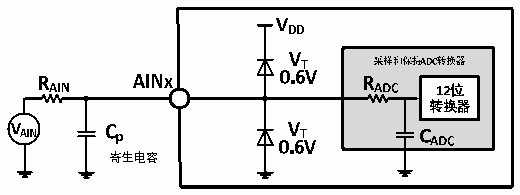
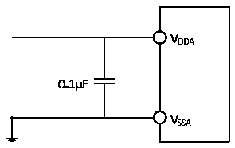

<!-- source-page: 37 -->

[← p.36](0036.md) · [index](../README.md) · [PDF p.37](https://ch32-riscv-ug.github.io/CH32V20x/datasheet_zh/CH32V208DS0.PDF#page=37) · [p.38 →](0038.md)

<!-- header: CH32V208数据手册 https://wch.cn -->

<!-- p37-table-001 (table-4-29@1) -->
<table><caption>表4-29 ADC误差</caption><tr><th>符号</th><th>参数</th><th>条件</th><th>最小值</th><th>典型值</th><th>最大值</th><th>单位</th></tr><tr><td>EO</td><td>偏移误差</td><td rowspan="3" style="text-align:left">f = 56 MHz,f = PCLK2 ADC 14 MHz,R &lt; 10AIN kΩ,V = 3.3VDDA</td><td></td><td>±4</td><td></td><td rowspan="3">LSB</td></tr><tr><td>ED</td><td>微分非线性误差</td><td></td><td>±2</td><td></td></tr><tr><td>EL</td><td>积分非线性误差</td><td></td><td>±2.5</td><td></td></tr></table>

Cp 表示PCB与焊盘上的寄生电容（大约5pF），可能与焊盘和PCB布局质量有关。较大的Cp 数值将  
降低转换精度，解决办法是降低fADC 值。  

图4-12 ADC典型连接图  
 <!-- rendered from the PDF; verify at https://ch32-riscv-ug.github.io/CH32V20x/datasheet_zh/CH32V208DS0.PDF#page=37 -->

🖼 Text parsed from the figure above

<!-- image: p37-draw-image-00032 inside the figure -->
<!-- image: p37-draw-image-00033 inside the figure -->
<!-- image: p37-draw-image-00026 inside the figure -->
<!-- image: p37-draw-image-00017 inside the figure -->
<!-- image: p37-draw-image-00019 inside the figure -->
<!-- image: p37-draw-image-00018 inside the figure -->
<!-- image: p37-draw-image-00027 inside the figure -->
<!-- image: p37-draw-image-00028 inside the figure -->
<!-- image: p37-draw-image-00030 inside the figure -->
<!-- image: p37-draw-image-00031 inside the figure -->
<!-- image: p37-draw-image-00004 inside the figure -->
<!-- image: p37-draw-image-00002 inside the figure -->
<!-- image: p37-draw-image-00015 inside the figure -->
<!-- image: p37-draw-image-00029 inside the figure -->
<!-- image: p37-draw-image-00016 inside the figure -->
<!-- image: p37-draw-image-00003 inside the figure -->
<!-- image: p37-draw-image-00011 inside the figure -->
<!-- image: p37-draw-image-00010 inside the figure -->
<!-- image: p37-draw-image-00012 inside the figure -->
<!-- image: p37-draw-image-00020 inside the figure -->
<!-- image: p37-draw-image-00008 inside the figure -->
<!-- image: p37-draw-image-00005 inside the figure -->
<!-- image: p37-draw-image-00013 inside the figure -->
<!-- image: p37-draw-image-00009 inside the figure -->
<!-- image: p37-draw-image-00021 inside the figure -->
<!-- image: p37-draw-image-00006 inside the figure -->
<!-- image: p37-draw-image-00014 inside the figure -->
<!-- image: p37-draw-image-00022 inside the figure -->
<!-- image: p37-draw-image-00024 inside the figure -->
<!-- image: p37-draw-image-00025 inside the figure -->
<!-- image: p37-draw-image-00023 inside the figure -->
<!-- image: p37-draw-image-00007 inside the figure -->

图4-13 模拟电源及退耦电路参考  
 <!-- rendered from the PDF; verify at https://ch32-riscv-ug.github.io/CH32V20x/datasheet_zh/CH32V208DS0.PDF#page=37 -->

🖼 Text parsed from the figure above

<!-- image: p37-draw-image-00034 inside the figure -->
<!-- image: p37-draw-image-00035 inside the figure -->
<!-- image: p37-draw-image-00038 inside the figure -->
<!-- image: p37-draw-image-00040 inside the figure -->
<!-- image: p37-draw-image-00042 inside the figure -->
<!-- image: p37-draw-image-00041 inside the figure -->
<!-- image: p37-draw-image-00039 inside the figure -->
<!-- image: p37-draw-image-00036 inside the figure -->
<!-- image: p37-draw-image-00037 inside the figure -->

### 4.3.17 温度传感器特性

<!-- p37-table-002 (table-4-30@1) -->
<table><caption>表4-30 温度传感器特性</caption><tr><th>符号</th><th>参数</th><th>条件</th><th>最小值</th><th>典型值</th><th>最大值</th><th>单位</th></tr><tr><td style="text-align:left">RTS</td><td>温度传感器测量范围</td><td></td><td>-40</td><td></td><td>85</td><td></td></tr><tr><td style="text-align:left">ATSC</td><td>温度传感器的测量误差</td><td></td><td></td><td>±12</td><td></td><td></td></tr><tr><td>Avg_Slope</td><td>平均斜率（负温度系数）</td><td></td><td>3.8</td><td>4.3</td><td>4.8</td><td>mV/℃</td></tr><tr><td style="text-align:left">V25</td><td>在25℃时的电压</td><td></td><td>1.34</td><td>1.40</td><td>1.46</td><td>V</td></tr><tr><td style="text-align:left">TS_temp</td><td>当读取温度时，ADC采样时间</td><td style="text-align:left">f = 14MHz ADC</td><td></td><td></td><td>17.1</td><td>us</td></tr></table>

### 4.3.18 OPA特性

<!-- p37-table-003 (table-4-31@1) pages 37-38 -->
<table><caption>表4-31 OPA特性</caption><tr><th>符号</th><th>参数</th><th>条件</th><th>最小值</th><th>典型值</th><th>最大值</th><th>单位</th></tr><tr><td style="text-align:left">VDDA</td><td>供电电压</td><td></td><td>2.4</td><td>3.3</td><td>3.6</td><td>V</td></tr><tr><td style="text-align:left">CMIR</td><td>共模输入电压</td><td></td><td>0</td><td></td><td style="text-align:left">V -0.9DDA</td><td>V</td></tr><tr><td style="text-align:left">VIOFFSET</td><td>输入失调电压</td><td></td><td></td><td>±2.5</td><td>±8</td><td>mV</td></tr><tr><td style="text-align:left">ILOAD</td><td>驱动电流</td><td></td><td></td><td></td><td>600</td><td>uA</td></tr><tr><td style="text-align:left">IDDOPAMP</td><td>消耗电流</td><td>无负载，静态模式</td><td></td><td>195</td><td></td><td>uA</td></tr><tr><td style="text-align:left">C (1) MRR</td><td>共模抑制比</td><td>@1KHz</td><td></td><td>96</td><td></td><td>dB</td></tr><tr><td style="text-align:left">P (1) SRR</td><td>电源抑制比</td><td>@1KHz</td><td></td><td>86</td><td></td><td>dB</td></tr><tr><td style="text-align:left">A(1) V</td><td>开环增益</td><td style="text-align:left">C =5pFLOAD</td><td></td><td>136</td><td></td><td>dB</td></tr><tr><td style="text-align:left">G (1) BW</td><td>单位增益带宽</td><td style="text-align:left">C =5pFLOAD</td><td></td><td>19</td><td></td><td>MHz</td></tr><tr><td style="text-align:left">P(1) M</td><td>相位裕度</td><td style="text-align:left">C =5pFLOAD</td><td></td><td>93</td><td></td><td></td></tr><tr><td style="text-align:left">S(1) R</td><td>压摆率</td><td style="text-align:left">C =5pFLOAD</td><td></td><td>8</td><td></td><td>V/us</td></tr><tr><td style="text-align:left">t (1) WAKU P</td><td>关闭到唤醒建立时间，0.1%</td><td style="text-align:left">输入V /2,C =5pF,R =4kΩ DDA LOAD LOAD</td><td></td><td></td><td>368</td><td>ns</td></tr><tr><td style="text-align:left">RLOAD</td><td>电阻性负载</td><td></td><td>4</td><td></td><td></td><td>kΩ</td></tr><tr><td style="text-align:left">CLOAD</td><td>电容性负载</td><td></td><td></td><td></td><td>50</td><td>pF</td></tr><tr><td rowspan="2" style="text-align:left">V (2) OHSAT</td><td rowspan="2">高饱和输出电压</td><td style="text-align:left">R =4kΩ,输入V LOAD DDA</td><td style="text-align:left">V -45DDA</td><td></td><td></td><td rowspan="2">mV</td></tr><tr><td style="text-align:left">R =20kΩ,输入V LOAD DDA</td><td style="text-align:left">V -10DDA</td><td></td><td></td></tr><tr><td rowspan="2" style="text-align:left">V (2) OLSAT</td><td rowspan="2">低饱和输出电压</td><td style="text-align:left">R =4kΩ,输入0LOAD</td><td></td><td></td><td>0.5</td><td rowspan="2">mV</td></tr><tr><td style="text-align:left">R =20kΩ,输入0LOAD</td><td></td><td></td><td>0.5</td></tr><tr><td rowspan="2">EN(1)</td><td rowspan="2">等效输入电压噪声</td><td style="text-align:left">R =4kΩ,@1KHz LOAD</td><td></td><td>83</td><td></td><td rowspan="2" style="text-align:left">nv Hz</td></tr><tr><td style="text-align:left">R =4kΩ,@10KHz LOAD</td><td></td><td>42</td><td></td></tr></table>

<!-- image: p37-draw-image-00001 bbox=[502.92, 779.28, 522.36, 789.6] -->
<!-- footer: V2.7 36 -->
