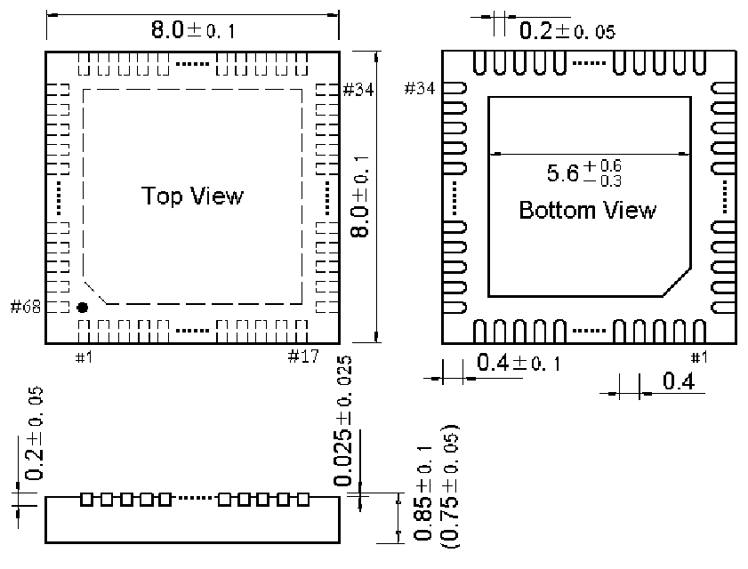
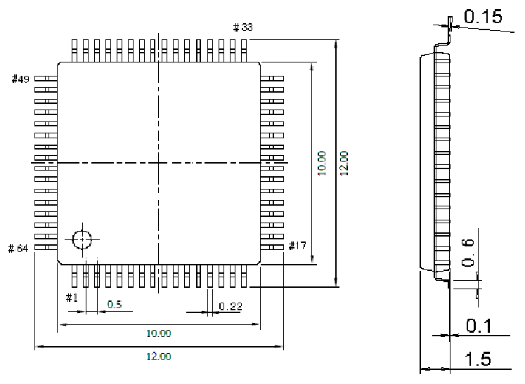

<!-- source-page: 41 -->

[← p.40](0040.md) · [index](../README.md) · [PDF p.41](https://ch32-riscv-ug.github.io/CH32V20x/datasheet_zh/CH32V208DS0.PDF#page=41) · [p.42 →](0042.md)

<!-- header: CH32V208数据手册 https://wch.cn -->

## 5.3 QFN68封装

 <!-- p41-draw-image-00002 rendered from the PDF -->

## 5.4 LQFP64M封装

 <!-- p41-draw-image-00003 rendered from the PDF -->

<!-- image: p41-draw-image-00001 bbox=[502.92, 779.28, 522.36, 789.6] -->
<!-- footer: V2.7 40 -->
