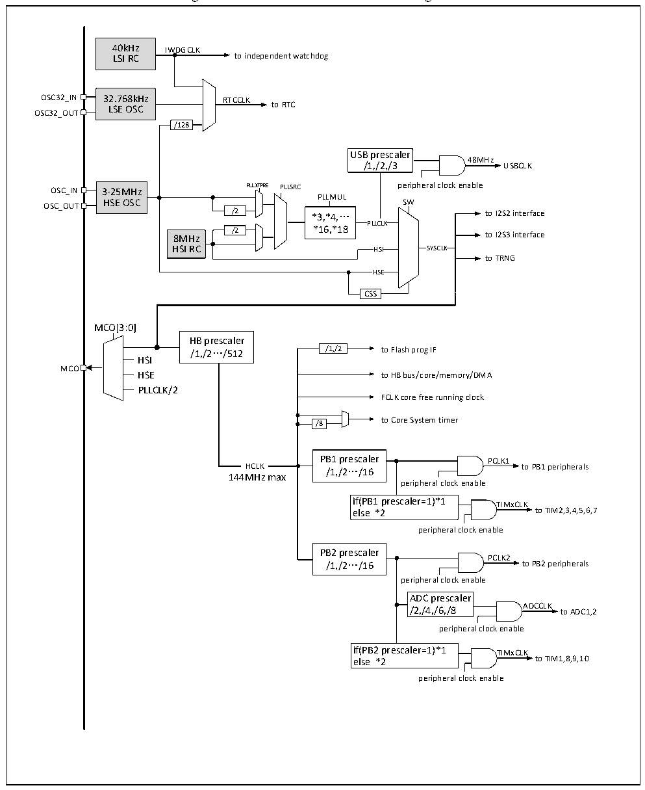

<!-- source-page: 14 -->

[← p.13](0013.md) · [index](../README.md) · [PDF p.14](https://ch32-riscv-ug.github.io/CH32V307/datasheet_en/CH32V20x_30xDS0.PDF#page=14) · [p.15 →](0015.md)

<!-- header: CH32V303/305/307/317 Datasheet https://wch-ic.com -->

Figure 2-4 CH32V303 clock tree block diagram  
 <!-- rendered from the PDF; verify at https://ch32-riscv-ug.github.io/CH32V307/datasheet_en/CH32V20x_30xDS0.PDF#page=14 -->

🖼 Text parsed from the figure above

40kHz IWDGCLK  
LSI RC to independent watchdog  
OSC32_IN 32.768kHz RTCCLK  
LSE OSC to RTC  
OSC32_OUT  
/128  
USB prescaler  
48MHz  
/1,/2,/3 USBCLK  
OSC_IN 3-25MHz PLLXTPRE PLLSRC peripheral clock enable  
3-25MHz HSE OSC  
PLLMUL  
OSC_OUT HSE OSC SW  
/2 *3,*4,… to I2S2 interface  
PLLCLK  
/2 *16,*18  
8MHz to I2S3 interface  
HSI RC HSI SYSCLK  
to TRNG  
HSE  HSE  
CSS  
MCO[3:0]  
HB prescaler  
/1,/2…/512 /1,/2 to Flash prog IF  
HSI  
MCO  
HSE to HB bus/core/memory/DMA  
PLLCLK/2  
FCLK core free running clock  
to Core System timer  
/8  
PB1 prescaler PCLK1  
HCLK  HCLK  
HCLK /1,/2…/16 to PB1 peripherals  
144MHz max  
peripheral clock enable  
if(PB1 prescaler=1)*1 TIMxCLK  
else *2 to TIM2,3,4,5,6,7  
peripheral clock enable  
PB2 prescaler  
PCLK2  
/1,/2…/16 to PB2 peripherals  
peripheral clock enable  
ADC prescaler  
/2,/4,/6,/8 ADCCLK to ADC1,2  
peripheral clock enable  
if(PB2 prescaler=1)*1 TIMxCLK  
else *2 to TIM1,8,9,10  
peripheral clock enable  

Note: 1. When using USB, the CPU clock speed must be 48MHz or 96MHz or 144MHz. When system wakes  
up from Stop mode or Standby mode, the system will automatically select HSI as the system clock frequency.  

## 2.5 Functional Description

### 2.5.1 RISC-V4F Processor

RISC-V4F supports the IMAFC subset of the RISC-V instruction set with the addition of single-precision  
<!-- image: p14-draw-image-00001 bbox=[518.28, 783.36, 537.72, 793.92] -->
<!-- footer: V3.9 12 -->
