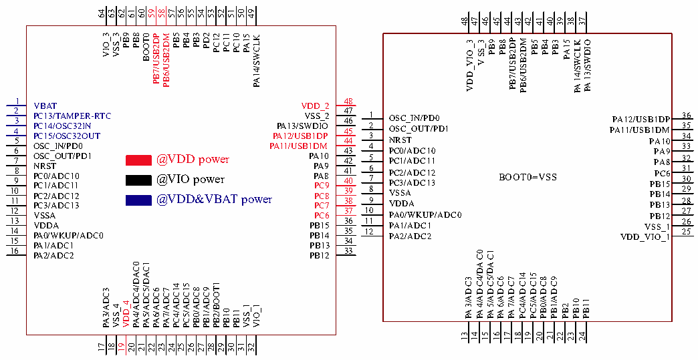
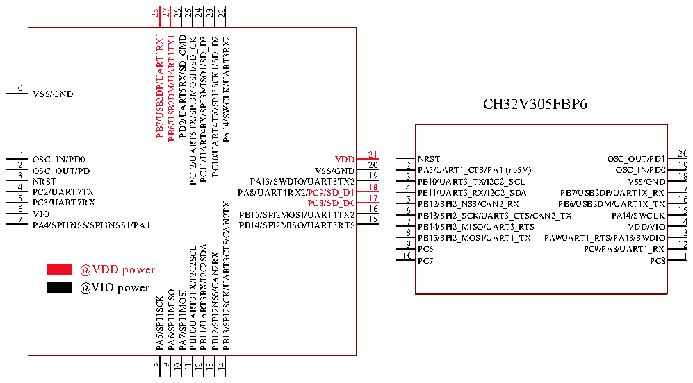

<!-- source-page: 26 -->

[← p.25](0025.md) · [index](../README.md) · [PDF p.26](https://ch32-riscv-ug.github.io/CH32V307/datasheet_en/CH32V20x_30xDS0.PDF#page=26) · [p.27 →](0027.md)

<!-- header: CH32V303/305/307/317 Datasheet http://wch-ic.com -->

### 3.1.2 Connectivity Device V305

# CH32V305RBT6 CH32V305CCT6

 <!-- p26-cluster-01 uncaptioned graphics, rendered from the PDF; verify at https://ch32-riscv-ug.github.io/CH32V307/datasheet_en/CH32V20x_30xDS0.PDF#page=26 -->

🖼 Text parsed from the figure above

64  
63  
62  
61  
60  
59  
58  
57  
56  
55  
54  
53  
52  
51  
50  
49  
48  
47  
46  
45 44 43  
42  
41 40 39  
38 37  
PB3  
PC11  
VIO_3  
PB8  
PB5  
VSS_3  
PB9  
PB4  
PD2  
PC12  
BOOT0  
PC10  
PB7/USB2DP  
PB6/USB2DM  
PA15  
PA14/SWCLK  
VDD_VIO_3 VSS_3 PB9 PB8 PB7/USB2DP PB6/USB2DM PB5 PB4 PB3 PA15 PA14/SWCLK PA13/SWDIO  
1  
48  
VBAT  
VDD_2  
2 PC13/TAMPER-RTC 3  
47 VSS_2 46  
1 OSC_IN/PD0  
36  
PA12/USB1DP  
2 OSC_OUT/PD1  
35  
PC14/OSC32IN 4  
PA13/SWDIO 45  
PA11/USB1DM  
3 NRST  
5 PC15/OSC32OUT  
PA12/USB1DP 44  
34  
PA10  
OSC_IN/PD0 6 7 OSC_OUT/PD1 NRST 8 PC0/ADC10 9 PC1/ADC11 10 PC2/ADC12 11 PC3/ADC13  
PA11/USB1DM 43 PA10 42 PA9 41 PA8 40 PC9 39 PC8 38 PC7  
4 PC0/ADC10 5 PC1/ADC11 6 31 7 PC2/ADC12 BOOT0=VSS PC3/ADC13 8 VSSA 9 VDDA  
33 32 30 29 28  
PA9 PA8 PC6 PB15 PB14 PB13  
@VDD power @VIO power @VDD&amp;VBAT power  
10 PA0/WKUP/ADC0 11 PA1/ADC1 12 PA2/ADC2  
12 VSSA 13 VDDA 14 PA0/WKUP/ADC0 15  
37 PC6 36 PB15 35 PB14 34  
27 26 25  
PB12 VSS_1 VDD_VIO_1  
PA1/ADC1  
PB13  
16 PA2/ADC2  
33 PB12  
PA4/ADC4/DAC0 PA5/ADC5/DAC1  
PA4/ADC4/DAC0  
PA5/ADC5/DAC1  
PC4/ADC14 PC5/ADC15  
PA3/ADC3  
PA6/ADC6 PA7/ADC7  
PB0/ADC8 PB1/ADC9  
PB2/BOOT1  
PC4/ADC14  
PC5/ADC15  
PB0/ADC8  
PB1/ADC9  
PA3/ADC3  
PA6/ADC6  
PA7/ADC7  
PB2 PB10 PB11  
VDD_4  
VSS_4  
VSS_1  
VIO_1  
PB10  
PB11  
16 17 20 21 23 24  
13  
14  
15  
18  
19  
22  
21  
31  
23  
18  
25  
28  
17  
19  
20  
22  
24  
26  
27  
29  
30  
32  

# CH32V305GBU6

 <!-- p26-cluster-02 uncaptioned graphics, rendered from the PDF; verify at https://ch32-riscv-ug.github.io/CH32V307/datasheet_en/CH32V20x_30xDS0.PDF#page=26 -->

🖼 Text parsed from the figure above

28  
27  
26  
25  
24  
23  
22  
PB7/USB2DP/UART1RX1  
PB6/USB2DM/UART1TX1  
PD2/UART5RX/SD_CMD  
PC11/UART4RX/SPI3MISO1/SD_D3  
PC10/UART4TX/SPI3SCK1/SD_D2  
PA14/SWCLK/UART3RX2  
PC12/UART5TX/SPI3MOSI1/SD_CK  
0  
VSS/GND  
CH32V305FBP6  
1 20  
1 21  
NRST OSC_OUT/PD1  
OSC_IN/PD0 VDD  
2 19  
2 20  
PA5/UART1_CTS/PA1 (no5V) OSC_IN/PD0 3 18  
OSC_OUT/PD1 VSS/GND  
3  
19  
NRST PA13/SWDIO/UART3TX2  
PB10/UART3_TX/I2C2_SCL VSS/GND  
4 17  
4 18  
PC2/UART7TX PA8/UART1RX2/PC9/SD_D1  
PB11/UART3_RX/I2C2_SDA PB7/USB2DP/UART1X_RX  
5 17 16  
5 16 PB12/SPI2_NSS/CAN2_RX PB6/USB2DM/UART1X_TX 6 15  
PC3/UART7RX PC8/SD_D0  
PB13/SPI2SCK/UART3CTS/CAN2TX  
6  
VIO PB15/SPI2MOSI/UART1TX2 PA4/SPI1NSS/SPI3NSS1/PA1 PB14/SPI2MISO/UART3RTS  
PB13/SPI2_SCK/UART3_CTS/CAN2_TX PA14/SWCLK 7 14 PB14/SPI2_MISO/UART3_RTS VDD/VIO  
7  
15  
8 13  
PB15/SPI2_MOSI/UART1_TX PA9/UART1_RTS/PA13/SWDIO  
9 12 PC6 PC9/PA8/UART1_RX  
PB11/UART3RX/I2C2SDA  
PB10/UART3TX/I2C2SCL  
10 11  
PB12/SPI2NSS/CAN2RX  
PC7 PC8  
@VDD power  
@VIO power  
PA6/SPI1MISO  
PA7/SPI1MOSI  
PA5/SPI1SCK  
8  
9  
10  
11  
12  
13  
14  

<!-- image: p26-draw-image-00001 bbox=[501.72, 779.88, 523.44, 789.6] -->
<!-- footer: V3.9 24 -->
