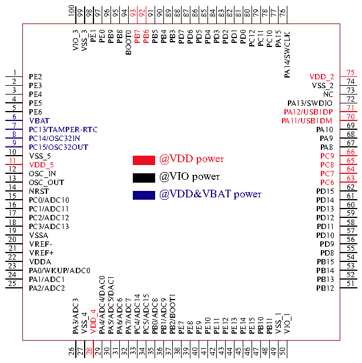
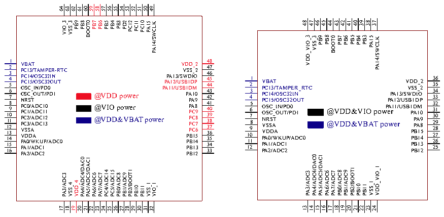

<!-- source-page: 27 -->

[← p.26](0026.md) · [index](../README.md) · [PDF p.27](https://ch32-riscv-ug.github.io/CH32V307/datasheet_en/CH32V20x_30xDS0.PDF#page=27) · [p.28 →](0028.md)

<!-- header: CH32V303/305/307/317 Datasheet http://wch-ic.com -->

### 3.1.3 High-capacity General-purpose Device V303

# CH32V303VCT6

 <!-- p27-cluster-01 uncaptioned graphics, rendered from the PDF; verify at https://ch32-riscv-ug.github.io/CH32V307/datasheet_en/CH32V20x_30xDS0.PDF#page=27 -->

🖼 Text parsed from the figure above

100  
99  
98  
97  
96  
95  
94  
93  
92  
91  
90  
89  
88  
87  
86  
85  
84  
83  
82  
81  
80  
79  
78  
77  
76  
PE1  
PD1  
PB3  
PD3  
PC11  
VIO_3  
PB8  
PB5  
PD5  
VSS_3  
PE0  
PB9  
PB7  
PB6  
PB4  
PD7  
PD6  
PD4  
PD2  
PD0  
PC12  
BOOT0  
PC10  
PA15  
PA14/SWCLK  
1  
75  
PE2  
VDD_2  
2  
74  
PE3  
VSS_2  
3  
73  
PE4  
NC  
4  
72  
PE5  
PA13/SWDIO  
5  
71  
PE6  
PA12/USB1DP  
6  
70  
VBAT  
PA11/USB1DM  
7  
69  
PC13/TAMPER-RTC  
PA10  
8  
68  
PC14/OSC32IN  
PA9  
9  
67  
PC15/OSC32OUT  
PA8  
10  
66  
VSS_5 11  
PC9 65  
@VDD power  
VDD_5  
PC8  
12  
64  
OSC_IN 13  
PC7 63  
@VIO power  
OSC_OUT  
PC6  
14  
62  
NRST 15  
PD15 61  
@VDD&amp;VBAT power  
PC0/ADC10  
PD14  
16  
60  
PC1/ADC11  
PD13  
17  
59  
PC2/ADC12  
PD12  
18  
58  
PC3/ADC13  
PD11  
19  
57  
VSSA  
PD10  
20  
56  
VREF-  
PD9  
21  
55  
VREF+  
PD8  
22  
54  
VDDA  
PB15  
23  
53  
PA0/WKUP/ADC0  
PB14  
24  
52  
PA4/ADC4/DAC0  
PA5/ADC5/DAC1  
PA1/ADC1  
PB13  
25  
51  
PA2/ADC2  
PB12  
PB2/BOOT1  
PC4/ADC14  
PC5/ADC15  
PB0/ADC8  
PB1/ADC9  
PA3/ADC3  
PA6/ADC6  
PA7/ADC7  
VDD_4  
VSS_4  
VSS_1  
VIO_1  
PB10  
PB11  
PE10  
PE12  
PE13  
PE14  
PE15  
PE11  
PE7  
PE8  
PE9  
31  
41  
33  
43  
28  
35  
38  
45  
48  
26  
27  
29  
30  
32  
34  
36  
37  
39  
40  
42  
44  
46  
47  
49  
50  

# CH32V303RxT6/CH32V303RCT7 CH32V303CBT6

 <!-- p27-cluster-02 uncaptioned graphics, rendered from the PDF; verify at https://ch32-riscv-ug.github.io/CH32V307/datasheet_en/CH32V20x_30xDS0.PDF#page=27 -->

🖼 Text parsed from the figure above

64 63 62 61 60 59 58 57 56 55 54 53 52 51 50 49  
VIO_3 VSS_3 PB9 PB8 BOOT0 PB7 @@@ PB6 VVV PB5 DID O PB4 DD &amp;V pow po PPDB23 Bew PC12 Arer PC11 T PC10 p PA15 o w PA14/SWCLK e r  
P P A P A 1 A 1 1 1 2 /U 3 /U / S S V S B W V B D 1 P P P P P S 1 D A D P P D B B B B S D A A I 1 M _ _ 1 1 1 1 O P 9 0 8 2 2 2 4 5 3 2 2 2 2 2 3 3 3 3 3 3 3 5 6 7 8 9 0 1 2 3 4 5 6 7 9 0 1 2 3 5 6 8 4 7 8 3 3 4 4 4 4 4 4 3 4 4 4 3 5 8 3 4 6 7 9 3 0 5 K B B B _ _ B B B T B 1 L S O A P O P P P P P P S C I P O V V W B _ S D /4 D 1 V AP 1 1 1 2 4 6 7 9 0 2 5 8 3 1 1 V P P P O O N V V P P P A A A C C C B S S R S D 0 1 2 1 1 1 C C S A S D / / / 3 4 5 A _ _ T W A A T A / / / I O T O O D D N K A U S S C C / U P M C C T 1 2 D P 3 3 / P P / 2 2 0 A E D I O N R D 1 U _ C T R 0 TC 0 1 C C A A D D / / 3 4 5 C C C D D D A A A / / / 3 4 5 A A A P P P  
1 1 1 1 1 1 1 5 2 4 5 6 7 8 9 0 2 4 6 3 3 1 1 V P P P O O N P P P P V V P P P A A A C C C C C C C B S S R S D 0 1 2 1 1 1 0 1 2 3 C C S A S D / / / 3 4 5 / / / / A _ _ T W A A T A A A A A / / / I O T O O D D D D D D N K A U S S C C C C C C / U P M C C T 1 2 1 1 1 1 D P 3 3 / 1 0 2 3 P P / 2 2 0 A E D I O N R D 1 U - C R T 0 TC 0 1 C C A A D D 1 4 5 / / T 1 1 8 9 3 4 5 6 7 O C C C C C C C C C D D D D D D D D D O 4 4 1 1 A A A A A A A A A _ B _ _ _ 0 1 D / / / / / / / / / / S S O 4 5 0 1 2 1 1 3 4 5 6 7 D S S C C B B B B B A A A A A I V V V V P P P P P P P P P P P P  
P P A P A 1 A 1 1 1 2 /U 3 /U / S S V S B W V B D 1 P P P P P S 1 D A D P P P P P D P B B B B S D A A I C C C C 1 M _ 1 1 _ 1 1 O P 9 0 8 2 2 4 6 7 9 2 5 8 3 3 3 4 4 4 4 4 3 3 3 3 3 4 4 4 4 4 6 1 2 4 5 6 3 5 7 8 9 0 3 7 8  
@VDD&amp;VIO power @VDD&amp;VBAT power  
PA6/ADC6 PA7/ADC7 PB0/ADC8 PB1/ADC9 PB2/BOOT1 PB10 PB11 VSS_1 VDD_VIO_1  
16 17 18 19 20 21 22 23 24  
13 14 15  
17 18 19 20 21 22 23 24 25 26 27 28 29 30 31 32  

<!-- image: p27-draw-image-00001 bbox=[501.72, 779.88, 523.44, 789.6] -->
<!-- footer: V3.9 25 -->
