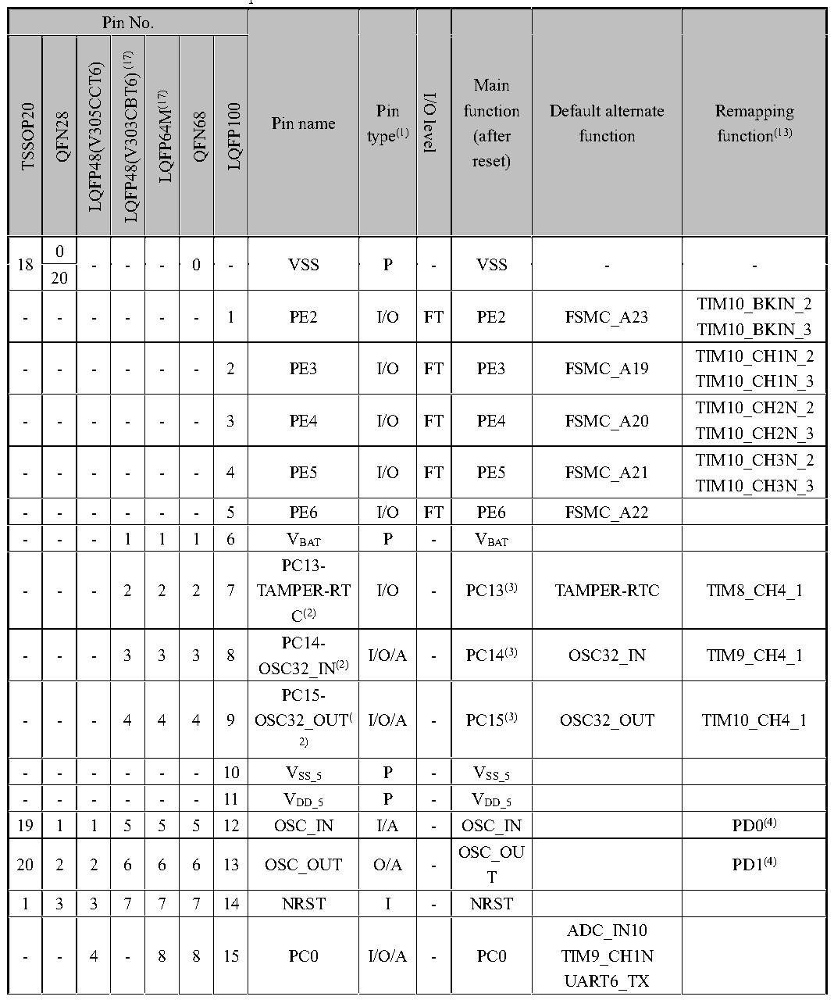

<!-- source-page: 29 -->

[← p.28](0028.md) · [index](../README.md) · [PDF p.29](https://ch32-riscv-ug.github.io/CH32V307/datasheet_en/CH32V20x_30xDS0.PDF#page=29) · [p.30 →](0030.md)

<!-- header: CH32V303/305/307/317 Datasheet http://wch-ic.com -->

## 3.2 Pin Definitions

<em>Note: The pin function in the table below refer to all functions and does not involve specific model(s). There</em>  
<em>are differences in peripheral resources between different models. Please confirm whether this function is</em>  
<em>available according to the particular model&#x27;s resource table before viewing this table.</em>  

 <!-- p29-cluster-01 uncaptioned graphics, rendered from the PDF; verify at https://ch32-riscv-ug.github.io/CH32V307/datasheet_en/CH32V20x_30xDS0.PDF#page=29 -->

🖼 Text parsed from the figure above

<!-- p29-table-001 (table-3-1@1) pages 29-40 -->
<table><caption>Table 3-1 CH32V303/305/307 pin definitions</caption><tr><th colspan="7">Pin No.</th><th rowspan="2">Pin name</th><th rowspan="2" style="text-align:left">Pin type(1)</th><th rowspan="2">I/O level</th><th rowspan="2" style="text-align:left">Main function (after reset)</th><th rowspan="2" style="text-align:left">Default alternate function</th><th rowspan="2" style="text-align:left">Remapping function(13)</th></tr><tr><td>TSSOP20</td><td>QFN28</td><td>LQFP48(V305CCT6)</td><td>LQFP48(V303CBT6)(17)</td><td>LQFP64M(17)</td><td>QFN68</td><td>LQFP100</td></tr><tr><td rowspan="2">18</td><td>0</td><td rowspan="2">-</td><td rowspan="2">-</td><td rowspan="2">-</td><td rowspan="2">0</td><td rowspan="2">-</td><td rowspan="2">VSS</td><td rowspan="2">P</td><td rowspan="2">-</td><td rowspan="2">VSS</td><td rowspan="2">-</td><td rowspan="2">-</td></tr><tr><td>20</td></tr><tr><td>-</td><td>-</td><td>-</td><td>-</td><td>-</td><td>-</td><td>1</td><td>PE2</td><td>I/O</td><td>FT</td><td>PE2</td><td>FSMC_A23</td><td style="text-align:left">TIM10_BKIN_2TIM10_BKIN_3</td></tr><tr><td>-</td><td>-</td><td>-</td><td>-</td><td>-</td><td>-</td><td>2</td><td>PE3</td><td>I/O</td><td>FT</td><td>PE3</td><td>FSMC_A19</td><td style="text-align:left">TIM10_CH1N_2TIM10_CH1N_3</td></tr><tr><td>-</td><td>-</td><td>-</td><td>-</td><td>-</td><td>-</td><td>3</td><td>PE4</td><td>I/O</td><td>FT</td><td>PE4</td><td>FSMC_A20</td><td style="text-align:left">TIM10_CH2N_2TIM10_CH2N_3</td></tr><tr><td>-</td><td>-</td><td>-</td><td>-</td><td>-</td><td>-</td><td>4</td><td>PE5</td><td>I/O</td><td>FT</td><td>PE5</td><td>FSMC_A21</td><td style="text-align:left">TIM10_CH3N_2TIM10_CH3N_3</td></tr><tr><td>-</td><td>-</td><td>-</td><td>-</td><td>-</td><td>-</td><td>5</td><td>PE6</td><td>I/O</td><td>FT</td><td>PE6</td><td>FSMC_A22</td><td></td></tr><tr><td>-</td><td>-</td><td>-</td><td>1</td><td>1</td><td>1</td><td>6</td><td style="text-align:left">VBAT</td><td>P</td><td>-</td><td style="text-align:left">VBAT</td><td></td><td></td></tr><tr><td>-</td><td>-</td><td>-</td><td>2</td><td>2</td><td>2</td><td>7</td><td style="text-align:left">PC13- TAMPER-RTC(2)</td><td>I/O</td><td>-</td><td>PC13(3)</td><td>TAMPER-RTC</td><td>TIM8_CH4_1</td></tr><tr><td>-</td><td>-</td><td>-</td><td>3</td><td>3</td><td>3</td><td>8</td><td style="text-align:left">PC14- OSC32_IN(2)</td><td>I/O/A</td><td>-</td><td>PC14(3)</td><td>OSC32_IN</td><td>TIM9_CH4_1</td></tr><tr><td>-</td><td>-</td><td>-</td><td>4</td><td>4</td><td>4</td><td>9</td><td style="text-align:left">PC15- OSC32_OUT( 2)</td><td>I/O/A</td><td>-</td><td>PC15(3)</td><td>OSC32_OUT</td><td>TIM10_CH4_1</td></tr><tr><td>-</td><td>-</td><td>-</td><td>-</td><td>-</td><td>-</td><td>10</td><td style="text-align:left">VSS_5</td><td>P</td><td>-</td><td style="text-align:left">VSS_5</td><td></td><td></td></tr><tr><td>-</td><td>-</td><td>-</td><td>-</td><td>-</td><td>-</td><td>11</td><td style="text-align:left">VDD_5</td><td>P</td><td>-</td><td style="text-align:left">VDD_5</td><td></td><td></td></tr><tr><td>19</td><td>1</td><td>1</td><td>5</td><td>5</td><td>5</td><td>12</td><td>OSC_IN</td><td>I/A</td><td>-</td><td>OSC_IN</td><td></td><td>PD0(4)</td></tr><tr><td>20</td><td>2</td><td>2</td><td>6</td><td>6</td><td>6</td><td>13</td><td>OSC_OUT</td><td>O/A</td><td>-</td><td style="text-align:left">OSC_OUT</td><td></td><td>PD1(4)</td></tr><tr><td>1</td><td>3</td><td>3</td><td>7</td><td>7</td><td>7</td><td>14</td><td>NRST</td><td>I</td><td>-</td><td>NRST</td><td></td><td></td></tr><tr><td>-</td><td>-</td><td>4</td><td>-</td><td>8</td><td>8</td><td>15</td><td>PC0</td><td>I/O/A</td><td>-</td><td>PC0</td><td style="text-align:left">ADC_IN10TIM9_CH1NUART6_TX</td><td></td></tr><tr><td colspan="7">Pin No.</td><td rowspan="2">Pin name</td><td rowspan="2" style="text-align:left">Pin type(1)</td><td rowspan="2">I/O level</td><td rowspan="2" style="text-align:left">Main function (after reset)</td><td rowspan="2" style="text-align:left">Default alternate function</td><td rowspan="2" style="text-align:left">Remapping function(13)</td></tr><tr><td>TSSOP20</td><td>QFN28</td><td>LQFP48(V305CCT6)</td><td>LQFP48(V303CBT6)(17)</td><td>LQFP64M(17)</td><td>QFN68</td><td>LQFP100</td></tr><tr><td></td><td></td><td></td><td></td><td></td><td></td><td></td><td></td><td></td><td></td><td></td><td>ETH_RGMII_RXC</td><td></td></tr><tr><td>-</td><td>-</td><td>5</td><td>-</td><td>9</td><td>9</td><td>16</td><td>PC1</td><td>I/O/A</td><td>-</td><td>PC1</td><td style="text-align:left">ADC_IN11TIM9_CH2NUART6_RXETH_MII_MDCETH_RMII_MDCETH_RGMII_RXCTL</td><td></td></tr><tr><td>-</td><td>4</td><td>6</td><td>-</td><td>10</td><td>10</td><td>17</td><td>PC2</td><td>I/O/A</td><td>-</td><td>PC2</td><td style="text-align:left">ADC_IN12TIM9_CH3NUART7_TXOPA3_CH1NETH_MII_TXD2ETH_RGMII_RXD0</td><td></td></tr><tr><td>-</td><td>5</td><td>7</td><td>-</td><td>11</td><td>11</td><td>18</td><td>PC3</td><td>I/O/A</td><td>-</td><td>PC3</td><td style="text-align:left">ADC_IN13TIM10_CH3UART7_RXOPA4_CH1NETH_MII_TX_CLKETH_RGMII_RXD1</td><td></td></tr><tr><td>-</td><td>-</td><td>8</td><td>8</td><td>12</td><td>12</td><td>19</td><td style="text-align:left">VSSA</td><td>P</td><td>-</td><td style="text-align:left">VSSA</td><td></td><td></td></tr><tr><td>-</td><td>-</td><td>-</td><td>-</td><td>-</td><td>-</td><td>20</td><td style="text-align:left">VREF-</td><td>P</td><td>-</td><td style="text-align:left">VREF-</td><td></td><td></td></tr><tr><td>-</td><td>-</td><td>-</td><td>-</td><td>-</td><td>-</td><td>21</td><td style="text-align:left">VREF+</td><td>P</td><td>-</td><td style="text-align:left">VREF+</td><td></td><td></td></tr><tr><td>-</td><td>-</td><td>9</td><td>9</td><td>13</td><td>13</td><td>22</td><td style="text-align:left">VDDA</td><td>P</td><td>-</td><td style="text-align:left">VDDA</td><td></td><td></td></tr><tr><td>-</td><td>-</td><td>10</td><td>10</td><td>14</td><td>14</td><td>23</td><td>PA0-WKUP</td><td>I/O/A</td><td>-</td><td>PA0</td><td style="text-align:left">WKUPUSART2_CTSADC_IN0TIM2_CH1(14) TIM2_ETR(14) TIM5_CH1TIM8_ETROPA4_OUT0ETH_MII_CRS</td><td style="text-align:left">TIM2_CH1_2(14) TIM2_ETR_2(14) TIM8_ETR_1</td></tr><tr><td colspan="7">Pin No.</td><td rowspan="2">Pin name</td><td rowspan="2" style="text-align:left">Pin type(1)</td><td rowspan="2">I/O level</td><td rowspan="2" style="text-align:left">Main function (after reset)</td><td rowspan="2" style="text-align:left">Default alternate function</td><td rowspan="2" style="text-align:left">Remapping function(13)</td></tr><tr><td>TSSOP20</td><td>QFN28</td><td>LQFP48(V305CCT6)</td><td>LQFP48(V303CBT6)(17)</td><td>LQFP64M(17)</td><td>QFN68</td><td>LQFP100</td></tr><tr><td></td><td></td><td></td><td></td><td></td><td></td><td></td><td></td><td></td><td></td><td></td><td style="text-align:left">ETH_RGMII_RXD2</td><td></td></tr><tr><td>2</td><td>7</td><td>11</td><td>11</td><td>15</td><td>15</td><td>24</td><td>PA1(15)</td><td>I/O/A</td><td>-</td><td>PA1</td><td style="text-align:left">USART2_RTSADC_IN1TIM5_CH2TIM2_CH2OPA3_OUT0ETH_MII_RX_CLKETH_RMII_REF_ CLKETH_RGMII_RXD3</td><td style="text-align:left">TIM2_CH2_2TIM9_BKIN_1</td></tr><tr><td>-</td><td>-</td><td>12</td><td>12</td><td>16</td><td>16</td><td>25</td><td>PA2</td><td>I/O/A</td><td>-</td><td>PA2</td><td style="text-align:left">USART2_TXTIM5_CH3ADC_IN2TIM2_CH3TIM9_CH1TIM9_ETROPA2_OUT0ETH_MII_MDIOETH_RMII_MDIOETH_RGMII_GTXC</td><td style="text-align:left">TIM2_CH3_1TIM9_CH1_1TIM9_ETR_1</td></tr><tr><td>-</td><td>-</td><td>-</td><td>-</td><td>-</td><td>17</td><td>-</td><td style="text-align:left">VIO_4</td><td>P</td><td>-</td><td style="text-align:left">VIO_4</td><td></td><td></td></tr><tr><td>-</td><td>-</td><td>13</td><td>13</td><td>17</td><td>19</td><td>26</td><td>PA3</td><td>I/O/A</td><td>-</td><td>PA3</td><td style="text-align:left">USART2_RXTIM5_CH4ADC_IN3TIM2_CH4TIM9_CH2OPA1_OUT0ETH_MII_COLETH_RGMII_TXEN</td><td style="text-align:left">TIM2_CH4_1TIM9_CH2_1</td></tr><tr><td>-</td><td>-</td><td>-</td><td>-</td><td>18</td><td>-</td><td>27</td><td style="text-align:left">VSS_4</td><td>P</td><td>-</td><td style="text-align:left">VSS_4</td><td></td><td></td></tr><tr><td>-</td><td>-</td><td>-</td><td>-</td><td>19</td><td>-</td><td>28</td><td style="text-align:left">VDD_4</td><td>P</td><td>-</td><td style="text-align:left">VDD_4</td><td></td><td></td></tr><tr><td colspan="7">Pin No.</td><td rowspan="2">Pin name</td><td rowspan="2" style="text-align:left">Pin type(1)</td><td rowspan="2">I/O level</td><td rowspan="2" style="text-align:left">Main function (after reset)</td><td rowspan="2" style="text-align:left">Default alternate function</td><td rowspan="2" style="text-align:left">Remapping function(13)</td></tr><tr><td>TSSOP20</td><td>QFN28</td><td>LQFP48(V305CCT6)</td><td>LQFP48(V303CBT6)(17)</td><td>LQFP64M(17)</td><td>QFN68</td><td>LQFP100</td></tr><tr><td>-</td><td>7</td><td>14</td><td>14</td><td>20</td><td>20</td><td>29</td><td>PA4</td><td>I/O/A</td><td>-</td><td>PA4</td><td style="text-align:left">SPI1_NSSUSART2_CKADC_IN4DAC1_OUTTIM9_CH3DVP_HSYNC</td><td style="text-align:left">SPI3_NSS_1I2S3_WS_1TIM9_CH3_1</td></tr><tr><td>2</td><td>8</td><td>15</td><td>15</td><td>21</td><td>21</td><td>30</td><td>PA5（15）</td><td>I/O/A</td><td>-</td><td>PA5</td><td style="text-align:left">SPI1_SCKADC_IN5DAC2_OUTOPA2_CH1NDVP_VSYNC</td><td style="text-align:left">TIM10_CH1N_1USART1_CTS_2USART1_CK_3</td></tr><tr><td>-</td><td>9</td><td>16</td><td>16</td><td>22</td><td>22</td><td>31</td><td>PA6</td><td>I/O/A</td><td>-</td><td>PA6</td><td style="text-align:left">SPI1_MISOTIM8_BKINADC_IN6TIM3_CH1OPA1_CH1NDVP_PCLK</td><td style="text-align:left">TIM1_BKIN_1USART1_TX_3UART7_TX_1TIM10_CH2N_1</td></tr><tr><td>-</td><td>10</td><td>17</td><td>17</td><td>23</td><td>23</td><td>32</td><td>PA7</td><td>I/O/A</td><td>-</td><td>PA7</td><td style="text-align:left">SPI1_MOSITIM8_CH1NADC_IN7TIM3_CH2OPA2_CH1PETH_MII_RX_DVETH_RMII_CRS_ DVETH_RGMII_TXD0</td><td style="text-align:left">TIM1_CH1N_1USART1_RX_3UART7_RX_1TIM10_CH3N_1</td></tr><tr><td>-</td><td>-</td><td>18</td><td>-</td><td>24</td><td>24</td><td>33</td><td>PC4</td><td>I/O/A</td><td>-</td><td>PC4</td><td style="text-align:left">ADC_IN14TIM9_CH4UART8_TXOPA4_CH1PETH_MII_RXD0ETH_RMII_RXD0ETH_RGMII_TXD1</td><td>USART1_CTS_3</td></tr><tr><td>-</td><td>-</td><td>19</td><td>-</td><td>25</td><td>25</td><td>34</td><td>PC5</td><td>I/O/A</td><td>-</td><td>PC5</td><td>ADC_IN15</td><td>USART1_RTS_3</td></tr><tr><td colspan="7">Pin No.</td><td rowspan="2">Pin name</td><td rowspan="2" style="text-align:left">Pin type(1)</td><td rowspan="2">I/O level</td><td rowspan="2" style="text-align:left">Main function (after reset)</td><td rowspan="2" style="text-align:left">Default alternate function</td><td rowspan="2" style="text-align:left">Remapping function(13)</td></tr><tr><td>TSSOP20</td><td>QFN28</td><td>LQFP48(V305CCT6)</td><td>LQFP48(V303CBT6)(17)</td><td>LQFP64M(17)</td><td>QFN68</td><td>LQFP100</td></tr><tr><td></td><td></td><td></td><td></td><td></td><td></td><td></td><td></td><td></td><td></td><td></td><td style="text-align:left">TIM9_BKINUART8_RXOPA3_CH1PETH_MII_RXD1ETH_RMII_RXD1ETH_RGMII_TXD2</td><td></td></tr><tr><td>-</td><td>-</td><td>20</td><td>18</td><td>26</td><td>26</td><td>35</td><td>PB0</td><td>I/O/A</td><td>-</td><td>PB0</td><td style="text-align:left">ADC_IN8TIM3_CH3TIM8_CH2NOPA1_CH1PETH_MII_RXD2ETH_RGMII_TXD3</td><td style="text-align:left">TIM1_CH2N_1TIM3_CH3_2TIM9_CH1N_1UART4_TX_1</td></tr><tr><td>-</td><td>-</td><td>21</td><td>19</td><td>27</td><td>27</td><td>36</td><td>PB1</td><td>I/O/A</td><td>-</td><td>PB1</td><td style="text-align:left">ADC_IN9TIM3_CH4TIM8_CH3NOPA4_CH0NETH_MII_RXD3ETH_RGMII_125IN</td><td style="text-align:left">TIM1_CH3N_1TIM3_CH4_2TIM9_CH2N_1UART4_RX_1</td></tr><tr><td>-</td><td>-</td><td>22</td><td>20</td><td>28</td><td>28</td><td>37</td><td>PB2(5)</td><td>I/O</td><td>FT</td><td style="text-align:left">PB2BOOT1(5)</td><td>OPA3_CH0N</td><td>TIM9_CH3N_1</td></tr><tr><td>-</td><td>-</td><td>-</td><td>-</td><td>-</td><td>-</td><td>38</td><td>PE7</td><td>I/O/A</td><td>FT</td><td>PE7</td><td style="text-align:left">FSMC_D4OPA3_OUT1</td><td>TIM1_ETR_3</td></tr><tr><td>-</td><td>-</td><td>-</td><td>-</td><td>-</td><td>-</td><td>39</td><td>PE8</td><td>I/O/A</td><td>FT</td><td>PE8</td><td style="text-align:left">FSMC_D5OPA4_OUT1</td><td style="text-align:left">TIM1_CH1N_3UART5_TX_2UART5_TX_3</td></tr><tr><td>-</td><td>-</td><td>-</td><td>-</td><td>-</td><td>-</td><td>40</td><td>PE9</td><td>I/O</td><td>FT</td><td>PE9</td><td>FSMC_D6</td><td style="text-align:left">TIM1_CH1_3UART5_RX_2UART5_RX_3</td></tr><tr><td>-</td><td>-</td><td>-</td><td>-</td><td>-</td><td>-</td><td>41</td><td>PE10</td><td>I/O</td><td>FT</td><td>PE10</td><td>FSMC_D7</td><td style="text-align:left">TIM1_CH2N_3UART6_TX_2UART6_TX_3</td></tr><tr><td>-</td><td>-</td><td>-</td><td>-</td><td>-</td><td>-</td><td>42</td><td>PE11</td><td>I/O</td><td>FT</td><td>PE11</td><td>FSMC_D8</td><td style="text-align:left">TIM1_CH2_3UART6_RX_2</td></tr><tr><td colspan="7">Pin No.</td><td rowspan="2">Pin name</td><td rowspan="2" style="text-align:left">Pin type(1)</td><td rowspan="2">I/O level</td><td rowspan="2" style="text-align:left">Main function (after reset)</td><td rowspan="2" style="text-align:left">Default alternate function</td><td rowspan="2" style="text-align:left">Remapping function(13)</td></tr><tr><td>TSSOP20</td><td>QFN28</td><td>LQFP48(V305CCT6)</td><td>LQFP48(V303CBT6)(17)</td><td>LQFP64M(17)</td><td>QFN68</td><td>LQFP100</td></tr><tr><td></td><td></td><td></td><td></td><td></td><td></td><td></td><td></td><td></td><td></td><td></td><td></td><td>UART6_RX_3</td></tr><tr><td>-</td><td>-</td><td>-</td><td>-</td><td>-</td><td>-</td><td>43</td><td>PE12</td><td>I/O</td><td>FT</td><td>PE12</td><td>FSMC_D9</td><td style="text-align:left">TIM1_CH3N_3UART7_TX_2UART7_TX_3</td></tr><tr><td>-</td><td>-</td><td>-</td><td>-</td><td>-</td><td>-</td><td>44</td><td>PE13</td><td>I/O</td><td>FT</td><td>PE13</td><td>FSMC_D10</td><td style="text-align:left">TIM1_CH3_3UART7_RX_2UART7_RX_3</td></tr><tr><td>-</td><td>-</td><td>-</td><td>-</td><td>-</td><td>-</td><td>45</td><td>PE14</td><td>I/O/A</td><td>FT</td><td>PE14</td><td style="text-align:left">FSMC_D11OPA2_OUT1</td><td style="text-align:left">TIM1_CH4_3UART8_TX_2UART8_TX_3</td></tr><tr><td>-</td><td>-</td><td>-</td><td>-</td><td>-</td><td>-</td><td>46</td><td>PE15</td><td>I/O/A</td><td>FT</td><td>PE15</td><td style="text-align:left">FSMC_D12OPA1_OUT1</td><td style="text-align:left">TIM1_BKIN_3UART8_RX_2UART8_RX_3</td></tr><tr><td>3</td><td>11</td><td>23</td><td>21</td><td>29</td><td>29</td><td>47</td><td>PB10</td><td>I/O/A</td><td>FT</td><td>PB10</td><td style="text-align:left">I2C2_SCLUSART3_TXOPA2_CH0NETH_MII_RX_ER</td><td style="text-align:left">TIM2_CH3_2TIM2_CH3_3TIM10_BKIN_1</td></tr><tr><td>4</td><td>12</td><td>24</td><td>22</td><td>30</td><td>30</td><td>48</td><td>PB11</td><td>I/O/A</td><td>FT</td><td>PB11</td><td style="text-align:left">I2C2_SDAUSART3_RXOPA1_CH0NETH_MII_TX_ENETH_RMII_TX_EN</td><td style="text-align:left">TIM2_CH4_2TIM2_CH4_3TIM10_ETR_1</td></tr><tr><td>-</td><td>-</td><td>26</td><td>23</td><td>31</td><td>18</td><td>49</td><td style="text-align:left">VSS_1</td><td>P</td><td></td><td style="text-align:left">VSS_1</td><td></td><td></td></tr><tr><td>-</td><td>-</td><td>-</td><td>-</td><td>32</td><td>31</td><td>50</td><td style="text-align:left">VIO_1</td><td>P</td><td></td><td style="text-align:left">VIO_1</td><td></td><td></td></tr><tr><td>-</td><td>-</td><td>25</td><td>24</td><td>-</td><td>-</td><td>-</td><td style="text-align:left">VDD_IO_1</td><td>P</td><td></td><td style="text-align:left">VDD_IO_1</td><td></td><td></td></tr><tr><td>-</td><td>-</td><td>-</td><td>-</td><td>-</td><td>32</td><td>-</td><td style="text-align:left">VDD_1</td><td>P</td><td></td><td style="text-align:left">VDD_1</td><td></td><td></td></tr><tr><td>5</td><td>13</td><td>27</td><td>25</td><td>33</td><td>35</td><td>51</td><td>PB12</td><td>I/O/A</td><td>FT</td><td>PB12</td><td style="text-align:left">SPI2_NSSI2S2_WSI2C2_SMBAUSART3_CKTIM1_BKINOPA4_CH0PCAN2_RXETH_MII_TXD0ETH_RMII_TXD0</td><td></td></tr><tr><td colspan="7">Pin No.</td><td rowspan="2">Pin name</td><td rowspan="2" style="text-align:left">Pin type(1)</td><td rowspan="2">I/O level</td><td rowspan="2" style="text-align:left">Main function (after reset)</td><td rowspan="2" style="text-align:left">Default alternate function</td><td rowspan="2" style="text-align:left">Remapping function(13)</td></tr><tr><td>TSSOP20</td><td>QFN28</td><td>LQFP48(V305CCT6)</td><td>LQFP48(V303CBT6)(17)</td><td>LQFP64M(17)</td><td>QFN68</td><td>LQFP100</td></tr><tr><td></td><td></td><td></td><td></td><td></td><td></td><td></td><td></td><td></td><td></td><td></td><td style="text-align:left">ETH_RGMII_MDC</td><td></td></tr><tr><td>6</td><td>14</td><td>28</td><td>26</td><td>34</td><td>36</td><td>52</td><td>PB13</td><td>I/O/A</td><td>FT</td><td>PB13</td><td style="text-align:left">SPI2_SCKI2S2_CKUSART3_CTSTIM1_CH1NOPA3_CH0PCAN2_TXETH_MII_TXD1ETH_RMII_TXD1ETH_RGMII_MDIO</td><td>USART3_CTS_1</td></tr><tr><td>7</td><td>15</td><td>29</td><td>27</td><td>35</td><td>37</td><td>53</td><td>PB14</td><td>I/O/A</td><td>FT</td><td>PB14</td><td style="text-align:left">SPI2_MISOTIM1_CH2NUSART3_RTSOPA2_CH0PSDIO_D0(7)</td><td>USART3_RTS_1</td></tr><tr><td>8</td><td>16</td><td>30</td><td>28</td><td>36</td><td>38</td><td>54</td><td>PB15</td><td>I/O/A</td><td>FT</td><td>PB15</td><td style="text-align:left">SPI2_MOSII2S2_SDTIM1_CH3NOPA1_CH0PSDIO_D1(7)</td><td>USART1_TX_2</td></tr><tr><td>-</td><td>-</td><td>-</td><td>-</td><td>-</td><td>33</td><td>55</td><td>PD8</td><td>I/O</td><td>FT</td><td>PD8</td><td>FSMC_D13</td><td style="text-align:left">USART3_TX_3TIM9_CH1N_2TIM9_CH1N_3ETH_MII_RX_DV_1ETH_RMII_CRS_ DV_1</td></tr><tr><td>-</td><td>-</td><td>-</td><td>-</td><td>-</td><td>34</td><td>56</td><td>PD9</td><td>I/O</td><td>FT</td><td>PD9</td><td>FSMC_D14</td><td style="text-align:left">USART3_RX_3TIM9_CH1_2TIM9_ETR_2TIM9_CH1_3TIM9_ETR_3ETH_MII_RXD0_ 1</td></tr><tr><td colspan="7">Pin No.</td><td rowspan="2">Pin name</td><td rowspan="2" style="text-align:left">Pin type(1)</td><td rowspan="2">I/O level</td><td rowspan="2" style="text-align:left">Main function (after reset)</td><td rowspan="2" style="text-align:left">Default alternate function</td><td rowspan="2" style="text-align:left">Remapping function(13)</td></tr><tr><td>TSSOP20</td><td>QFN28</td><td>LQFP48(V305CCT6)</td><td>LQFP48(V303CBT6)(17)</td><td>LQFP64M(17)</td><td>QFN68</td><td>LQFP100</td></tr><tr><td></td><td></td><td></td><td></td><td></td><td></td><td></td><td></td><td></td><td></td><td></td><td></td><td style="text-align:left">ETH_RMII_RXD0 _1</td></tr><tr><td>-</td><td>-</td><td>-</td><td>-</td><td>-</td><td>-</td><td>57</td><td>PD10</td><td>I/O</td><td>FT</td><td>PD10</td><td>FSMC_D15</td><td style="text-align:left">USART3_CK_2USART3_CK_3TIM9_CH2N_2TIM9_CH2N_3ETH_MII_RXD1_ 1ETH_RMII_RXD1 _1</td></tr><tr><td>-</td><td>-</td><td>-</td><td>-</td><td>-</td><td>-</td><td>58</td><td>PD11</td><td>I/O</td><td>FT</td><td>PD11</td><td>FSMC_A16</td><td style="text-align:left">USART3_CTS_2USART3_CTS_3TIM9_CH2_2TIM9_CH2_3ETH_MII_RXD2_ 1</td></tr><tr><td>-</td><td>-</td><td>-</td><td>-</td><td>-</td><td>-</td><td>59</td><td>PD12</td><td>I/O</td><td>FT</td><td>PD12</td><td>FSMC_A17</td><td style="text-align:left">TIM4_CH1_1TIM9_CH3N_2TIM9_CH3N_3USART3_RTS_3ETH_MII_RXD3USART3_RTS_2</td></tr><tr><td>-</td><td>-</td><td>-</td><td>-</td><td>-</td><td>-</td><td>60</td><td>PD13</td><td>I/O</td><td>FT</td><td>PD13</td><td>FSMC_A18</td><td style="text-align:left">TIM4_CH2_1TIM9_CH3_2TIM9_CH3_3</td></tr><tr><td>-</td><td>-</td><td>-</td><td>-</td><td>-</td><td>-</td><td>61</td><td>PD14</td><td>I/O</td><td>FT</td><td>PD14</td><td>FSMC_D0</td><td style="text-align:left">TIM4_CH3_1TIM9_BKIN_2TIM9_BKIN_3</td></tr><tr><td>-</td><td>-</td><td>-</td><td>-</td><td>-</td><td>-</td><td>62</td><td>PD15</td><td>I/O</td><td>FT</td><td>PD15</td><td>FSMC_D1</td><td style="text-align:left">TIM4_CH4_1TIM9_CH4_2TIM9_CH4_3</td></tr><tr><td>9</td><td>-</td><td>31</td><td>-</td><td>37</td><td>39</td><td>63</td><td>PC6</td><td>I/O</td><td>FT</td><td>PC6</td><td style="text-align:left">I2S2_MCKTIM8_CH1SDIO_D6ETH_RXP</td><td>TIM3_CH1_3</td></tr><tr><td>10</td><td>-</td><td>-</td><td>-</td><td>38</td><td>40</td><td>64</td><td>PC7</td><td>I/O</td><td>FT</td><td>PC7</td><td>I2S3_MCK(11) (12)</td><td>TIM3_CH2_3</td></tr><tr><td colspan="7">Pin No.</td><td rowspan="2">Pin name</td><td rowspan="2" style="text-align:left">Pin type(1)</td><td rowspan="2">I/O level</td><td rowspan="2" style="text-align:left">Main function (after reset)</td><td rowspan="2" style="text-align:left">Default alternate function</td><td rowspan="2" style="text-align:left">Remapping function(13)</td></tr><tr><td>TSSOP20</td><td>QFN28</td><td>LQFP48(V305CCT6)</td><td>LQFP48(V303CBT6)(17)</td><td>LQFP64M(17)</td><td>QFN68</td><td>LQFP100</td></tr><tr><td></td><td></td><td></td><td></td><td></td><td></td><td></td><td></td><td></td><td></td><td></td><td style="text-align:left">TIM8_CH2SDIO_D7ETH_RXN</td><td></td></tr><tr><td>11</td><td>17</td><td>-</td><td>-</td><td>39</td><td>41</td><td>65</td><td>PC8</td><td>I/O</td><td>FT</td><td>PC8</td><td style="text-align:left">TIM8_CH3SDIO_D0(7) ETH_TXPDVP_D2</td><td>TIM3_CH3_3</td></tr><tr><td>12</td><td>18</td><td>-</td><td>-</td><td>40</td><td>42</td><td>66</td><td>PC9（6）</td><td>I/O</td><td>FT</td><td>PC9</td><td style="text-align:left">TIM8_CH4SDIO_D1(7) ETH_TXNDVP_D3</td><td>TIM3_CH4_3</td></tr><tr><td></td><td></td><td>32</td><td>29</td><td>41</td><td>43</td><td>67</td><td>PA8(6)</td><td>I/O</td><td>FT</td><td>PA8</td><td style="text-align:left">USART1_CKTIM1_CH1MCO I2S3_MCK(11) (12)</td><td style="text-align:left">USART1_CK_1USART1_RX_2TIM1_CH1_1</td></tr><tr><td>13</td><td>-</td><td>33</td><td>30</td><td>42</td><td>44</td><td>68</td><td>PA9(16)</td><td>I/O</td><td>FT</td><td>PA9</td><td style="text-align:left">USART1_TXTIM1_CH2OTG_FS_VBUSDVP_D0 I2S3_SD(10) (12)</td><td style="text-align:left">USART1_RTS_2TIM1_CH2_1</td></tr><tr><td>-</td><td>-</td><td>34</td><td>31</td><td>43</td><td>45</td><td>69</td><td>PA10</td><td>I/O</td><td>FT</td><td>PA10</td><td style="text-align:left">USART1_RXTIM1_CH3OTG_FS_IDDVP_D1</td><td style="text-align:left">USART1_CK_2TIM1_CH3_1</td></tr><tr><td>-</td><td>-</td><td>35</td><td>32</td><td>44</td><td>46</td><td>70</td><td>PA11</td><td>I/O/A</td><td>FT</td><td>PA11</td><td style="text-align:left">USART1_CTSCAN1_RXTIM1_CH4OTG_FS_DM</td><td style="text-align:left">USART1_CTS_1TIM1_CH4_1</td></tr><tr><td>-</td><td>-</td><td>36</td><td>33</td><td>45</td><td>47</td><td>71</td><td>PA12</td><td>I/O/A</td><td>FT</td><td>PA12</td><td style="text-align:left">USART1_RTSCAN1_TXTIM1_ETRTIM10_CH1NOTG_FS_DP</td><td style="text-align:left">USART1_RTS_1TIM1_ETR_1</td></tr><tr><td>13</td><td>19</td><td>37</td><td>34</td><td>46</td><td>48</td><td>72</td><td>PA13(16)</td><td>I/O</td><td>FT</td><td>SWDIO</td><td>TIM10_CH2N</td><td style="text-align:left">PA13TIM8_CH1N_1USART3_TX_2</td></tr><tr><td colspan="7">Pin No.</td><td rowspan="2">Pin name</td><td rowspan="2" style="text-align:left">Pin type(1)</td><td rowspan="2">I/O level</td><td rowspan="2" style="text-align:left">Main function (after reset)</td><td rowspan="2" style="text-align:left">Default alternate function</td><td rowspan="2" style="text-align:left">Remapping function(13)</td></tr><tr><td>TSSOP20</td><td>QFN28</td><td>LQFP48(V305CCT6)</td><td>LQFP48(V303CBT6)(17)</td><td>LQFP64M(17)</td><td>QFN68</td><td>LQFP100</td></tr><tr><td>-</td><td>-</td><td>-</td><td>-</td><td>-</td><td>-</td><td>73</td><td colspan="6">Unused</td></tr><tr><td>-</td><td>-</td><td>-</td><td>35</td><td>47</td><td>49</td><td>74</td><td style="text-align:left">VSS_2</td><td>P</td><td>-</td><td style="text-align:left">VSS_2</td><td></td><td></td></tr><tr><td>-</td><td>-</td><td>-</td><td>36</td><td>48</td><td>50</td><td>75</td><td style="text-align:left">VDD_2</td><td>P</td><td>-</td><td style="text-align:left">VDD_2</td><td></td><td></td></tr><tr><td>-</td><td>-</td><td>-</td><td>-</td><td>-</td><td>51</td><td>-</td><td style="text-align:left">VIO_2</td><td>P</td><td>-</td><td style="text-align:left">VIO_2</td><td></td><td></td></tr><tr><td>15</td><td>22</td><td>38</td><td>37</td><td>49</td><td>52</td><td>76</td><td>PA14</td><td>I/O</td><td>FT</td><td>SWCLK</td><td>TIM10_CH3N</td><td style="text-align:left">TIM8_CH2N_1UART8_TX_1USART3_RX_2</td></tr><tr><td>-</td><td>-</td><td>39</td><td>38</td><td>50</td><td>53</td><td>77</td><td>PA15</td><td>I/O</td><td>FT</td><td>PA15</td><td style="text-align:left">SPI3_NSS(12) SPI3_MOSI(12) I2S3_WS(12)</td><td style="text-align:left">TIM2_CH1_1(14) TIM2_ETR_1(14) TIM2_CH1_3(14) TIM2_ETR_3(14) SPI1_NSS_1TIM8_CH3N_1UART8_RX_1</td></tr><tr><td>-</td><td>23</td><td>-</td><td>-</td><td>51</td><td>54</td><td>78</td><td>PC10</td><td>I/O</td><td>FT</td><td>PC10</td><td style="text-align:left">UART4_TXSDIO_D2TIM10_ETRDVP_D8</td><td style="text-align:left">USART3_TX_1SPI3_SCK_1I2S3_CK_1</td></tr><tr><td>-</td><td>24</td><td>-</td><td>-</td><td>52</td><td>55</td><td>79</td><td>PC11</td><td>I/O</td><td>FT</td><td>PC11</td><td style="text-align:left">UART4_RXSDIO_D3TIM10_CH4DVP_D4</td><td style="text-align:left">USART3_RX_1SPI3_MISO_1</td></tr><tr><td>-</td><td>25</td><td>-</td><td>-</td><td>53</td><td>56</td><td>80</td><td>PC12</td><td>I/O</td><td>FT</td><td>PC12</td><td style="text-align:left">UART5_TXSDIO_CKTIM10_BKINDVP_D9</td><td style="text-align:left">USART3_CK_1SPI3_MOSI_1I2S3_SD_1</td></tr><tr><td>-</td><td>-</td><td>-</td><td>-</td><td>-</td><td>-</td><td>81</td><td>PD0</td><td>I/O/A</td><td>FT</td><td>PD0</td><td>FSMC_D2</td><td style="text-align:left">CAN1_RX_3TIM10_ETR_2TIM10_ETR_3</td></tr><tr><td>-</td><td>-</td><td>-</td><td>-</td><td>-</td><td>-</td><td>82</td><td>PD1</td><td>I/O/A</td><td>FT</td><td>PD1</td><td>FSMC_D3</td><td style="text-align:left">CAN1_TX_3TIM10_CH1_2TIM10_CH1_3</td></tr><tr><td>-</td><td>26</td><td>-</td><td>-</td><td>54</td><td>57</td><td>83</td><td>PD2</td><td>I/O</td><td>FT</td><td>PD2</td><td style="text-align:left">TIM3_ETRUART5_RXSDIO_CMDDVP_D11</td><td style="text-align:left">TIM3_ETR_2TIM3_ETR_3</td></tr><tr><td colspan="7">Pin No.</td><td rowspan="2">Pin name</td><td rowspan="2" style="text-align:left">Pin type(1)</td><td rowspan="2">I/O level</td><td rowspan="2" style="text-align:left">Main function (after reset)</td><td rowspan="2" style="text-align:left">Default alternate function</td><td rowspan="2" style="text-align:left">Remapping function(13)</td></tr><tr><td>TSSOP20</td><td>QFN28</td><td>LQFP48(V305CCT6)</td><td>LQFP48(V303CBT6)(17)</td><td>LQFP64M(17)</td><td>QFN68</td><td>LQFP100</td></tr><tr><td></td><td></td><td></td><td></td><td></td><td></td><td></td><td></td><td></td><td></td><td></td><td>FSMC_NADV(9)</td><td></td></tr><tr><td>-</td><td>-</td><td>-</td><td>-</td><td>-</td><td>-</td><td>84</td><td>PD3</td><td>I/O</td><td>FT</td><td>PD3</td><td>FSMC_CLK</td><td style="text-align:left">USART2_CTS_1TIM10_CH2_2TIM10_CH2_3</td></tr><tr><td>-</td><td>-</td><td>-</td><td>-</td><td>-</td><td>-</td><td>85</td><td>PD4</td><td>I/O</td><td>FT</td><td>PD4</td><td>FSMC_NOE</td><td>USART2_RTS_1</td></tr><tr><td>-</td><td>-</td><td>-</td><td>-</td><td>-</td><td>-</td><td>86</td><td>PD5</td><td>I/O</td><td>FT</td><td>PD5</td><td>FSMC_NWE</td><td style="text-align:left">USART2_TX_1TIM10_CH3_2TIM10_CH3_3</td></tr><tr><td>-</td><td>-</td><td>-</td><td>-</td><td>-</td><td>-</td><td>87</td><td>PD6</td><td>I/O</td><td>FT</td><td>PD6</td><td style="text-align:left">FSMC_NWAITDVP_D10</td><td>USART2_RX_1</td></tr><tr><td>-</td><td>-</td><td>-</td><td>-</td><td>-</td><td>-</td><td>88</td><td>PD7</td><td>I/O</td><td>FT</td><td>PD7</td><td style="text-align:left">FSMC_NE1FSMC_NCE2</td><td style="text-align:left">USART2_CK_1TIM10_CH4_2TIM10_CH4_3</td></tr><tr><td>-</td><td>-</td><td>40</td><td>39</td><td>55</td><td>58</td><td>89</td><td>PB3</td><td>I/O</td><td>FT</td><td>PB3</td><td style="text-align:left">SPI3_SCKI2S3_CK(12) DVP_D5(8)</td><td style="text-align:left">TIM2_CH2_1TIM2_CH2_3SPI1_SCK_1TIM10_CH1_1</td></tr><tr><td>-</td><td>-</td><td>41</td><td>40</td><td>56</td><td>59</td><td>90</td><td>PB4</td><td>I/O</td><td>FT</td><td>PB4</td><td>SPI3_MISO</td><td style="text-align:left">TIM3_CH1_2SPI1_MISO_1UART5_TX_1TIM10_CH2_1</td></tr><tr><td>-</td><td>-</td><td>42</td><td>41</td><td>57</td><td>60</td><td>91</td><td>PB5</td><td>I/O</td><td>FT</td><td>PB5</td><td style="text-align:left">I2C1_SMBASPI3_MOSI(12) I2S3_SD(10) (12) ETH_MII_PPS_OUTETH_RMII_PPS_OUT</td><td style="text-align:left">TIM3_CH2_2SPI1_MOSI_1CAN2_RX_1TIM10_CH3_1UART5_RX_1</td></tr><tr><td>16</td><td>27</td><td>43</td><td>42</td><td>58</td><td>61</td><td>92</td><td>PB6</td><td>I/O</td><td>FT</td><td>PB6</td><td style="text-align:left">I2C1_SCLTIM4_CH1DVP_D5(8) USBHS_DM</td><td style="text-align:left">USART1_TX_1CAN2_TX_1TIM8_CH1_1</td></tr><tr><td>17</td><td>28</td><td>44</td><td>43</td><td>59</td><td>62</td><td>93</td><td>PB7</td><td>I/O</td><td>FT</td><td>PB7</td><td style="text-align:left">I2C1_SDAFSMC_NADVTIM4_CH2USBHS_DP</td><td style="text-align:left">USART1_RX_1TIM8_CH2_1</td></tr><tr><td colspan="7">Pin No.</td><td rowspan="2">Pin name</td><td rowspan="2" style="text-align:left">Pin type(1)</td><td rowspan="2">I/O level</td><td rowspan="2" style="text-align:left">Main function (after reset)</td><td rowspan="2" style="text-align:left">Default alternate function</td><td rowspan="2" style="text-align:left">Remapping function(13)</td></tr><tr><td>TSSOP20</td><td>QFN28</td><td>LQFP48(V305CCT6)</td><td>LQFP48(V303CBT6)(17)</td><td>LQFP64M(17)</td><td>QFN68</td><td>LQFP100</td></tr><tr><td>-</td><td>-</td><td>-</td><td>44</td><td>60</td><td>63</td><td>94</td><td>BOOT0(5)</td><td>I</td><td>-</td><td>BOOT0(5)</td><td></td><td></td></tr><tr><td>-</td><td>-</td><td>45</td><td>45</td><td>61</td><td>64</td><td>95</td><td>PB8</td><td>I/O/A</td><td>FT</td><td>PB8</td><td style="text-align:left">TIM4_CH3SDIO_D4TIM10_CH1DVP_D6ETH_MII_TXD3</td><td style="text-align:left">I2C1_SCL_1CAN1_RX_2UART6_TX_1TIM8_CH3_1</td></tr><tr><td>-</td><td>-</td><td>46</td><td>46</td><td>62</td><td>65</td><td>96</td><td>PB9</td><td>I/O/A</td><td>FT</td><td>PB9</td><td style="text-align:left">TIM4_CH4SDIO_D5TIM10_CH2DVP_D7</td><td style="text-align:left">I2C1_SDA_1CAN1_TX_2UART6_RX_1TIM8_BKIN_1</td></tr><tr><td>-</td><td>-</td><td>-</td><td>-</td><td>-</td><td>66</td><td>97</td><td>PE0</td><td>I/O</td><td>FT</td><td>PE0</td><td style="text-align:left">TIM4_ETRFSMC_NBL0</td><td style="text-align:left">TIM4_ETR_1UART4_TX_2UART4_TX_3</td></tr><tr><td>-</td><td>-</td><td>-</td><td>-</td><td>-</td><td>-</td><td>98</td><td>PE1</td><td>I/O</td><td>FT</td><td>PE1</td><td>FSMC_NBL1</td><td style="text-align:left">UART4_RX_2UART4_RX_3</td></tr><tr><td>-</td><td>-</td><td>47</td><td>47</td><td>63</td><td>-</td><td>99</td><td style="text-align:left">VSS_3</td><td>P</td><td>-</td><td style="text-align:left">VSS_3</td><td></td><td></td></tr><tr><td>-</td><td>-</td><td>-</td><td>-</td><td>64</td><td>67</td><td>100</td><td style="text-align:left">VIO_3</td><td>P</td><td>-</td><td style="text-align:left">VIO_3</td><td></td><td></td></tr><tr><td>-</td><td>-</td><td>-</td><td>-</td><td>-</td><td>68</td><td>-</td><td style="text-align:left">VDD_3</td><td>P</td><td>-</td><td style="text-align:left">VDD_3</td><td></td><td></td></tr><tr><td>-</td><td>-</td><td>48</td><td>48</td><td>-</td><td></td><td>-</td><td style="text-align:left">VDD_IO_3</td><td>P</td><td>-</td><td style="text-align:left">VDD_IO_3</td><td></td><td></td></tr><tr><td rowspan="2">14</td><td>21</td><td>-</td><td>-</td><td>-</td><td>-</td><td>-</td><td style="text-align:left">VDD</td><td>P</td><td>-</td><td style="text-align:left">VDD</td><td></td><td></td></tr><tr><td>6</td><td>-</td><td>-</td><td>-</td><td>-</td><td>-</td><td style="text-align:left">VIO</td><td>P</td><td>-</td><td style="text-align:left">VIO</td><td></td><td></td></tr></table>

- - 1 1 1 6 VBAT P - VBAT  

<!-- image: p29-draw-image-00001 bbox=[501.72, 779.88, 523.44, 789.6] -->
<!-- footer: V3.9 27 -->
