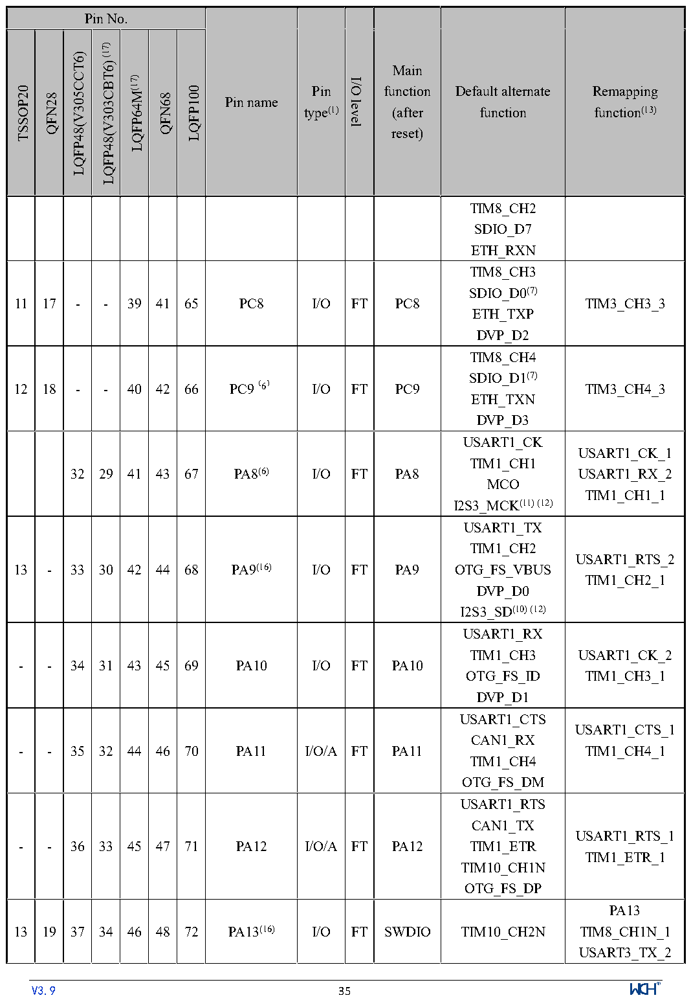

<!-- source-page: 37 -->

[← p.36](0036.md) · [index](../README.md) · [PDF p.37](https://ch32-riscv-ug.github.io/CH32V307/datasheet_en/CH32V20x_30xDS0.PDF#page=37) · [p.38 →](0038.md)

<!-- header: CH32V303/305/307/317 Datasheet http://wch-ic.com -->

 <!-- p37-cluster-01 uncaptioned graphics, rendered from the PDF; verify at https://ch32-riscv-ug.github.io/CH32V307/datasheet_en/CH32V20x_30xDS0.PDF#page=37 -->

🖼 Text parsed from the figure above

> ⬆ **Table continued** — rendered in full at [page 29](0029.md). <!-- p37-table-001 -->

<!-- image: p37-draw-image-00001 inside the figure -->
<!-- footer: V3.9 35 -->

