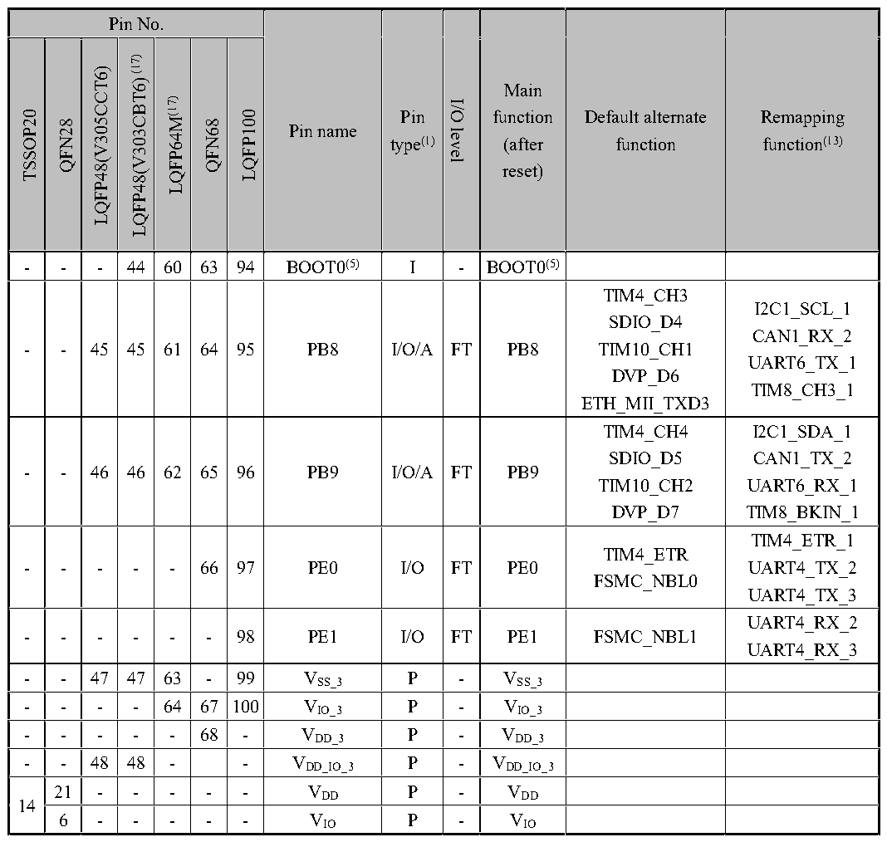

<!-- source-page: 40 -->

[← p.39](0039.md) · [index](../README.md) · [PDF p.40](https://ch32-riscv-ug.github.io/CH32V307/datasheet_en/CH32V20x_30xDS0.PDF#page=40) · [p.41 →](0041.md)

<!-- header: CH32V303/305/307/317 Datasheet http://wch-ic.com -->

 <!-- p40-cluster-01 uncaptioned graphics, rendered from the PDF; verify at https://ch32-riscv-ug.github.io/CH32V307/datasheet_en/CH32V20x_30xDS0.PDF#page=40 -->

🖼 Text parsed from the figure above

> ⬆ **Table continued** — rendered in full at [page 29](0029.md). <!-- p40-table-001 -->

6 - - - - - VIO P - VIO  

<em>Note 1: Abbreviations in the table</em>  
<em>I = TTL/CMOS Schmitt input;</em>  
<em>O = CMOS tri-state output;</em>  
<em>A = analog signal input or output;</em>  
<em>P = power;</em>  
<em>FT = 5V tolerance;</em>  
<em>ANT = RF signal input and output (antenna).</em>  
<em>Note 2: Both VDD and VBAT can be connected with an internal analog switch to supply power to the backup</em>  
<em>area and the pins PC13, PC14 and PC15. This analog switch can only pass a limited current (3mA). When</em>  
<em>powered by VDD, PC14 and PC15 can be used for GPIO or LSE pins, and PC13 can be used as a</em>  
<em>general-purpose I/O port, TAMPER pin, RTC calibration clock, RTC alarm clock or second output; PC13,</em>  
<em>PC14 and PC15 can only work in 2MHz mode when they are used as GPIO output pins, and the maximum</em>  
<em>driving load is 30pF, and they cannot be used as current sources (such as driving LEDs). When the power is</em>  
<em>supplied by VBAT, PC14 and PC15 can only be used for LSE pin, and PC13 can be used as TAMPER pin, RTC</em>  
<!-- image: p40-draw-image-00001 bbox=[501.72, 779.88, 523.44, 789.6] -->
<!-- footer: V3.9 38 -->
