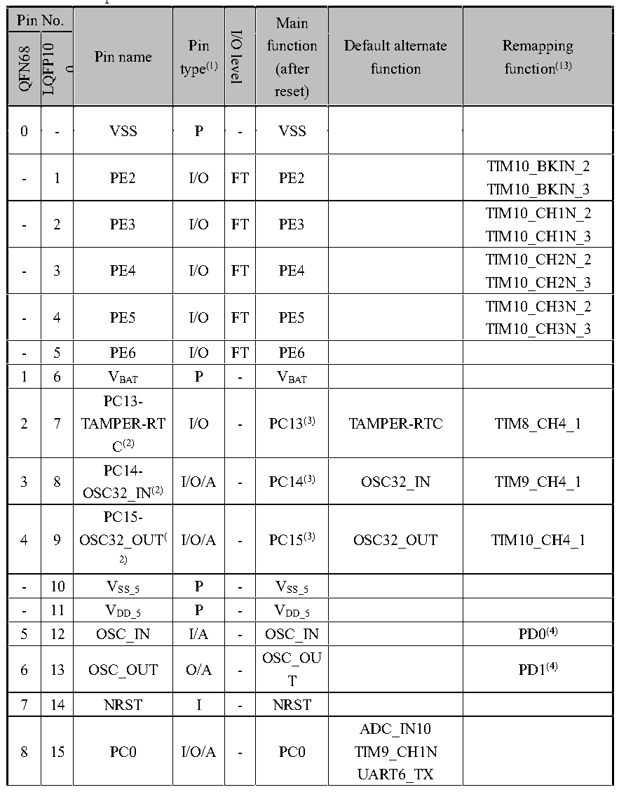

<!-- source-page: 42 -->

[← p.41](0041.md) · [index](../README.md) · [PDF p.42](https://ch32-riscv-ug.github.io/CH32V307/datasheet_en/CH32V20x_30xDS0.PDF#page=42) · [p.43 →](0043.md)

<!-- header: CH32V303/305/307/317 Datasheet http://wch-ic.com -->
<em>Note 13: The value after the underscore of the remap function indicates the configuration value of the</em>  
<em>corresponding bit in the AFIO register. For example, UART4_RX_3 indicates that the corresponding bit in</em>  
<em>the AFIO register is configured as 11b.</em>  
<em>Note 14: TIM2_CH1 and TIM2_ETR share a common pin, but cannot be used at the same time.</em>  
<em>Note 15 and Note 16: For CH32V305FBP6 chip, PA5 and PA1 pins are short-circuited inside the chip,</em>  
<em>prohibiting both IOs to be configured as output function; PA9 and PA13 pins are short-circuited inside the</em>  
<em>chip, prohibiting both IOs to be configured as output function; pay attention to the pin status if there is power</em>  
<em>consumption requirement.</em>  
<em>Note 17: The CH32V303CBT6 and CH32V303RBT6 chips do not support TIM8.</em>  

 <!-- p42-cluster-01 uncaptioned graphics, rendered from the PDF; verify at https://ch32-riscv-ug.github.io/CH32V307/datasheet_en/CH32V20x_30xDS0.PDF#page=42 -->

🖼 Text parsed from the figure above

<!-- p42-table-001 (table-3-2@1) pages 42-49 -->
<table><caption>Table 3-2 CH32V317 pin definitions</caption><tr><th colspan="3">Pin No.</th><th rowspan="2" style="text-align:left">Pin name 0</th><th rowspan="2" style="text-align:left">Pin type(1)</th><th rowspan="2">I/O level</th><th rowspan="2" style="text-align:left">Main function (after reset)</th><th rowspan="2" style="text-align:left">Default alternate function</th><th rowspan="2" style="text-align:left">Remapping function(13)</th></tr><tr><td>QFN68</td><td>LQFP10</td><td>0</td></tr><tr><td>0</td><td colspan="2">-</td><td>VSS</td><td>P</td><td>-</td><td>VSS</td><td></td><td></td></tr><tr><td>-</td><td colspan="2">1</td><td>PE2</td><td>I/O</td><td>FT</td><td>PE2</td><td></td><td style="text-align:left">TIM10_BKIN_2TIM10_BKIN_3</td></tr><tr><td>-</td><td colspan="2">2</td><td>PE3</td><td>I/O</td><td>FT</td><td>PE3</td><td></td><td style="text-align:left">TIM10_CH1N_2TIM10_CH1N_3</td></tr><tr><td>-</td><td colspan="2">3</td><td>PE4</td><td>I/O</td><td>FT</td><td>PE4</td><td></td><td style="text-align:left">TIM10_CH2N_2TIM10_CH2N_3</td></tr><tr><td>-</td><td colspan="2">4</td><td>PE5</td><td>I/O</td><td>FT</td><td>PE5</td><td></td><td style="text-align:left">TIM10_CH3N_2TIM10_CH3N_3</td></tr><tr><td>-</td><td colspan="2">5</td><td>PE6</td><td>I/O</td><td>FT</td><td>PE6</td><td></td><td></td></tr><tr><td>1</td><td colspan="2">6</td><td style="text-align:left">VBAT</td><td>P</td><td>-</td><td style="text-align:left">VBAT</td><td></td><td></td></tr><tr><td>2</td><td colspan="2">7</td><td style="text-align:left">PC13- TAMPER-RTC(2)</td><td>I/O</td><td>-</td><td>PC13(3)</td><td>TAMPER-RTC</td><td>TIM8_CH4_1</td></tr><tr><td>3</td><td colspan="2">8</td><td style="text-align:left">PC14- OSC32_IN(2)</td><td>I/O/A</td><td>-</td><td>PC14(3)</td><td>OSC32_IN</td><td>TIM9_CH4_1</td></tr><tr><td>4</td><td colspan="2">9</td><td style="text-align:left">PC15- OSC32_OUT( 2)</td><td>I/O/A</td><td>-</td><td>PC15(3)</td><td>OSC32_OUT</td><td>TIM10_CH4_1</td></tr><tr><td>-</td><td colspan="2">10</td><td style="text-align:left">VSS_5</td><td>P</td><td>-</td><td style="text-align:left">VSS_5</td><td></td><td></td></tr><tr><td>-</td><td colspan="2">11</td><td style="text-align:left">VDD_5</td><td>P</td><td>-</td><td style="text-align:left">VDD_5</td><td></td><td></td></tr><tr><td>5</td><td colspan="2">12</td><td>OSC_IN</td><td>I/A</td><td>-</td><td>OSC_IN</td><td></td><td>PD0(4)</td></tr><tr><td>6</td><td colspan="2">13</td><td>OSC_OUT</td><td>O/A</td><td>-</td><td style="text-align:left">OSC_OUT</td><td></td><td>PD1(4)</td></tr><tr><td>7</td><td colspan="2">14</td><td>NRST</td><td>I</td><td>-</td><td>NRST</td><td></td><td></td></tr><tr><td>8</td><td colspan="2">15</td><td>PC0</td><td>I/O/A</td><td>-</td><td>PC0</td><td style="text-align:left">ADC_IN10TIM9_CH1NUART6_TX</td><td></td></tr><tr><td colspan="3">Pin No.</td><td rowspan="2" style="text-align:left">Pin name 0</td><td rowspan="2" style="text-align:left">Pin type(1)</td><td rowspan="2">I/O level</td><td rowspan="2" style="text-align:left">Main function (after reset)</td><td rowspan="2" style="text-align:left">Default alternate function</td><td rowspan="2" style="text-align:left">Remapping function(13)</td></tr><tr><td>QFN68</td><td>LQFP10</td><td>0</td></tr><tr><td>9</td><td colspan="2">16</td><td>PC1</td><td>I/O/A</td><td>-</td><td>PC1</td><td style="text-align:left">ADC_IN11TIM9_CH2NUART6_RX</td><td></td></tr><tr><td>10</td><td colspan="2">17</td><td>PC2</td><td>I/O/A</td><td>-</td><td>PC2</td><td style="text-align:left">ADC_IN12TIM9_CH3NUART7_TXOPA3_CH1N</td><td></td></tr><tr><td>11</td><td colspan="2">18</td><td>PC3</td><td>I/O/A</td><td>-</td><td>PC3</td><td style="text-align:left">ADC_IN13TIM10_CH3UART7_RXOPA4_CH1N</td><td></td></tr><tr><td>12</td><td colspan="2">19</td><td style="text-align:left">VSSA</td><td>P</td><td>-</td><td style="text-align:left">VSSA</td><td></td><td></td></tr><tr><td>-</td><td colspan="2">20</td><td style="text-align:left">VREF-</td><td>P</td><td>-</td><td style="text-align:left">VREF-</td><td></td><td></td></tr><tr><td>-</td><td colspan="2">21</td><td style="text-align:left">VREF+</td><td>P</td><td>-</td><td style="text-align:left">VREF+</td><td></td><td></td></tr><tr><td>13</td><td colspan="2">22</td><td style="text-align:left">VDDA</td><td>P</td><td>-</td><td style="text-align:left">VDDA</td><td></td><td></td></tr><tr><td>14</td><td colspan="2">23</td><td>PA0-WKUP</td><td>I/O/A</td><td>-</td><td>PA0</td><td style="text-align:left">WKUPUSART2_CTSADC_IN0TIM2_CH1(11) TIM2_ETR(11) TIM5_CH1TIM8_ETROPA4_OUT0</td><td style="text-align:left">TIM2_CH1_2(11) TIM2_ETR_2(11) TIM8_ETR_1</td></tr><tr><td>15</td><td colspan="2">24</td><td>PA1</td><td>I/O/A</td><td>-</td><td>PA1</td><td style="text-align:left">USART2_RTSADC_IN1TIM5_CH2TIM2_CH2OPA3_OUT0</td><td style="text-align:left">TIM2_CH2_2TIM9_BKIN_1</td></tr><tr><td>16</td><td colspan="2">25</td><td>PA2</td><td>I/O/A</td><td>-</td><td>PA2</td><td style="text-align:left">USART2_TXTIM5_CH3ADC_IN2TIM2_CH3TIM9_CH1TIM9_ETROPA2_OUT0</td><td style="text-align:left">TIM2_CH3_1TIM9_CH1_1TIM9_ETR_1</td></tr><tr><td>17</td><td colspan="2">26</td><td>PA3</td><td>I/O/A</td><td>-</td><td>PA3</td><td style="text-align:left">USART2_RXTIM5_CH4ADC_IN3TIM2_CH4TIM9_CH2</td><td style="text-align:left">TIM2_CH4_1TIM9_CH2_1</td></tr><tr><td colspan="3">Pin No.</td><td rowspan="2" style="text-align:left">Pin name 0</td><td rowspan="2" style="text-align:left">Pin type(1)</td><td rowspan="2">I/O level</td><td rowspan="2" style="text-align:left">Main function (after reset)</td><td rowspan="2" style="text-align:left">Default alternate function</td><td rowspan="2" style="text-align:left">Remapping function(13)</td></tr><tr><td>QFN68</td><td>LQFP10</td><td>0</td></tr><tr><td></td><td colspan="2"></td><td></td><td></td><td></td><td></td><td>OPA1_OUT0</td><td></td></tr><tr><td>-</td><td colspan="2">27</td><td style="text-align:left">VSS_4</td><td>P</td><td>-</td><td style="text-align:left">VSS_4</td><td></td><td></td></tr><tr><td>18</td><td colspan="2">28</td><td style="text-align:left">VIO_4</td><td>P</td><td>-</td><td style="text-align:left">VIO_4</td><td></td><td></td></tr><tr><td>19</td><td colspan="2">29</td><td>PA4</td><td>I/O/A</td><td>-</td><td>PA4</td><td style="text-align:left">SPI1_NSSUSART2_CKADC_IN4DAC1_OUTTIM9_CH3DVP_HSYNC</td><td style="text-align:left">SPI3_NSS_1I2S3_WS_1TIM9_CH3_1</td></tr><tr><td>20</td><td colspan="2">30</td><td>PA5</td><td>I/O/A</td><td>-</td><td>PA5</td><td style="text-align:left">SPI1_SCKADC_IN5DAC2_OUTOPA2_CH1NDVP_VSYNC</td><td style="text-align:left">TIM10_CH1N_1USART1_CTS_2USART1_CK_3</td></tr><tr><td>21</td><td colspan="2">31</td><td>PA6</td><td>I/O/A</td><td>-</td><td>PA6</td><td style="text-align:left">SPI1_MISOTIM8_BKINADC_IN6TIM3_CH1OPA1_CH1NDVP_PCLK</td><td style="text-align:left">TIM1_BKIN_1USART1_TX_3UART7_TX_1TIM10_CH2N_1</td></tr><tr><td>22</td><td colspan="2">32</td><td>PA7</td><td>I/O/A</td><td>-</td><td>PA7</td><td style="text-align:left">SPI1_MOSITIM8_CH1NADC_IN7TIM3_CH2OPA2_CH1P</td><td style="text-align:left">TIM1_CH1N_1USART1_RX_3UART7_RX_1TIM10_CH3N_1</td></tr><tr><td>23</td><td colspan="2">33</td><td>PC4</td><td>I/O/A</td><td>-</td><td>PC4</td><td style="text-align:left">ADC_IN14TIM9_CH4UART8_TXOPA4_CH1P</td><td>USART1_CTS_3</td></tr><tr><td>24</td><td colspan="2">34</td><td>PC5</td><td>I/O/A</td><td>-</td><td>PC5</td><td style="text-align:left">ADC_IN15TIM9_BKINUART8_RXOPA3_CH1P</td><td>USART1_RTS_3</td></tr><tr><td>25</td><td colspan="2">35</td><td>PB0</td><td>I/O/A</td><td>-</td><td>PB0</td><td style="text-align:left">ADC_IN8TIM3_CH3TIM8_CH2NOPA1_CH1P</td><td style="text-align:left">TIM1_CH2N_1TIM3_CH3_2TIM9_CH1N_1UART4_TX_1</td></tr><tr><td>26</td><td colspan="2">36</td><td>PB1</td><td>I/O/A</td><td>-</td><td>PB1</td><td style="text-align:left">ADC_IN9TIM3_CH4TIM8_CH3N</td><td style="text-align:left">TIM1_CH3N_1TIM3_CH4_2TIM9_CH2N_1</td></tr><tr><td colspan="3">Pin No.</td><td rowspan="2" style="text-align:left">Pin name 0</td><td rowspan="2" style="text-align:left">Pin type(1)</td><td rowspan="2">I/O level</td><td rowspan="2" style="text-align:left">Main function (after reset)</td><td rowspan="2" style="text-align:left">Default alternate function</td><td rowspan="2" style="text-align:left">Remapping function(13)</td></tr><tr><td>QFN68</td><td>LQFP10</td><td>0</td></tr><tr><td></td><td colspan="2"></td><td></td><td></td><td></td><td></td><td>OPA4_CH0N</td><td>UART4_RX_1</td></tr><tr><td>27</td><td colspan="2">37</td><td>PB2(5)</td><td>I/O</td><td>FT</td><td style="text-align:left">PB2BOOT1(5)</td><td>OPA3_CH0N</td><td>TIM9_CH3N_1</td></tr><tr><td>28</td><td colspan="2">38</td><td>LED0</td><td>I/O</td><td>-</td><td>LED0</td><td></td><td></td></tr><tr><td>29</td><td colspan="2">39</td><td>LED1</td><td>I/O</td><td>-</td><td>LED1</td><td></td><td></td></tr><tr><td>30</td><td colspan="2">40</td><td style="text-align:left">VDDK</td><td>P</td><td>-</td><td style="text-align:left">VDDK</td><td></td><td></td></tr><tr><td>-</td><td colspan="2">41</td><td style="text-align:left">VSS_6</td><td>P</td><td>-</td><td style="text-align:left">VSS_6</td><td></td><td></td></tr><tr><td>31</td><td colspan="2">42</td><td>MDITP(12)</td><td>I/O</td><td>-</td><td>MDITP</td><td></td><td></td></tr><tr><td>32</td><td colspan="2">43</td><td>MDITN(12)</td><td>I/O</td><td>-</td><td>MDITN</td><td></td><td></td></tr><tr><td>33</td><td colspan="2">44</td><td>MDIRP(12)</td><td>I/O</td><td>-</td><td>MDIRP</td><td></td><td></td></tr><tr><td>34</td><td colspan="2">45</td><td>MDIRN(12)</td><td>I/O</td><td>-</td><td>MDIRN</td><td></td><td></td></tr><tr><td>35</td><td colspan="2">46</td><td style="text-align:left">VDD_ETH</td><td>P</td><td>-</td><td style="text-align:left">VDD_ETH</td><td></td><td></td></tr><tr><td>-</td><td colspan="2">47</td><td style="text-align:left">VSS_1</td><td>P</td><td>-</td><td style="text-align:left">VSS_1</td><td></td><td></td></tr><tr><td>36</td><td colspan="2">48</td><td style="text-align:left">VIO_1</td><td>P</td><td>-</td><td style="text-align:left">VIO_1</td><td></td><td></td></tr><tr><td>42</td><td colspan="2">49</td><td>PB10(6)</td><td>I/O/A</td><td>FT</td><td>PB10</td><td style="text-align:left">I2C2_SCLUSART3_TXOPA2_CH0N</td><td style="text-align:left">TIM2_CH3_2TIM2_CH3_3TIM10_BKIN_1</td></tr><tr><td>41</td><td colspan="2">50</td><td>PB11(7)</td><td>I/O/A</td><td>FT</td><td>PB11</td><td style="text-align:left">I2C2_SDAUSART3_RXOPA1_CH0N</td><td style="text-align:left">TIM2_CH4_2TIM2_CH4_3TIM10_ETR_1</td></tr><tr><td>-</td><td colspan="2">51</td><td style="text-align:left">VDD_1</td><td>P</td><td></td><td style="text-align:left">VDD_1</td><td></td><td></td></tr><tr><td>37</td><td colspan="2">52</td><td>PB12</td><td>I/O/A</td><td>FT</td><td>PB12</td><td style="text-align:left">SPI2_NSSI2S2_WSI2C2_SMBAUSART3_CKTIM1_BKINOPA4_CH0PCAN2_RX</td><td></td></tr><tr><td>38</td><td colspan="2">53</td><td>PB13</td><td>I/O/A</td><td>FT</td><td>PB13</td><td style="text-align:left">SPI2_SCKI2S2_CKUSART3_CTSTIM1_CH1NOPA3_CH0PCAN2_TX</td><td>USART3_CTS_1</td></tr><tr><td>39</td><td colspan="2">54</td><td>PB14</td><td>I/O/A</td><td>FT</td><td>PB14</td><td style="text-align:left">SPI2_MISOTIM1_CH2NUSART3_RTSOPA2_CH0PSDIO_D0(8)</td><td>USART3_RTS_1</td></tr><tr><td>40</td><td colspan="2">55</td><td>PB15</td><td>I/O/A</td><td>FT</td><td>PB15</td><td>SPI2_MOSI</td><td>USART1_TX_2</td></tr><tr><td colspan="3">Pin No.</td><td rowspan="2" style="text-align:left">Pin name 0</td><td rowspan="2" style="text-align:left">Pin type(1)</td><td rowspan="2">I/O level</td><td rowspan="2" style="text-align:left">Main function (after reset)</td><td rowspan="2" style="text-align:left">Default alternate function</td><td rowspan="2" style="text-align:left">Remapping function(13)</td></tr><tr><td>QFN68</td><td>LQFP10</td><td>0</td></tr><tr><td></td><td colspan="2"></td><td></td><td></td><td></td><td></td><td style="text-align:left">I2S2_SDTIM1_CH3NOPA1_CH0PSDIO_D1(8)</td><td></td></tr><tr><td>-</td><td colspan="2">56</td><td>PD9</td><td>I/O</td><td>FT</td><td>PD9</td><td></td><td style="text-align:left">USART3_RX_3TIM9_CH1_2TIM9_ETR_2TIM9_CH1_3TIM9_ETR_3</td></tr><tr><td>-</td><td colspan="2">57</td><td>PD10</td><td>I/O</td><td>FT</td><td>PD10</td><td></td><td style="text-align:left">USART3_CK_2USART3_CK_3TIM9_CH2N_2TIM9_CH2N_3</td></tr><tr><td>-</td><td colspan="2">58</td><td>PD11</td><td>I/O</td><td>FT</td><td>PD11</td><td></td><td style="text-align:left">USART3_CTS_2USART3_CTS_3TIM9_CH2_2TIM9_CH2_3</td></tr><tr><td>-</td><td colspan="2">59</td><td>PD12</td><td>I/O</td><td>FT</td><td>PD12</td><td></td><td style="text-align:left">TIM4_CH1_1TIM9_CH3N_2TIM9_CH3N_3USART3_RTS_3USART3_RTS_2</td></tr><tr><td>-</td><td colspan="2">60</td><td>PD13</td><td>I/O</td><td>FT</td><td>PD13</td><td></td><td style="text-align:left">TIM4_CH2_1TIM9_CH3_2TIM9_CH3_3</td></tr><tr><td>41</td><td colspan="2">61</td><td>PD14（7）</td><td>I/O</td><td>FT</td><td>PD14</td><td></td><td style="text-align:left">TIM4_CH3_1TIM9_BKIN_2TIM9_BKIN_3</td></tr><tr><td>42</td><td colspan="2">62</td><td>PD15（6）</td><td>I/O</td><td>FT</td><td>PD15</td><td></td><td style="text-align:left">TIM4_CH4_1TIM9_CH4_2TIM9_CH4_3</td></tr><tr><td>-</td><td colspan="2">63</td><td>PC6</td><td>I/O</td><td>FT</td><td>PC6</td><td style="text-align:left">I2S2_MCKTIM8_CH1SDIO_D6</td><td>TIM3_CH1_3</td></tr><tr><td>-</td><td colspan="2">64</td><td>PC7</td><td>I/O</td><td>FT</td><td>PC7</td><td style="text-align:left">I2S3_MCKTIM8_CH2SDIO_D7</td><td>TIM3_CH2_3</td></tr><tr><td>-</td><td colspan="2">65</td><td>PC8</td><td>I/O</td><td>FT</td><td>PC8</td><td style="text-align:left">TIM8_CH3SDIO_D0（8） DVP_D2</td><td>TIM3_CH3_3</td></tr><tr><td colspan="3">Pin No.</td><td rowspan="2" style="text-align:left">Pin name 0</td><td rowspan="2" style="text-align:left">Pin type(1)</td><td rowspan="2">I/O level</td><td rowspan="2" style="text-align:left">Main function (after reset)</td><td rowspan="2" style="text-align:left">Default alternate function</td><td rowspan="2" style="text-align:left">Remapping function(13)</td></tr><tr><td>QFN68</td><td>LQFP10</td><td>0</td></tr><tr><td>-</td><td colspan="2">66</td><td>PC9</td><td>I/O</td><td>FT</td><td>PC9</td><td style="text-align:left">TIM8_CH4SDIO_D1（8） DVP_D3</td><td>TIM3_CH4_3</td></tr><tr><td>43</td><td colspan="2">67</td><td>PA8</td><td>I/O</td><td>FT</td><td>PA8</td><td style="text-align:left">USART1_CKTIM1_CH1MCO</td><td style="text-align:left">USART1_CK_1USART1_RX_2TIM1_CH1_1</td></tr><tr><td>44</td><td colspan="2">68</td><td>PA9</td><td>I/O</td><td>FT</td><td>PA9</td><td style="text-align:left">USART1_TXTIM1_CH2OTG_FS_VBUSDVP_D0</td><td style="text-align:left">USART1_RTS_2TIM1_CH2_1</td></tr><tr><td>45</td><td colspan="2">69</td><td>PA10</td><td>I/O</td><td>FT</td><td>PA10</td><td style="text-align:left">USART1_RXTIM1_CH3OTG_FS_IDDVP_D1</td><td style="text-align:left">USART1_CK_2TIM1_CH3_1</td></tr><tr><td>46</td><td colspan="2">70</td><td>PA11</td><td>I/O/A</td><td>FT</td><td>PA11</td><td style="text-align:left">USART1_CTSCAN1_RXTIM1_CH4OTG_FS_DM</td><td style="text-align:left">USART1_CTS_1TIM1_CH4_1</td></tr><tr><td>47</td><td colspan="2">71</td><td>PA12</td><td>I/O/A</td><td>FT</td><td>PA12</td><td style="text-align:left">USART1_RTSCAN1_TXTIM1_ETRTIM10_CH1NOTG_FS_DP</td><td style="text-align:left">USART1_RTS_1TIM1_ETR_1</td></tr><tr><td>48</td><td colspan="2">72</td><td>PA13</td><td>I/O</td><td>FT</td><td>SWDIO</td><td>TIM10_CH2N</td><td style="text-align:left">PA13TIM8_CH1N_1USART3_TX_2</td></tr><tr><td>-</td><td colspan="2">73</td><td>NC.</td><td></td><td></td><td></td><td></td><td></td></tr><tr><td>49</td><td colspan="2">74</td><td style="text-align:left">VSS_2</td><td>P</td><td>-</td><td style="text-align:left">VSS_2</td><td></td><td></td></tr><tr><td>50</td><td colspan="2">75</td><td style="text-align:left">VDD_2</td><td>P</td><td>-</td><td style="text-align:left">VDD_2</td><td></td><td></td></tr><tr><td>51</td><td colspan="2">-</td><td style="text-align:left">VIO_2</td><td>P</td><td>-</td><td style="text-align:left">VIO_2</td><td></td><td></td></tr><tr><td>52</td><td colspan="2">76</td><td>PA14</td><td>I/O</td><td>FT</td><td>SWCLK</td><td>TIM10_CH3N</td><td style="text-align:left">TIM8_CH2N_1UART8_TX_1USART3_RX_2</td></tr><tr><td>53</td><td colspan="2">77</td><td>PA15</td><td>I/O</td><td>FT</td><td>PA15</td><td style="text-align:left">SPI3_NSSI2S3_WS</td><td style="text-align:left">TIM2_CH1_1(11) TIM2_ETR_1(11) TIM2_CH1_3(11) TIM2_ETR_3(11) SPI1_NSS_1TIM8_CH3N_1UART8_RX_1</td></tr><tr><td colspan="3">Pin No.</td><td rowspan="2" style="text-align:left">Pin name 0</td><td rowspan="2" style="text-align:left">Pin type(1)</td><td rowspan="2">I/O level</td><td rowspan="2" style="text-align:left">Main function (after reset)</td><td rowspan="2" style="text-align:left">Default alternate function</td><td rowspan="2" style="text-align:left">Remapping function(13)</td></tr><tr><td>QFN68</td><td>LQFP10</td><td>0</td></tr><tr><td>54</td><td colspan="2">78</td><td>PC10</td><td>I/O</td><td>FT</td><td>PC10</td><td style="text-align:left">UART4_TXSDIO_D2TIM10_ETRDVP_D8</td><td style="text-align:left">USART3_TX_1SPI3_SCK_1I2S3_CK_1</td></tr><tr><td>55</td><td colspan="2">79</td><td>PC11</td><td>I/O</td><td>FT</td><td>PC11</td><td style="text-align:left">UART4_RXSDIO_D3TIM10_CH4DVP_D4</td><td style="text-align:left">USART3_RX_1SPI3_MISO_1</td></tr><tr><td>56</td><td colspan="2">80</td><td>PC12</td><td>I/O</td><td>FT</td><td>PC12</td><td style="text-align:left">UART5_TXSDIO_CKTIM10_BKINDVP_D9</td><td style="text-align:left">USART3_CK_1SPI3_MOSI_1I2S3_SD_1</td></tr><tr><td>-</td><td colspan="2">81</td><td>PD0</td><td>I/O/A</td><td>FT</td><td>PD0</td><td></td><td style="text-align:left">CAN1_RX_3TIM10_ETR_2TIM10_ETR_3</td></tr><tr><td>-</td><td colspan="2">82</td><td>PD1</td><td>I/O/A</td><td>FT</td><td>PD1</td><td></td><td style="text-align:left">CAN1_TX_3TIM10_CH1_2TIM10_CH1_3</td></tr><tr><td>57</td><td colspan="2">83</td><td>PD2</td><td>I/O</td><td>FT</td><td>PD2</td><td style="text-align:left">TIM3_ETRUART5_RXSDIO_CMDDVP_D11</td><td style="text-align:left">TIM3_ETR_2TIM3_ETR_3</td></tr><tr><td>-</td><td colspan="2">84</td><td>PD3</td><td>I/O</td><td>FT</td><td>PD3</td><td></td><td style="text-align:left">USART2_CTS_1TIM10_CH2_2TIM10_CH2_3</td></tr><tr><td>-</td><td colspan="2">85</td><td>PD4</td><td>I/O</td><td>FT</td><td>PD4</td><td></td><td>USART2_RTS_1</td></tr><tr><td>-</td><td colspan="2">86</td><td>PD5</td><td>I/O</td><td>FT</td><td>PD5</td><td></td><td style="text-align:left">USART2_TX_1TIM10_CH3_2TIM10_CH3_3</td></tr><tr><td>-</td><td colspan="2">87</td><td>PD6</td><td>I/O</td><td>FT</td><td>PD6</td><td>DVP_D10</td><td>USART2_RX_1</td></tr><tr><td>-</td><td colspan="2">88</td><td>PD7</td><td>I/O</td><td>FT</td><td>PD7</td><td></td><td style="text-align:left">USART2_CK_1TIM10_CH4_2TIM10_CH4_3</td></tr><tr><td>58</td><td colspan="2">89</td><td>PB3</td><td>I/O</td><td>FT</td><td>PB3</td><td style="text-align:left">SPI3_SCKI2S3_CKDVP_D5(9)</td><td style="text-align:left">TIM2_CH2_1TIM2_CH2_3SPI1_SCK_1TIM10_CH1_1</td></tr><tr><td>59</td><td colspan="2">90</td><td>PB4</td><td>I/O</td><td>FT</td><td>PB4</td><td>SPI3_MISO</td><td style="text-align:left">TIM3_CH1_2SPI1_MISO_1</td></tr><tr><td colspan="3">Pin No.</td><td rowspan="2" style="text-align:left">Pin name 0</td><td rowspan="2" style="text-align:left">Pin type(1)</td><td rowspan="2">I/O level</td><td rowspan="2" style="text-align:left">Main function (after reset)</td><td rowspan="2" style="text-align:left">Default alternate function</td><td rowspan="2" style="text-align:left">Remapping function(13)</td></tr><tr><td>QFN68</td><td>LQFP10</td><td>0</td></tr><tr><td></td><td colspan="2"></td><td></td><td></td><td></td><td></td><td></td><td style="text-align:left">UART5_TX_1TIM10_CH2_1</td></tr><tr><td>60</td><td colspan="2">91</td><td>PB5</td><td>I/O</td><td>FT</td><td>PB5</td><td style="text-align:left">I2C1_SMBASPI3_MOSII2S3_SD</td><td style="text-align:left">TIM3_CH2_2SPI1_MOSI_1CAN2_RX_1TIM10_CH3_1UART5_RX_1</td></tr><tr><td>61</td><td colspan="2">92</td><td>PB6</td><td>I/O</td><td>FT</td><td>PB6</td><td style="text-align:left">I2C1_SCLTIM4_CH1DVP_D5(9) USBHS_DM</td><td style="text-align:left">USART1_TX_1CAN2_TX_1TIM8_CH1_1</td></tr><tr><td>62</td><td colspan="2">93</td><td>PB7</td><td>I/O</td><td>FT</td><td>PB7</td><td style="text-align:left">I2C1_SDATIM4_CH2USBHS_DP</td><td style="text-align:left">USART1_RX_1TIM8_CH2_1</td></tr><tr><td>63</td><td colspan="2">94</td><td>BOOT0(5)</td><td>I</td><td>-</td><td>BOOT0(5)</td><td></td><td></td></tr><tr><td>64</td><td colspan="2">95</td><td>PB8</td><td>I/O/A</td><td>FT</td><td>PB8</td><td style="text-align:left">TIM4_CH3SDIO_D4TIM10_CH1DVP_D6</td><td style="text-align:left">I2C1_SCL_1CAN1_RX_2UART6_TX_1TIM8_CH3_1</td></tr><tr><td>65</td><td colspan="2">96</td><td>PB9</td><td>I/O/A</td><td>FT</td><td>PB9</td><td style="text-align:left">TIM4_CH4SDIO_D5TIM10_CH2DVP_D7</td><td style="text-align:left">I2C1_SDA_1CAN1_TX_2UART6_RX_1TIM8_BKIN_1</td></tr><tr><td>66</td><td colspan="2">97</td><td>PE0</td><td>I/O</td><td>FT</td><td>PE0</td><td>TIM4_ETR</td><td style="text-align:left">TIM4_ETR_1UART4_TX_2UART4_TX_3</td></tr><tr><td>-</td><td colspan="2">98</td><td>PE1</td><td>I/O</td><td>FT</td><td>PE1</td><td></td><td style="text-align:left">UART4_RX_2UART4_RX_3</td></tr><tr><td>-</td><td colspan="2">99</td><td style="text-align:left">VSS_3</td><td>P</td><td>-</td><td style="text-align:left">VSS_3</td><td></td><td></td></tr><tr><td>67</td><td colspan="2">100</td><td style="text-align:left">VIO_3</td><td>P</td><td>-</td><td style="text-align:left">VIO_3</td><td></td><td></td></tr><tr><td>68</td><td colspan="2">-</td><td style="text-align:left">VDD_3</td><td>P</td><td>-</td><td style="text-align:left">VDD_3</td><td></td><td></td></tr></table>

1 6 VBAT P - VBAT  

<!-- image: p42-draw-image-00001 bbox=[501.72, 779.88, 523.44, 789.6] -->
<!-- footer: V3.9 40 -->
