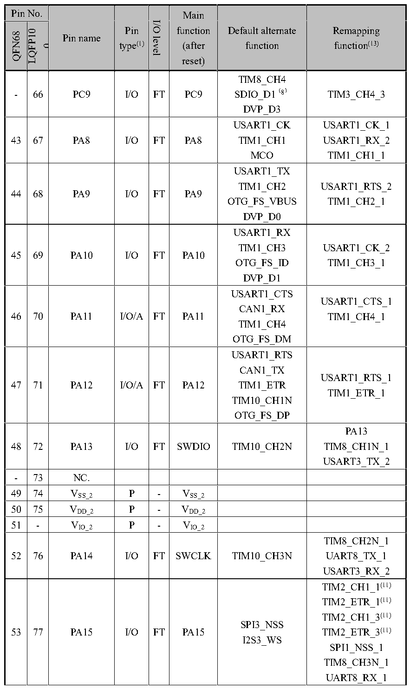

<!-- source-page: 47 -->

[← p.46](0046.md) · [index](../README.md) · [PDF p.47](https://ch32-riscv-ug.github.io/CH32V307/datasheet_en/CH32V20x_30xDS0.PDF#page=47) · [p.48 →](0048.md)

<!-- header: CH32V303/305/307/317 Datasheet http://wch-ic.com -->

 <!-- p47-cluster-01 uncaptioned graphics, rendered from the PDF; verify at https://ch32-riscv-ug.github.io/CH32V307/datasheet_en/CH32V20x_30xDS0.PDF#page=47 -->

🖼 Text parsed from the figure above

> ⬆ **Table continued** — rendered in full at [page 42](0042.md). <!-- p47-table-001 -->

<!-- image: p47-draw-image-00001 bbox=[501.72, 779.88, 523.44, 789.6] -->
<!-- footer: V3.9 45 -->
