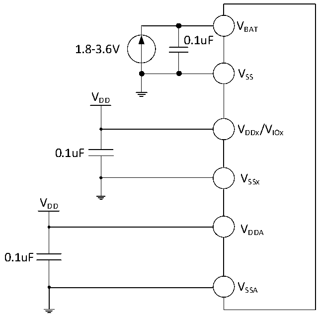

<!-- source-page: 57 -->

[← p.56](0056.md) · [index](../README.md) · [PDF p.57](https://ch32-riscv-ug.github.io/CH32V307/datasheet_en/CH32V20x_30xDS0.PDF#page=57) · [p.58 →](0058.md)

<!-- header: CH32V303/305/307/317 Datasheet https://wch-ic.com -->

# Chapter 4 Electrical Characteristics

## 4.1 Test Conditions

Unless otherwise specified and marked, all voltages are referenced to VSS.  
All minimum and maximum values are guaranteed in the worst conditions of ambient temperature, supply voltage  
and clock frequency.  
The typical values of CH32V303/305/307 are based on the ambient temperature of 25℃ and VDD= 3.3V for  
design guidance.  
The typical value of CH32V317 is based on the ambient temperature of 25℃, VDD = 3.3V and VDD_ETH= 3.3V  
for design guidance.  
The data based on comprehensive evaluation, design simulation or technology characteristics are not tested in  
production. On the basis of comprehensive evaluation, the minimum and maximum values refer to sample tests.  
Unless otherwise specified that is tested, the characteristic parameters are guaranteed by comprehensive evaluation  
or design.  
Power supply scheme:  

Figure 4-1-1 CH32V303/305/307 typical circuit for conventional power supply  
 <!-- rendered from the PDF; verify at https://ch32-riscv-ug.github.io/CH32V307/datasheet_en/CH32V20x_30xDS0.PDF#page=57 -->

🖼 Text parsed from the figure above

VBAT  
0.1uF  
1.8-3.6V  
VSS  
VDD  
VDDx/VIOx  
0.1uF  
VSSx  
VDD  
VDDA  
0.1uF  
VSSA  

<!-- image: p57-draw-image-00001 bbox=[499.8, 777.6, 522.36, 789.6] -->
<!-- footer: V3.9 55 -->
