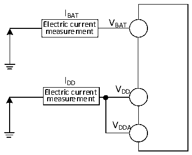
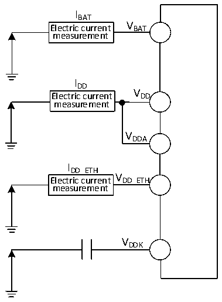

<!-- source-page: 62 -->

[← p.61](0061.md) · [index](../README.md) · [PDF p.62](https://ch32-riscv-ug.github.io/CH32V307/datasheet_en/CH32V20x_30xDS0.PDF#page=62) · [p.63 →](0063.md)

<!-- header: CH32V303/305/307/317 Datasheet https://wch-ic.com -->

### 4.3.4 Supply Current Characteristics

Current consumption is a comprehensive index of a variety of parameters and factors. These parameters and  
factors include operating voltage, ambient temperature, I/O pin load, the software configuration of the  
product, the operating frequency, flip rate of the I/O pin, the location of the program in memory and the  
executed code, etc. The current consumption measurement method is as follows:  

Figure 4-2-1 CH32V303/305/307 current consumption measurement  
 <!-- rendered from the PDF; verify at https://ch32-riscv-ug.github.io/CH32V307/datasheet_en/CH32V20x_30xDS0.PDF#page=62 -->

🖼 Text parsed from the figure above

IBAT  
Electric current V BAT  
measurement  
IDD  
V  
Electric current DD  
measurement  
VDDA  

Figure 4-2-2 CH32V317 current consumption measurement  
 <!-- rendered from the PDF; verify at https://ch32-riscv-ug.github.io/CH32V307/datasheet_en/CH32V20x_30xDS0.PDF#page=62 -->

🖼 Text parsed from the figure above

IBAT  
Electric current V BAT  
measurement  
IDD  
V  
Electric current DD  
measurement  
VDDA  
IDD_ETH  
V  
Electric current DD_ETH  
measurement  
VDDK  

CH32V303/305/307 is in the following conditions:  
Under normal temperature conditions and when VDD= 3.3V, all I/O ports are configured with pull-down  
inputs, only one of HSE and HIS is enabled, HSE=8M, HIS=8M (calibrated), FPLCK1=FHCLK/2, FPLCK2=FHCLK,  
PLL is enabled when FHCLK&gt;8MHz. Enable or disable the power consumption of all peripheral clocks.  
CH32V317 is in the following conditions:  
Under normal temperature conditions and when VDD= 3.3V, VDD_ETH= 3.3V all I/O ports are configured with  
pull-down inputs, only one of HSE and HIS is enabled, HSE=8M, HIS=8M (calibrated), FPLCK1=FHCLK/2,  
FPLCK2=FHCLK, PLL is enabled when FHCLK&gt;8MHz. Enable or disable the power consumption of all  
<!-- image: p62-draw-image-00001 bbox=[499.8, 777.6, 522.36, 789.6] -->
<!-- footer: V3.9 60 -->
