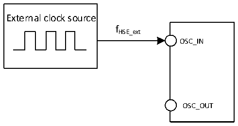

<!-- source-page: 65 -->

[← p.64](0064.md) · [index](../README.md) · [PDF p.65](https://ch32-riscv-ug.github.io/CH32V307/datasheet_en/CH32V20x_30xDS0.PDF#page=65) · [p.66 →](0066.md)

<!-- header: CH32V303/305/307/317 Datasheet https://wch-ic.com -->

> ⬆ **Table continued** — rendered in full at [page 64](0064.md). <!-- p65-table-001 -->

### 4.3.5 External Clock Source Characteristics

<!-- p65-table-002 (table-4-10@1) -->
<table><caption>Table 4-10 From external high-speed clock</caption><tr><th>Symbol</th><th>Parameter</th><th>Condition</th><th>Min.</th><th>Typ.</th><th>Max.</th><th>Unit</th></tr><tr><td style="text-align:left">FHSE_ext</td><td>External clock frequency</td><td></td><td>3</td><td>8</td><td>25</td><td>MHz</td></tr><tr><td style="text-align:left">V (1) HSEH</td><td style="text-align:left">OSC_IN input pin high level voltage</td><td></td><td style="text-align:left">0.8*VIO</td><td></td><td style="text-align:left">VI/O</td><td>V</td></tr><tr><td style="text-align:left">V (1) HSEL</td><td style="text-align:left">OSC_IN input pin low-level voltage</td><td></td><td>0</td><td></td><td style="text-align:left">0.2*VIO</td><td>V</td></tr><tr><td style="text-align:left">C in(HSE)</td><td>OSC_IN input capacitance</td><td></td><td></td><td>5</td><td></td><td>pF</td></tr><tr><td style="text-align:left">DuCy HSE</td><td>Duty cycle</td><td></td><td></td><td>50</td><td></td><td>%</td></tr><tr><td style="text-align:left">IL</td><td>OSC_IN input leakage current</td><td></td><td></td><td></td><td>±1</td><td>uA</td></tr></table>

<em>Note: 1. Failure to meet this condition may cause level recognition error.</em>  

Figure 4-3 External high-frequency clock source circuit  
 <!-- rendered from the PDF; verify at https://ch32-riscv-ug.github.io/CH32V307/datasheet_en/CH32V20x_30xDS0.PDF#page=65 -->

🖼 Text parsed from the figure above

External clock source  
fHSE_ext  
OSC_IN  
OSC_OUT  

<!-- p65-table-003 (table-4-11@1) pages 65-66 -->
<table><caption>Table 4-11 From external low-speed clock</caption><tr><th>Symbol</th><th>Parameter</th><th>Condition</th><th>Min.</th><th>Typ.</th><th>Max.</th><th>Unit</th></tr><tr><td style="text-align:left">FLSE_ext</td><td>User external clock frequency</td><td></td><td></td><td>32.768</td><td>1000</td><td>kHz</td></tr><tr><td style="text-align:left">VLSEH</td><td style="text-align:left">OSC32_IN input pin high level voltage</td><td></td><td style="text-align:left">0.8VDD</td><td></td><td style="text-align:left">VDD</td><td>V</td></tr><tr><td style="text-align:left">VLSEL</td><td>OSC32_IN input pin low voltage</td><td></td><td>0</td><td></td><td style="text-align:left">0.2VDD</td><td>V</td></tr><tr><td style="text-align:left">C in(LSE)</td><td>OSC32_IN input capacitance</td><td></td><td></td><td>5</td><td></td><td>pF</td></tr><tr><td style="text-align:left">DuCy (LSE)</td><td>Duty cycle</td><td></td><td></td><td>50</td><td></td><td>%</td></tr><tr><td style="text-align:left">IL</td><td>OSC32_IN input leakage current</td><td></td><td></td><td></td><td>±1</td><td>uA</td></tr></table>

<!-- image: p65-draw-image-00001 bbox=[499.8, 777.6, 522.36, 789.6] -->
<!-- footer: V3.9 63 -->
