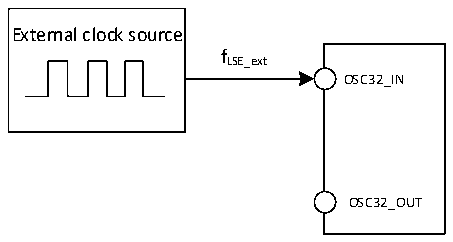

<!-- source-page: 66 -->

[← p.65](0065.md) · [index](../README.md) · [PDF p.66](https://ch32-riscv-ug.github.io/CH32V307/datasheet_en/CH32V20x_30xDS0.PDF#page=66) · [p.67 →](0067.md)

<!-- header: CH32V303/305/307/317 Datasheet https://wch-ic.com -->

> ⬆ **Table continued** — rendered in full at [page 65](0065.md). <!-- p66-table-001 -->

Figure 4-4 External low-frequency clock source circuit  
 <!-- rendered from the PDF; verify at https://ch32-riscv-ug.github.io/CH32V307/datasheet_en/CH32V20x_30xDS0.PDF#page=66 -->

🖼 Text parsed from the figure above

External clock source  
fLSE_ext  
OSC32_IN  
OSC32_OUT  

<!-- p66-table-002 (table-4-12@1) -->
<table><caption>Table 4-12 High-speed external clock generated from a crystal/ceramic resonator</caption><tr><th>Symbol</th><th>Parameter</th><th>Condition</th><th>Min.</th><th>Typ.</th><th>Max.</th><th>Unit</th></tr><tr><td style="text-align:left">FOSC_IN</td><td>Resonator frequency</td><td></td><td>3</td><td>8</td><td>25</td><td>MHz</td></tr><tr><td style="text-align:left">RF</td><td>Feedback resistance</td><td></td><td></td><td>250</td><td></td><td>kΩ</td></tr><tr><td>C</td><td style="text-align:left">Recommended load capacitance and corresponding crystal series impedance RS</td><td style="text-align:left">R =60Ω(1) S</td><td></td><td>20</td><td></td><td>pF</td></tr><tr><td style="text-align:left">I2</td><td>HSE drive current</td><td></td><td></td><td>0.53</td><td></td><td>mA</td></tr><tr><td style="text-align:left">g m</td><td>Oscillator transconductance</td><td>Startup</td><td></td><td>17</td><td></td><td>mA/V</td></tr><tr><td style="text-align:left">t SU(HSE)</td><td>Startup time</td><td style="text-align:left">V is stable, 8M crystal DD</td><td></td><td>1.5(2)</td><td>4</td><td>ms</td></tr></table>

<em>Note: 1. It is recommended that the crystal ESR does not exceed 80 ohms. Prioritize crystals with lower ESR</em>  
<em>values. Refer to the crystal manual for load capacitance requirements.</em>  
<em>2. The startup time refers to the time difference between HSEON being enabled and HSERDY being set.</em>  
<em>3. For CH32V317 chip, the crystal frequency deviation is recommended to be within ±40ppm.</em>  
Circuit reference design and requirements:  
The load capacitance of the crystal is subject to the recommendation of the crystal manufacturer, CL1=CL2.  
<!-- image: p66-draw-image-00001 bbox=[499.8, 777.6, 522.36, 789.6] -->
<!-- footer: V3.9 64 -->
