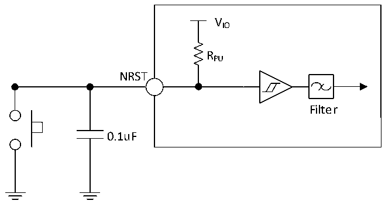

<!-- source-page: 72 -->

[← p.71](0071.md) · [index](../README.md) · [PDF p.72](https://ch32-riscv-ug.github.io/CH32V307/datasheet_en/CH32V20x_30xDS0.PDF#page=72) · [p.73 →](0073.md)

<!-- header: CH32V303/305/307/317 Datasheet https://wch-ic.com -->

> ⬆ **Table continued** — rendered in full at [page 71](0071.md). <!-- p72-table-001 -->

<em>Note: 1. The pull-up resistor is a real resistor in series with a switchable PMOS implementation. The</em>  
<em>resistance of this PMOS switch is very small (approximately 10%).</em>  
Circuit reference design and requirements:  

Figure 4-7 Typical circuit of external reset pin  
 <!-- rendered from the PDF; verify at https://ch32-riscv-ug.github.io/CH32V307/datasheet_en/CH32V20x_30xDS0.PDF#page=72 -->

🖼 Text parsed from the figure above

VIO  
RPU  
NRST  
Filter  
0.1uF  

### 4.3.12 TIM Timer Characteristics

<!-- p72-table-003 (table-4-26@1) -->
<table><caption>Table 4-26 TIMx characteristics</caption><tr><th>Symbol</th><th>Parameter</th><th>Condition</th><th>Min.</th><th>Max.</th><th>Unit</th></tr><tr><td rowspan="2" style="text-align:left">t res(TIM)</td><td rowspan="2">Timer reference clock</td><td></td><td>1</td><td></td><td style="text-align:left">t TIMxCLK</td></tr><tr><td style="text-align:left">f = 72MHz TIMxCLK</td><td>13.9</td><td></td><td>ns</td></tr><tr><td rowspan="2" style="text-align:left">FEXT</td><td rowspan="2" style="text-align:left">Timer external clock frequency on CH1 to CH4</td><td></td><td>0</td><td style="text-align:left">f /2TIMxCLK</td><td>MHz</td></tr><tr><td style="text-align:left">f = 72MHz TIMxCLK</td><td>0</td><td>36</td><td>MHz</td></tr><tr><td style="text-align:left">R esTIM</td><td>Timer resolution</td><td></td><td></td><td>16</td><td>bit</td></tr><tr><td rowspan="2" style="text-align:left">t COUNTER</td><td rowspan="2" style="text-align:left">16-bit counter clock cycle when the internal clock is selected</td><td></td><td>1</td><td>65536</td><td style="text-align:left">t TIMxCLK</td></tr><tr><td style="text-align:left">f = 72MHz TIMxCLK</td><td>0.0139</td><td>910</td><td>us</td></tr><tr><td rowspan="2" style="text-align:left">t MAX_COUNT</td><td rowspan="2">Maximum possible count</td><td></td><td></td><td>65536</td><td style="text-align:left">t TIMxCLK</td></tr><tr><td style="text-align:left">f = 72MHz TIMxCLK</td><td></td><td>59.6</td><td>s</td></tr></table>

<!-- image: p72-draw-image-00001 bbox=[499.8, 777.6, 522.36, 789.6] -->
<!-- footer: V3.9 70 -->
