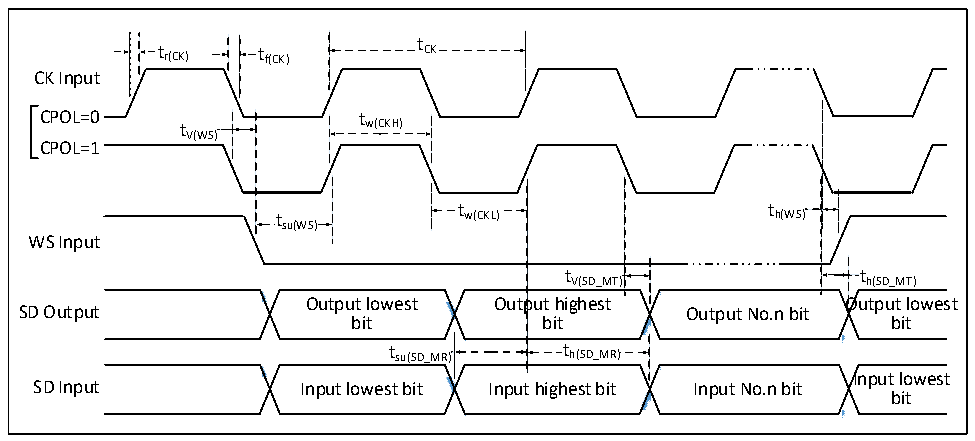
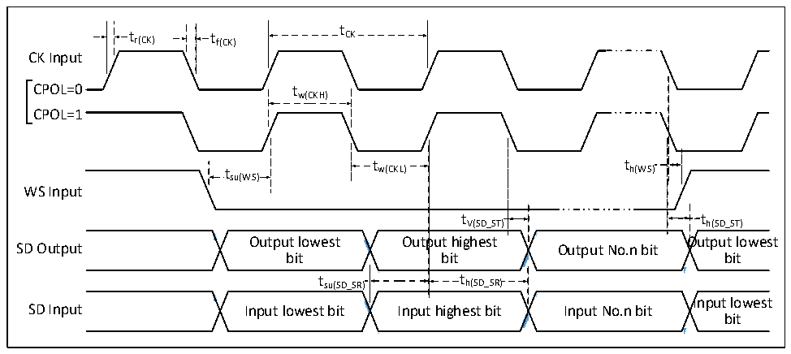

<!-- source-page: 76 -->

[← p.75](0075.md) · [index](../README.md) · [PDF p.76](https://ch32-riscv-ug.github.io/CH32V307/datasheet_en/CH32V20x_30xDS0.PDF#page=76) · [p.77 →](0077.md)

<!-- header: CH32V303/305/307/317 Datasheet https://wch-ic.com -->

### 4.3.15 I2S Interface Characteristics

Figure 4-12 I2S master timing diagram  
 <!-- rendered from the PDF; verify at https://ch32-riscv-ug.github.io/CH32V307/datasheet_en/CH32V20x_30xDS0.PDF#page=76 -->

🖼 Text parsed from the figure above

t  
t r(CK) t f(CK) CK  
CK Input  
CPOL=0t tw(CKH)  
V(WS)  
CPOL=1  
t t  
t w(CKL) h(WS)  
su(WS)  
WS Input  
t  t V(SD_MT)  
tV(SD_MT) th(SD_MT)  
<!-- image: p76-draw-image-00002 inside the figure -->
<!-- image: p76-draw-image-00003 inside the figure -->
<!-- image: p76-draw-image-00004 inside the figure -->
<!-- image: p76-draw-image-00005 inside the figure -->
Output lowest Output highest Output lowest  
SD Output Output No.n bit  
bit bit bit  
t  t h(SD_MR)  t  th(SD_MR)  
t su(SD_MR) t h(SD_MR)  
<!-- image: p76-draw-image-00006 inside the figure -->
<!-- image: p76-draw-image-00007 inside the figure -->
<!-- image: p76-draw-image-00008 inside the figure -->
<!-- image: p76-draw-image-00009 inside the figure -->
Input lowest  
SD Input Input lowest bit Input highest bit Input No.n bit  
bit  

Figure 4-13 I2S slave timing diagram  
 <!-- rendered from the PDF; verify at https://ch32-riscv-ug.github.io/CH32V307/datasheet_en/CH32V20x_30xDS0.PDF#page=76 -->

🖼 Text parsed from the figure above

t  
t r(CK) t f(CK) CK  
CK Input  
CPOL=0 tw(CKH)  
CPOL=1  
t t  
t w(CKL) h(WS)  
su(WS)  
WS Input  
t V(SD_ST)  
tV(SD_ST) th(SD_ST)  
<!-- image: p76-draw-image-00010 inside the figure -->
<!-- image: p76-draw-image-00011 inside the figure -->
<!-- image: p76-draw-image-00012 inside the figure -->
<!-- image: p76-draw-image-00013 inside the figure -->
Output lowest Output highest Output lowest  
SD Output Output No.n bit  
bit bit bit  
t h(SD_SR)  th(SD_SR)  
t su(SD_SR) t h(SD_SR)  
<!-- image: p76-draw-image-00014 inside the figure -->
<!-- image: p76-draw-image-00015 inside the figure -->
<!-- image: p76-draw-image-00016 inside the figure -->
<!-- image: p76-draw-image-00017 inside the figure -->
Input lowest  
SD Input Input lowest bit Input highest bit Input No.n bit  
bit  

<!-- p76-table-005 (table-4-29@1) pages 76-77 -->
<table><caption>Table 4-29 I2S interface characteristics</caption><tr><th>Symbol</th><th>Parameter</th><th>Condition</th><th>Min.</th><th>Max.</th><th>Unit</th></tr><tr><td rowspan="2" style="text-align:left">f /t CK CK</td><td rowspan="2" style="text-align:left">M I²S clock frequency S</td><td>Master mode</td><td></td><td>8</td><td>MHz</td></tr><tr><td>Slave mode</td><td></td><td>8</td><td>MHz</td></tr><tr><td style="text-align:left">t /t r(CK) f(CK)</td><td>I²S clock rise and fall time</td><td>Load capacitance: C = 30pF</td><td></td><td>20</td><td>ns</td></tr><tr><td style="text-align:left">t V(WS)</td><td>WS valid time</td><td>Master mode</td><td></td><td>5</td><td>ns</td></tr><tr><td style="text-align:left">t SU(WS)</td><td>WS setup time</td><td>Slave mode</td><td>10</td><td></td><td>ns</td></tr><tr><td rowspan="2" style="text-align:left">t h(WS)</td><td rowspan="2" style="text-align:left">M WS hold time S</td><td>Master mode</td><td>0</td><td></td><td>ns</td></tr><tr><td>Slave mode</td><td>0</td><td></td><td>ns</td></tr><tr><td style="text-align:left">t /t w(CKH) w(CKL)</td><td>SCK high and low time</td><td style="text-align:left">Master mode, f = 36MHz, PCLK Prescaler factor =4</td><td>40</td><td>60</td><td>%</td></tr><tr><td rowspan="2" style="text-align:left">t SU(SD_MR) t SU(SD_SR)</td><td rowspan="2">Data input setup time</td><td>Master mode</td><td>8</td><td></td><td>ns</td></tr><tr><td>Slave mode</td><td>8</td><td></td><td>ns</td></tr><tr><td rowspan="2" style="text-align:left">t h(SD_MR) t h(SD_SR)</td><td rowspan="2">Data input hold time</td><td>Master mode</td><td>5</td><td></td><td>ns</td></tr><tr><td>Slave mode</td><td>4</td><td></td><td>ns</td></tr><tr><td style="text-align:left">t h(SD_MT)</td><td rowspan="2">Data output hold time</td><td>Master mode (After enable edge)</td><td></td><td>5</td><td>ns</td></tr><tr><td style="text-align:left">t h(SD_ST)</td><td>Slave mode (After enable edge)</td><td></td><td>5</td><td>ns</td></tr><tr><td style="text-align:left">t V(SD_MT)</td><td rowspan="2">Data output valid time</td><td>Master mode (After enable edge)</td><td></td><td>5</td><td>ns</td></tr><tr><td style="text-align:left">t v(SD_ST)</td><td>Slave mode (After enable edge)</td><td></td><td>4</td><td>ns</td></tr></table>

<!-- image: p76-draw-image-00001 bbox=[499.8, 777.6, 522.36, 789.6] -->
<!-- footer: V3.9 74 -->
