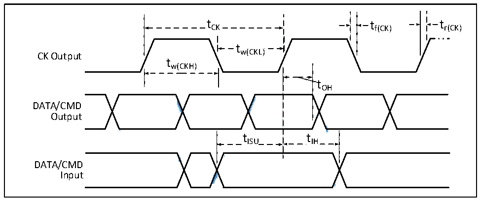

<!-- source-page: 77 -->

[← p.76](0076.md) · [index](../README.md) · [PDF p.77](https://ch32-riscv-ug.github.io/CH32V307/datasheet_en/CH32V20x_30xDS0.PDF#page=77) · [p.78 →](0078.md)

<!-- header: CH32V303/305/307/317 Datasheet https://wch-ic.com -->

> ⬆ **Table continued** — rendered in full at [page 76](0076.md). <!-- p77-table-001 -->

### 4.3.16 USB Interface Characteristics

<!-- p77-table-002 (table-4-30@1) -->
<table><caption>Table 4-30 USB characteristics</caption><tr><th>Symbol</th><th>Parameter</th><th>Condition</th><th>Min.</th><th>Max.</th><th>Unit</th></tr><tr><td style="text-align:left">VDD</td><td>USB operating voltage</td><td></td><td>3.0</td><td>3.6</td><td>V</td></tr><tr><td style="text-align:left">VSE</td><td style="text-align:left">Single-ended receiver threshold</td><td style="text-align:left">V = 3.3VDD</td><td>1.2</td><td>1.9</td><td>V</td></tr><tr><td style="text-align:left">VOL</td><td>Static output low level</td><td></td><td></td><td>0.3</td><td>V</td></tr><tr><td style="text-align:left">VOH</td><td>Static output high level</td><td></td><td>2.8</td><td>3.6</td><td>V</td></tr><tr><td style="text-align:left">VHSSQ</td><td style="text-align:left">High-speed suppression information detection threshold</td><td></td><td>100</td><td>150</td><td>mV</td></tr><tr><td style="text-align:left">VHSDSC</td><td style="text-align:left">High-speed disconnection detection threshold</td><td></td><td>500</td><td>625</td><td>mV</td></tr><tr><td style="text-align:left">VHSOI</td><td>High-speed idle level</td><td></td><td>-10</td><td>10</td><td>mV</td></tr><tr><td style="text-align:left">VHSOH</td><td>High-speed data high level</td><td></td><td>360</td><td>440</td><td>mV</td></tr><tr><td style="text-align:left">VHSOL</td><td>High-speed data low level</td><td></td><td>-10</td><td>10</td><td>mV</td></tr></table>

### 4.3.17 SD/MMC Interface Characteristics

Figure 4-14 SD high-speed timing diagram  
 <!-- rendered from the PDF; verify at https://ch32-riscv-ug.github.io/CH32V307/datasheet_en/CH32V20x_30xDS0.PDF#page=77 -->

🖼 Text parsed from the figure above

t CK  tCK  
tCK tf(CK) tr(CK)  
tw(CKL)  
CK Output  
tw(CKH)  
tOH  
<!-- image: p77-draw-image-00002 inside the figure -->
<!-- image: p77-draw-image-00003 inside the figure -->
<!-- image: p77-draw-image-00005 inside the figure -->
<!-- image: p77-draw-image-00004 inside the figure -->
<!-- image: p77-draw-image-00006 inside the figure -->
DATA/CMD  
Output  
tISU tIH  
<!-- image: p77-draw-image-00007 inside the figure -->
<!-- image: p77-draw-image-00009 inside the figure -->
<!-- image: p77-draw-image-00008 inside the figure -->
DATA/CMD  
Input  

<!-- image: p77-draw-image-00001 bbox=[499.8, 777.6, 522.36, 789.6] -->
<!-- footer: V3.9 75 -->
