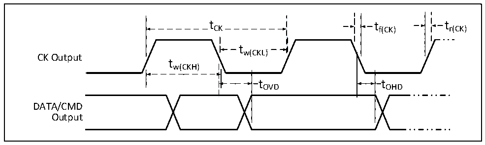

<!-- source-page: 78 -->

[← p.77](0077.md) · [index](../README.md) · [PDF p.78](https://ch32-riscv-ug.github.io/CH32V307/datasheet_en/CH32V20x_30xDS0.PDF#page=78) · [p.79 →](0079.md)

<!-- header: CH32V303/305/307/317 Datasheet https://wch-ic.com -->

Figure 4-15 SD default timing diagram  
 <!-- rendered from the PDF; verify at https://ch32-riscv-ug.github.io/CH32V307/datasheet_en/CH32V20x_30xDS0.PDF#page=78 -->

🖼 Text parsed from the figure above

t CK  tCK  
tCK tf(CK) tr(CK)  
tw(CKL)  
CK Output  
tw(CKH)  
t OHD  
tOVD tOHD  
DATA/CMD  
Output  

<!-- p78-table-004 (table-4-31@1) -->
<table><caption>Table 4-31 SD/MMC interface characteristics</caption><tr><th>Symbol</th><th>Parameter</th><th colspan="2">Condition</th><th>Min.</th><th>Max.</th><th>Unit</th></tr><tr><td style="text-align:left">f /t CK CK</td><td style="text-align:left">Clock frequency in data transfer mode</td><td colspan="2">CL≤30pF</td><td></td><td>48</td><td>MHz</td></tr><tr><td style="text-align:left">t W(CKL)</td><td>Clock low time</td><td colspan="2">CL≤30pF</td><td>6</td><td></td><td rowspan="4">ns</td></tr><tr><td style="text-align:left">t W(CKH)</td><td>Clock high time</td><td colspan="2">CL≤30pF</td><td>6</td><td></td></tr><tr><td style="text-align:left">t r(CK)</td><td>Rise Time</td><td colspan="2">CL≤30pF</td><td></td><td>4</td></tr><tr><td style="text-align:left">t f(CK)</td><td>Fall time</td><td colspan="2">CL≤30pF</td><td></td><td>4</td></tr><tr><td colspan="7">CMD/DAT input (refer to CK)</td></tr><tr><td style="text-align:left">t ISU</td><td>Input setup time</td><td colspan="2">CL≤30pF</td><td>7</td><td></td><td rowspan="2">ns</td></tr><tr><td style="text-align:left">t IH</td><td>Input hold time</td><td colspan="2">CL≤30pF</td><td>2</td><td></td></tr><tr><td colspan="7" style="text-align:left">CMD/DAT output in high-speed mode (refer to CK)</td></tr><tr><td rowspan="2" style="text-align:left">t OV</td><td rowspan="2">Output valid time</td><td rowspan="2">CL≤30pF</td><td>Master mode</td><td></td><td>5</td><td rowspan="3">ns</td></tr><tr><td>Slave mode</td><td></td><td>9</td></tr><tr><td style="text-align:left">t OH</td><td>Output hold time</td><td colspan="2">CL≤30pF</td><td>20</td><td></td></tr><tr><td colspan="7" style="text-align:left">CMD/DAT output in default mode (refer to CK)</td></tr><tr><td rowspan="2" style="text-align:left">t OVD</td><td rowspan="2">Output valid default time</td><td rowspan="2">CL≤30pF</td><td>Master mode</td><td></td><td>8</td><td rowspan="3">ns</td></tr><tr><td>Slave mode</td><td></td><td>14</td></tr><tr><td style="text-align:left">t OHD</td><td>Output hold default time</td><td colspan="2">CL≤30pF</td><td>20</td><td></td></tr></table>

<!-- image: p78-draw-image-00001 bbox=[499.8, 777.6, 522.36, 789.6] -->
<!-- footer: V3.9 76 -->
