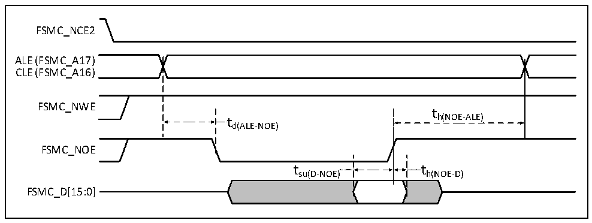
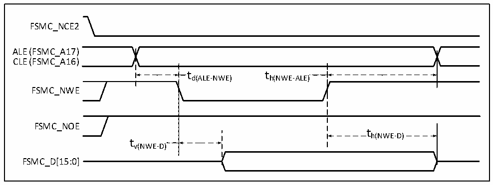
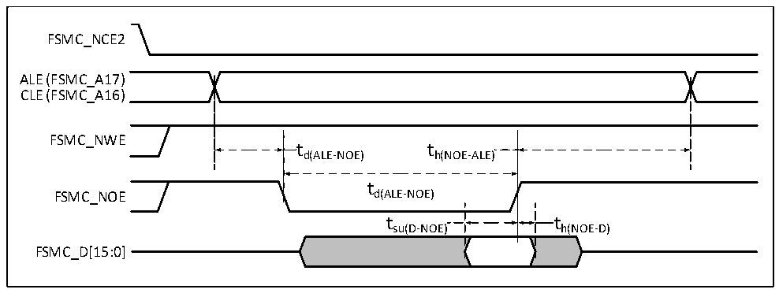

<!-- source-page: 83 -->

[← p.82](0082.md) · [index](../README.md) · [PDF p.83](https://ch32-riscv-ug.github.io/CH32V307/datasheet_en/CH32V20x_30xDS0.PDF#page=83) · [p.84 →](0084.md)

<!-- header: CH32V303/305/307/317 Datasheet https://wch-ic.com -->

Figure 4-20 NAND controller read waveform  
 <!-- rendered from the PDF; verify at https://ch32-riscv-ug.github.io/CH32V307/datasheet_en/CH32V20x_30xDS0.PDF#page=83 -->

🖼 Text parsed from the figure above

FSMC_NCE2  
ALE (FSMC_A17)  
CLE (FSMC_A16)  
FSMC_NWE  
t  
t h(NOE-ALE)  
d(ALE-NOE)  
FSMC_NOE  
t su(D-NOE)  )  t h(NOE-D)  )  
FSMC_D[15:0]  

Figure 4-21 NAND controller write waveform  
 <!-- rendered from the PDF; verify at https://ch32-riscv-ug.github.io/CH32V307/datasheet_en/CH32V20x_30xDS0.PDF#page=83 -->

🖼 Text parsed from the figure above

FSMC_NCE2  
ALE (FSMC_A17)  
CLE (FSMC_A16)  
t  t d(ALE-NWE)  
t h(NWE-ALE)  )  
FSMC_NWE  
FSMC_NOE  
th(NWE-D)  
tv(NWE-D)  
FSMC_D[15:0]  

Figure 4-22 NAND controller read waveform in general-purpose storage space  
 <!-- rendered from the PDF; verify at https://ch32-riscv-ug.github.io/CH32V307/datasheet_en/CH32V20x_30xDS0.PDF#page=83 -->

🖼 Text parsed from the figure above

FSMC_NCE2  
ALE (FSMC_A17)  
CLE (FSMC_A16)  
FSMC_NWE  
td(ALE-NOE) th(NOE-ALE)  
t  
FSMC_NOE d(ALE-NOE)  
t su(D-NOE)  )  t h(NOE-D)  )  
FSMC_D[15:0]  

<!-- image: p83-draw-image-00001 bbox=[499.8, 777.6, 522.36, 789.6] -->
<!-- footer: V3.9 81 -->
