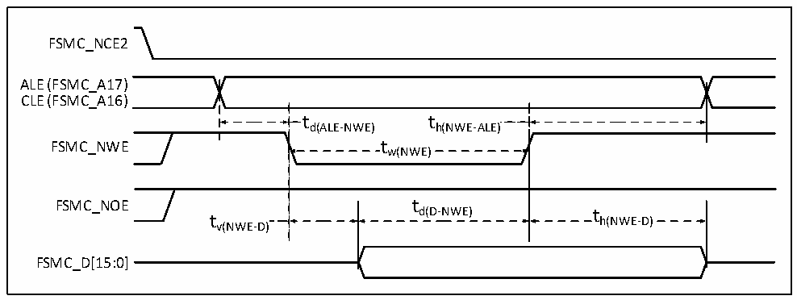
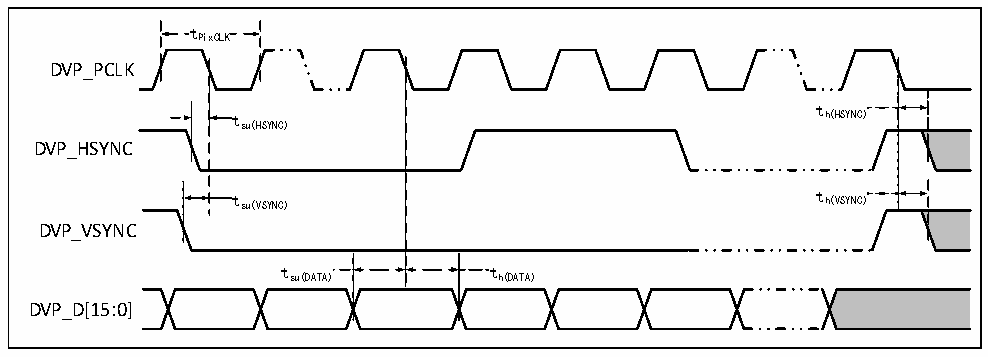

<!-- source-page: 84 -->

[← p.83](0083.md) · [index](../README.md) · [PDF p.84](https://ch32-riscv-ug.github.io/CH32V307/datasheet_en/CH32V20x_30xDS0.PDF#page=84) · [p.85 →](0085.md)

<!-- header: CH32V303/305/307/317 Datasheet https://wch-ic.com -->

Figure 4-23 NAND controller write waveform in general-purpose storage space  
 <!-- rendered from the PDF; verify at https://ch32-riscv-ug.github.io/CH32V307/datasheet_en/CH32V20x_30xDS0.PDF#page=84 -->

🖼 Text parsed from the figure above

FSMC_NCE2  
ALE (FSMC_A17)  
CLE (FSMC_A16)  
t d(ALE-NW  
t h(NWE-ALE)  )  t w(NWE)  
td(ALE-NWE) th(NWE-ALE)  
FSMC_NWE tw(NWE)  
FSMC_NOE t  
d(D-NWE) t  
t h(NWE-D)  
v(NWE-D)  
FSMC_D[15:0]  

<!-- p84-table-003 (table-4-36@1) -->
<table><caption>Table 4-36 Timing characteristics of NAND Flash read and write cycles</caption><tr><th>Symbol</th><th>Parameter</th><th>Min.</th><th>Max.</th><th>Unit</th></tr><tr><td style="text-align:left">t d(D-NWE)</td><td style="text-align:left">Before FSMC_NWE high to FSMC_D[15:0] data valid</td><td style="text-align:left">4*t HCLK</td><td></td><td rowspan="11">ns</td></tr><tr><td style="text-align:left">t w(NOE)</td><td>FSMC_NOE low time</td><td style="text-align:left">4*t HCLK</td><td></td></tr><tr><td style="text-align:left">t su(D-NOE)</td><td style="text-align:left">Before FSMC_NOE high to FSMC_D[15:0] data valid</td><td>20</td><td></td></tr><tr><td style="text-align:left">t h(NOE-D)</td><td style="text-align:left">After FSMC_NOE high to FSMC_D[15:0] data valid</td><td>15</td><td></td></tr><tr><td style="text-align:left">t w(NWE)</td><td>FSMC_NWE low time</td><td style="text-align:left">4*t HCLK</td><td></td></tr><tr><td style="text-align:left">t v(NWE-D)</td><td>FSMC_NWE low to FSMC_D[15:0] data valid</td><td>0</td><td></td></tr><tr><td style="text-align:left">t h(NWE-D)</td><td style="text-align:left">FSMC_NWE high to FSMC_D[15:0] data invalid</td><td style="text-align:left">2*t HCLK</td><td></td></tr><tr><td style="text-align:left">t d(ALE-NWE)</td><td>Before FSMC_NWE low to FSMC_ALE valid</td><td style="text-align:left">2*t HCLK</td><td></td></tr><tr><td style="text-align:left">t h(NWE-ALE)</td><td>FSMC_NWE high to FSMC_ALE invalid</td><td style="text-align:left">2*t HCLK</td><td></td></tr><tr><td style="text-align:left">t d(ALE-NOE)</td><td>Before FSMC_NOE low to FSMC_ALE valid</td><td style="text-align:left">2*t HCLK</td><td></td></tr><tr><td style="text-align:left">t h(NOE-ALE)</td><td>FSMC_NOE high to FSMC_ALE invalid</td><td style="text-align:left">4*t HCLK</td><td></td></tr></table>

### 4.3.19 DVP Interface Characteristics

Figure 4-24 DVP timing waveform  
 <!-- rendered from the PDF; verify at https://ch32-riscv-ug.github.io/CH32V307/datasheet_en/CH32V20x_30xDS0.PDF#page=84 -->

🖼 Text parsed from the figure above

tPixCLK  
DVP_PCLK  
t  
t h(HSYNC)  
su(HSYNC)  
DVP_HSYNC  
t su(VSYNC) t h(VSYNC)  
DVP_VSYNC  
t su(DATA)  
DVP_D[15:0]  

<!-- image: p84-draw-image-00001 bbox=[499.8, 777.6, 522.36, 789.6] -->
<!-- footer: V3.9 82 -->
