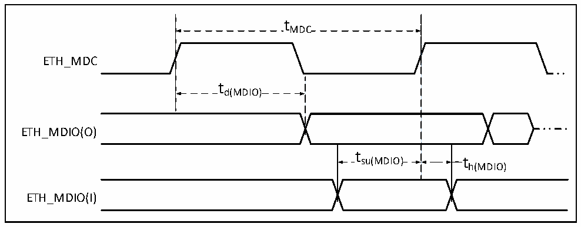
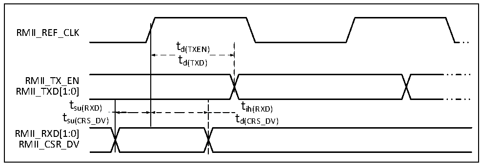

<!-- source-page: 85 -->

[← p.84](0084.md) · [index](../README.md) · [PDF p.85](https://ch32-riscv-ug.github.io/CH32V307/datasheet_en/CH32V20x_30xDS0.PDF#page=85) · [p.86 →](0086.md)

<!-- header: CH32V303/305/307/317 Datasheet https://wch-ic.com -->

<!-- p85-table-001 (table-4-37@1) -->
<table><caption>Table 4-37 DVP characteristics</caption><tr><th>Symbol</th><th>Parameter</th><th>Min.</th><th>Max.</th><th>Unit</th></tr><tr><td style="text-align:left">f /t PixCLK PixCLK</td><td>Pixel clock input frequency</td><td></td><td>144</td><td>MHz</td></tr><tr><td style="text-align:left">Duty (PixCLK)</td><td>Pixel clock duty cycle</td><td>15</td><td></td><td>%</td></tr><tr><td style="text-align:left">t su(DATA)</td><td>Data setup time</td><td>2.5</td><td></td><td rowspan="4">ns</td></tr><tr><td style="text-align:left">t h(DATA)</td><td>Data hold time</td><td>1</td><td></td></tr><tr><td style="text-align:left">t /t su(HSYNC) su(VSYNC)</td><td>HSYNC/VSYNC signal input setup time</td><td>2.5</td><td></td></tr><tr><td style="text-align:left">t /t h(HSYNC) h(VSYNC)</td><td>HSYNC/VSYNC signal input hold time</td><td>1</td><td></td></tr></table>

### 4.3.20 Gigabit Ethernet Interface Characteristics

Figure 4-25 ETH-SMI timing waveform  
 <!-- rendered from the PDF; verify at https://ch32-riscv-ug.github.io/CH32V307/datasheet_en/CH32V20x_30xDS0.PDF#page=85 -->

🖼 Text parsed from the figure above

tMDC  
ETH_MDC  
td(MDIO)  
ETH_MDIO(O)  
t  
su(MDIO) t  
h(MDIO)  
ETH_MDIO(I)  

<!-- p85-table-002 (table-4-38@1) -->
<table><caption>Table 4-38 SMI signal characteristics of Ethernet MAC</caption><tr><th>Symbol</th><th>Parameter</th><th>Min.</th><th>Typ.</th><th>Max.</th><th>Unit</th></tr><tr><td style="text-align:left">f /t MDC MDC</td><td>MDC clock frequency</td><td></td><td></td><td>2.5</td><td>MHz</td></tr><tr><td style="text-align:left">t d(MDIO)</td><td>MDIO write data valid time</td><td>0</td><td></td><td>300</td><td rowspan="3">ns</td></tr><tr><td style="text-align:left">t su(MDIO)</td><td>Read data setup time</td><td>10</td><td></td><td></td></tr><tr><td style="text-align:left">t h(MDIO)</td><td>Read data hold time</td><td>10</td><td></td><td></td></tr></table>

Figure 4-26 ETH-RMII signal timing waveform  
 <!-- rendered from the PDF; verify at https://ch32-riscv-ug.github.io/CH32V307/datasheet_en/CH32V20x_30xDS0.PDF#page=85 -->

🖼 Text parsed from the figure above

RMII_REF_CLK  
td(TXEN)  
td(TXD)  
RMII_TX_EN  
RMII_TXD[1:0]  
tsu(RXD) tih(RXD)  
tsu(CRS_DV) td(CRS_DV)  
RMII_RXD[1:0]  
RMII_CSR_DV  

<!-- image: p85-draw-image-00001 bbox=[499.8, 777.6, 522.36, 789.6] -->
<!-- footer: V3.9 83 -->
