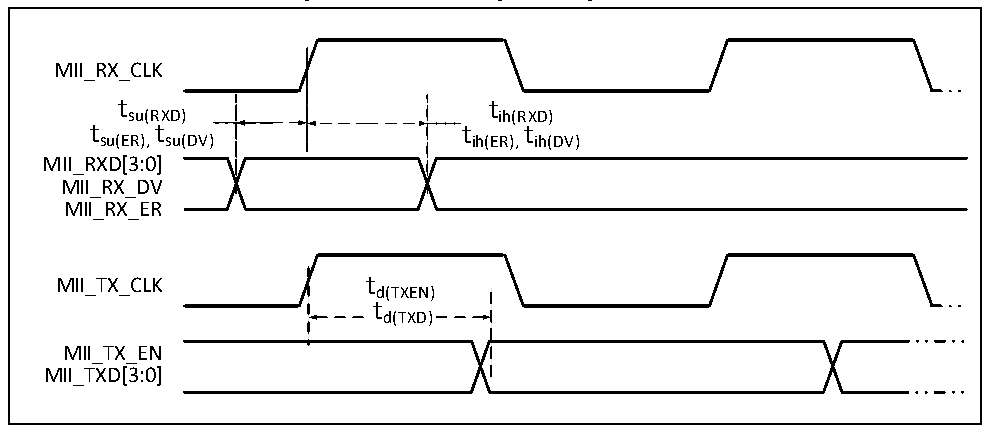

<!-- source-page: 86 -->

[← p.85](0085.md) · [index](../README.md) · [PDF p.86](https://ch32-riscv-ug.github.io/CH32V307/datasheet_en/CH32V20x_30xDS0.PDF#page=86) · [p.87 →](0087.md)

<!-- header: CH32V303/305/307/317 Datasheet https://wch-ic.com -->

<!-- p86-table-001 (table-4-39@1) -->
<table><caption>Table 4-39 RMII signal characteristics of Ethernet MAC</caption><tr><th>Symbol</th><th>Parameter</th><th>Min.</th><th>Typ.</th><th>Max.</th><th>Unit</th></tr><tr><td style="text-align:left">t su(RXD)</td><td>Setup time of received data</td><td>4</td><td></td><td></td><td rowspan="6">ns</td></tr><tr><td style="text-align:left">t ih(RXD)</td><td>Hold time of received data</td><td>2</td><td></td><td></td></tr><tr><td style="text-align:left">t su(CRS_DV)</td><td>Carrier detect signal setup time</td><td>4</td><td></td><td></td></tr><tr><td style="text-align:left">t ih(CRS_DV)</td><td>Carrier detect signal hold time</td><td>2</td><td></td><td></td></tr><tr><td style="text-align:left">t d(TXEN)</td><td>Transmission enable effective delay time</td><td></td><td></td><td>16</td></tr><tr><td style="text-align:left">t d(TXD)</td><td>Data transmission effective delay time</td><td></td><td></td><td>16</td></tr></table>

Figure 4-27 ETH-MII signal timing waveform  
 <!-- rendered from the PDF; verify at https://ch32-riscv-ug.github.io/CH32V307/datasheet_en/CH32V20x_30xDS0.PDF#page=86 -->

🖼 Text parsed from the figure above

MII_RX_CLK  
t su(RXD) t t su(ER), su(DV)  
tsu(RXD) tih(RXD)  
tsu(ER),su(DV) t tih(ER),ih(DV) t  
MII_RXD[3:0]  
MII_RX_DV  
MII_RX_ER  
MII_TX_CLK td(TXEN)  
td(TXD)  
MII_TX_EN  
MII_TXD[3:0]  

<!-- p86-table-003 (table-4-40@1) -->
<table><caption>Table 4-40 MII signal characteristics of Ethernet MAC</caption><tr><th>Symbol</th><th>Parameter</th><th>Min.</th><th>Typ.</th><th>Max.</th><th>Unit</th></tr><tr><td style="text-align:left">t su(RXD)</td><td>Setup time of received data</td><td>10</td><td></td><td></td><td rowspan="8">ns</td></tr><tr><td style="text-align:left">t ih(RXD)</td><td>Hold time of received data</td><td>10</td><td></td><td></td></tr><tr><td style="text-align:left">t su(DV)</td><td>Data valid signal setup time</td><td>10</td><td></td><td></td></tr><tr><td style="text-align:left">t ih(DV)</td><td>Data valid signal hold time</td><td>10</td><td></td><td></td></tr><tr><td style="text-align:left">t su(ER)</td><td>Error signal setup time</td><td>10</td><td></td><td></td></tr><tr><td style="text-align:left">t ih(ER)</td><td>Error signal hold time</td><td>10</td><td></td><td></td></tr><tr><td style="text-align:left">t d(TXEN)</td><td>Transmission enable effective delay time</td><td></td><td></td><td>16</td></tr><tr><td style="text-align:left">t d(TXD)</td><td>Data transmission effective delay time</td><td></td><td></td><td>16</td></tr></table>

<!-- image: p86-draw-image-00001 bbox=[499.8, 777.6, 522.36, 789.6] -->
<!-- footer: V3.9 84 -->
