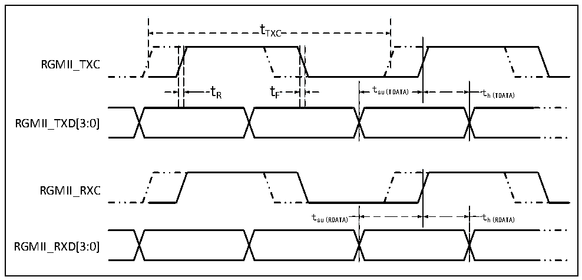

<!-- source-page: 87 -->

[← p.86](0086.md) · [index](../README.md) · [PDF p.87](https://ch32-riscv-ug.github.io/CH32V307/datasheet_en/CH32V20x_30xDS0.PDF#page=87) · [p.88 →](0088.md)

<!-- header: CH32V303/305/307/317 Datasheet https://wch-ic.com -->

Figure 4-28 ETH-RGMII signal timing waveform  
 <!-- rendered from the PDF; verify at https://ch32-riscv-ug.github.io/CH32V307/datasheet_en/CH32V20x_30xDS0.PDF#page=87 -->

🖼 Text parsed from the figure above

tTXC  
RGMII_TXC  
t R t F t su(TDATA) t h(TDATA)  
RGMII_TXD[3:0]  
RGMII_RXC  
tsu(RDATA) th(RDATA)  
RGMII_RXD[3:0]  

<!-- p87-table-001 (table-4-41@1) -->
<table><caption>Table 4-41 RGMII signal characteristics of Ethernet MAC</caption><tr><th>Symbol</th><th>Parameter</th><th>Min.</th><th>Typ.</th><th>Max.</th><th>Unit</th></tr><tr><td style="text-align:left">f /t TXC TXC</td><td>TXC/RXC clock frequency</td><td>7.2</td><td>8</td><td>8.8</td><td rowspan="7">ns</td></tr><tr><td style="text-align:left">t R</td><td>TXC/RXC rise time</td><td></td><td></td><td>2.0</td></tr><tr><td style="text-align:left">t F</td><td>TXC/RXC fall time</td><td></td><td></td><td>2.0</td></tr><tr><td style="text-align:left">t su(TDATA)</td><td>Transmit data setup time</td><td>1.2</td><td>2.0</td><td></td></tr><tr><td style="text-align:left">t h(TDATA)</td><td>Transmit data hold time</td><td>1.2</td><td>2.0</td><td></td></tr><tr><td style="text-align:left">t su(RDATA)</td><td>Input data setup time</td><td>1.2</td><td>2.0</td><td></td></tr><tr><td style="text-align:left">t h(RDATA)</td><td>Input data hold time</td><td>1.2</td><td>2.0</td><td></td></tr></table>

### 4.3.21 12-bit ADC Characteristics

<!-- p87-table-002 (table-4-42@1) pages 87-88 -->
<table><caption>Table 4-42 ADC characteristics</caption><tr><th>Symbol</th><th>Parameter</th><th>Condition</th><th>Min.</th><th>Typ.</th><th>Max.</th><th>Unit</th></tr><tr><td style="text-align:left">VDDA</td><td>Supply voltage</td><td></td><td>2.4</td><td></td><td>3.6</td><td>V</td></tr><tr><td style="text-align:left">VREF+</td><td>Positive reference voltage</td><td style="text-align:left">V cannot be REF+ more than VDDA</td><td>2.4</td><td></td><td style="text-align:left">VDDA</td><td>V</td></tr><tr><td style="text-align:left">IVREF</td><td>Reference current</td><td></td><td></td><td>160</td><td>220</td><td>uA</td></tr><tr><td style="text-align:left">IDDA</td><td>Supply current</td><td></td><td></td><td>480</td><td>530</td><td>uA</td></tr><tr><td style="text-align:left">f ADC</td><td>ADC clock frequency</td><td></td><td></td><td></td><td>14</td><td>MHz</td></tr><tr><td style="text-align:left">f S</td><td>Sampling rate</td><td></td><td>0.05</td><td></td><td>1</td><td>MHz</td></tr><tr><td style="text-align:left">f TRIG</td><td>External trigger frequency</td><td></td><td></td><td></td><td>16</td><td style="text-align:left">1/f ADC</td></tr><tr><td style="text-align:left">VAIN</td><td>Conversion voltage range</td><td></td><td>0</td><td></td><td style="text-align:left">VREF+</td><td>V</td></tr><tr><td style="text-align:left">RAIN</td><td>External input impedance</td><td></td><td></td><td></td><td>50</td><td>kΩ</td></tr><tr><td style="text-align:left">RADC</td><td>Sampling switch resistance</td><td></td><td></td><td>0.6</td><td>1</td><td>kΩ</td></tr><tr><td style="text-align:left">CADC</td><td>Internal sample and hold capacitor</td><td></td><td></td><td>8</td><td></td><td>pF</td></tr><tr><td style="text-align:left">t CAL</td><td>Calibration time</td><td></td><td></td><td>40</td><td></td><td style="text-align:left">1/f ADC</td></tr><tr><td style="text-align:left">t Iat</td><td>Injected trigger conversion latency</td><td></td><td></td><td></td><td>2</td><td style="text-align:left">1/f ADC</td></tr><tr><td style="text-align:left">t Iatr</td><td>Regular trigger conversion latency</td><td></td><td></td><td></td><td>2</td><td style="text-align:left">1/f ADC</td></tr><tr><td style="text-align:left">t s</td><td>Sampling time</td><td></td><td>1.5</td><td></td><td>239.5</td><td style="text-align:left">1/f ADC</td></tr><tr><td style="text-align:left">t STAB</td><td>Power-on time</td><td></td><td></td><td></td><td>1</td><td>us</td></tr><tr><td style="text-align:left">t CONV</td><td style="text-align:left">Total conversion time (including sampling time)</td><td></td><td>14</td><td></td><td>252</td><td style="text-align:left">1/f ADC</td></tr></table>

<!-- image: p87-draw-image-00001 bbox=[499.8, 777.6, 522.36, 789.6] -->
<!-- footer: V3.9 85 -->
