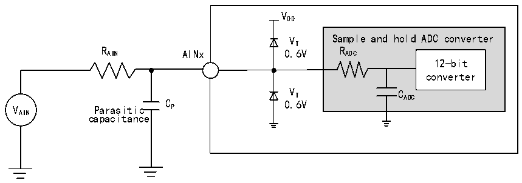
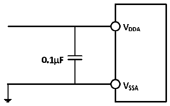

<!-- source-page: 89 -->

[← p.88](0088.md) · [index](../README.md) · [PDF p.89](https://ch32-riscv-ug.github.io/CH32V307/datasheet_en/CH32V20x_30xDS0.PDF#page=89) · [p.90 →](0090.md)

<!-- header: CH32V303/305/307/317 Datasheet https://wch-ic.com -->

Figure 4-29 ADC typical connection diagram  
 <!-- rendered from the PDF; verify at https://ch32-riscv-ug.github.io/CH32V307/datasheet_en/CH32V20x_30xDS0.PDF#page=89 -->

🖼 Text parsed from the figure above

VDD  
VT Sample and hold ADC converter  
R AIN AINx 0.6V R ADC  
12-bit  
converter  
V T C ADC  
VAIN Parasitic C P 0.6V  
capacitance  

Figure 4-30 Analog power supply and decoupling circuit reference  
 <!-- rendered from the PDF; verify at https://ch32-riscv-ug.github.io/CH32V307/datasheet_en/CH32V20x_30xDS0.PDF#page=89 -->

🖼 Text parsed from the figure above

<!-- image: p89-draw-image-00002 inside the figure -->
<!-- image: p89-draw-image-00003 inside the figure -->
<!-- image: p89-draw-image-00006 inside the figure -->
<!-- image: p89-draw-image-00008 inside the figure -->
<!-- image: p89-draw-image-00010 inside the figure -->
<!-- image: p89-draw-image-00009 inside the figure -->
<!-- image: p89-draw-image-00007 inside the figure -->
<!-- image: p89-draw-image-00004 inside the figure -->
<!-- image: p89-draw-image-00005 inside the figure -->

### 4.3.22 Temperature Sensor Characteristics

<!-- p89-table-001 (table-4-45@1) -->
<table><caption>Table 4-45 Temperature sensor characteristics</caption><tr><th>Symbol</th><th>Parameter</th><th>Condition</th><th>Min.</th><th>Typ.</th><th>Max.</th><th>Unit</th></tr><tr><td style="text-align:left">RTS</td><td style="text-align:left">Measurement range of temperature sensor</td><td></td><td>-40</td><td></td><td>85</td><td></td></tr><tr><td style="text-align:left">ATSC</td><td style="text-align:left">Measurement range of temperature sensor after software calibration</td><td></td><td></td><td>±12</td><td></td><td></td></tr><tr><td>Avg_Slope</td><td style="text-align:left">Average slope (negative temperature coefficient)</td><td></td><td>3.8</td><td>4.3</td><td>4.7</td><td>mV/℃</td></tr><tr><td style="text-align:left">V25</td><td>Voltage at 25℃</td><td></td><td>1.34</td><td>1.40</td><td>1.46</td><td>V</td></tr><tr><td style="text-align:left">TS_temp</td><td style="text-align:left">ADC sampling time when reading temperature</td><td style="text-align:left">f = 14MHz ADC</td><td></td><td></td><td>17.1</td><td>us</td></tr></table>

### 4.3.23 DAC Characteristics

<!-- p89-table-002 (table-4-46@1) pages 89-90 -->
<table><caption>Table 4-46 DAC characteristics</caption><tr><th>Symbol</th><th>Parameter</th><th>Condition</th><th>Min.</th><th>Typ.</th><th>Max.</th><th>Unit</th></tr><tr><td style="text-align:left">VDDA</td><td>Supply voltage</td><td></td><td>2.4</td><td>3.3</td><td>3.6</td><td>V</td></tr><tr><td style="text-align:left">VREF+</td><td>Positive reference voltage</td><td style="text-align:left">V ≤ V REF+ DDA</td><td>2.4</td><td>3.3</td><td>3.6</td><td>V</td></tr><tr><td rowspan="2" style="text-align:left">R (1) L</td><td>Resistive load with buffer ON</td><td></td><td>5</td><td></td><td></td><td>kΩ</td></tr><tr><td>Resistive load with buffer OFF</td><td></td><td>15</td><td></td><td></td><td>kΩ</td></tr><tr><td style="text-align:left">C (1) L</td><td>Capacitive load with buffer ON</td><td></td><td></td><td></td><td>50</td><td>pF</td></tr><tr><td style="text-align:left">V (1) OUT_MIN</td><td rowspan="2" style="text-align:left">12-bit DAC conversion with buffer ON</td><td></td><td>0</td><td></td><td>8</td><td>mV</td></tr><tr><td style="text-align:left">V (1) OUT_MAX</td><td>VREF+=3.3V</td><td>3.29</td><td></td><td>3.3</td><td>V</td></tr><tr><td style="text-align:left">V (1) OUT_MIN</td><td rowspan="2" style="text-align:left">12-bit DAC conversion with buffer OFF</td><td></td><td>0</td><td></td><td>3</td><td>mV</td></tr><tr><td style="text-align:left">V (1) OUT_MAX</td><td>VREF+=3.3V</td><td>3.295</td><td></td><td>3.3</td><td>V</td></tr><tr><td rowspan="3" style="text-align:left">IVREF+</td><td colspan="2">With no load, 0x800 on the inputs</td><td></td><td>58</td><td></td><td rowspan="3">uA</td></tr><tr><td colspan="2" style="text-align:left">With no load, 0xF1C at V =3.6V on the inputs REF+</td><td></td><td>194</td><td></td></tr><tr><td colspan="2" style="text-align:left">With no load, 0x555 (worst) at V =3.6V on the REF+ inputs</td><td></td><td>331</td><td></td></tr><tr><td rowspan="3" style="text-align:left">IDDA</td><td colspan="2" style="text-align:left">With buffer ON and no load, 0x800 on the inputs</td><td></td><td>170</td><td></td><td rowspan="3">uA</td></tr><tr><td colspan="2" style="text-align:left">With buffer ON and no load, 0xF1C on the inputs at V =3.6V, REF+</td><td></td><td>150</td><td></td></tr><tr><td colspan="2" style="text-align:left">With buffer ON and no load, 0x555 (worst) at V =3.6V on the inputs REF+</td><td></td><td>170</td><td></td></tr><tr><td>DNL</td><td>Differential nonlinearity error</td><td></td><td></td><td>±2</td><td></td><td>LSB</td></tr><tr><td>INL</td><td>Integral nonlinearity error</td><td style="text-align:left">After calibration of offset error and gain error</td><td></td><td>±4</td><td></td><td>LSB</td></tr><tr><td rowspan="2">Offset</td><td rowspan="2">Offset error</td><td></td><td></td><td>±3</td><td>±12</td><td>mV</td></tr><tr><td style="text-align:left">V =3.6VREF+</td><td></td><td></td><td>±10</td><td>LSB</td></tr><tr><td>Gain error</td><td></td><td style="text-align:left">DAC in 12-bit configuration</td><td></td><td>±0.4</td><td></td><td>%</td></tr><tr><td style="text-align:left">Amplifier gain(1)</td><td>Amplifier gain in open loop</td><td>5kΩ load (max)</td><td>80</td><td>85</td><td></td><td>dB</td></tr><tr><td style="text-align:left">t SETTLING</td><td style="text-align:left">Setting time (full scale: for an input code transition between the lowest and the highest input codes when DAC_OUT reaches final value ±1LSB)</td><td style="text-align:left">C ≤50pFLOAD R ≥5kΩLOAD</td><td></td><td>3</td><td>4</td><td>us</td></tr><tr><td>Update rate</td><td style="text-align:left">Max frequency for a correct DAC_OUT change when small variation in the input code (from code i to i+1LSB),</td><td style="text-align:left">C ≤50pFLOAD R ≥5kΩLOAD</td><td></td><td></td><td>1</td><td>MS/s</td></tr><tr><td style="text-align:left">t WAKEUP</td><td style="text-align:left">Time to wake up from off state (The DAC enable bit ENx changes from 0 to 1)</td><td style="text-align:left">C ≤50pF， LOAD R ≥5kΩ, LOAD input codes between the lowest and highest possible ones</td><td></td><td>6.5</td><td>10</td><td>us</td></tr><tr><td>PSRR+(1)</td><td style="text-align:left">Power supply rejection ratio (relative to V ) (static DCDDA measurement)</td><td style="text-align:left">No R , LOAD C ≤50pFLOAD</td><td></td><td>-100</td><td>-75</td><td>dB</td></tr></table>

<!-- image: p89-draw-image-00001 bbox=[499.8, 777.6, 522.36, 789.6] -->
<!-- footer: V3.9 87 -->
