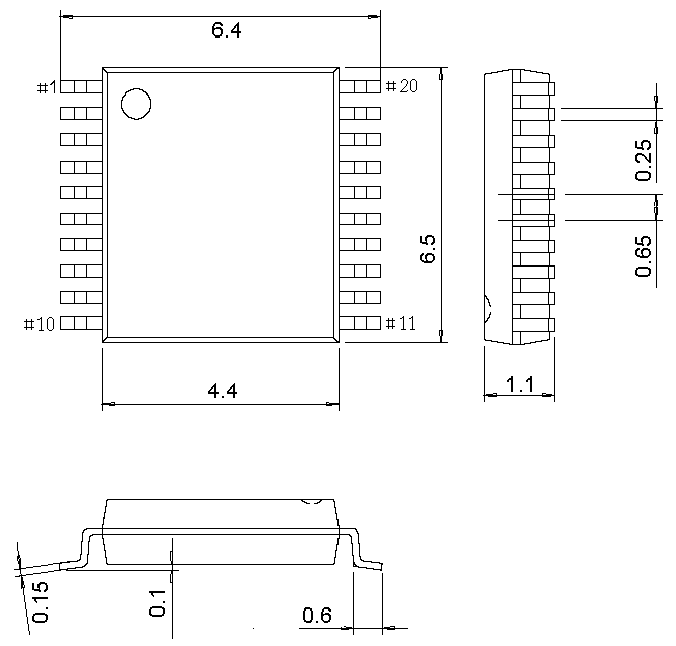

<!-- source-page: 94 -->

[← p.93](0093.md) · [index](../README.md) · [PDF p.94](https://ch32-riscv-ug.github.io/CH32V307/datasheet_en/CH32V20x_30xDS0.PDF#page=94) · [p.95 →](0095.md)

<!-- header: CH32V303/305/307/317 Datasheet https://wch-ic.com -->
<em>Note: All dimensions are in millimeters. The pin center spacing values are nominal values, with no error.</em>  
<em>Other than that, the dimensional error is not greater than the greater of ±0.2mm or 10%.</em>  

## 5.1 TSSOP20 Package

 <!-- p94-draw-image-00002 rendered from the PDF -->

<!-- image: p94-draw-image-00001 bbox=[500.28, 779.4, 522.0, 789.6] -->
<!-- footer: V3.9 92 -->
