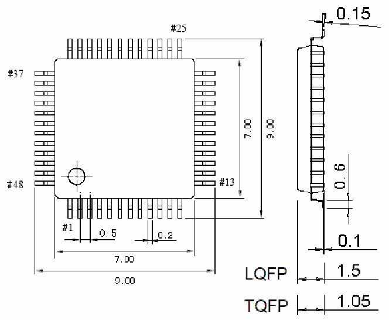

<!-- source-page: 95 -->

[← p.94](0094.md) · [index](../README.md) · [PDF p.95](https://ch32-riscv-ug.github.io/CH32V307/datasheet_en/CH32V20x_30xDS0.PDF#page=95) · [p.96 →](0096.md)

<!-- header: CH32V303/305/307/317 Datasheet https://wch-ic.com -->

## 5.2 QFN28 Package

 <!-- p95-draw-image-00002 rendered from the PDF -->

## 5.3 LQFP48 Package

 <!-- p95-draw-image-00003 rendered from the PDF -->

<!-- image: p95-draw-image-00001 bbox=[500.28, 779.4, 522.0, 789.6] -->
<!-- footer: V3.9 93 -->
