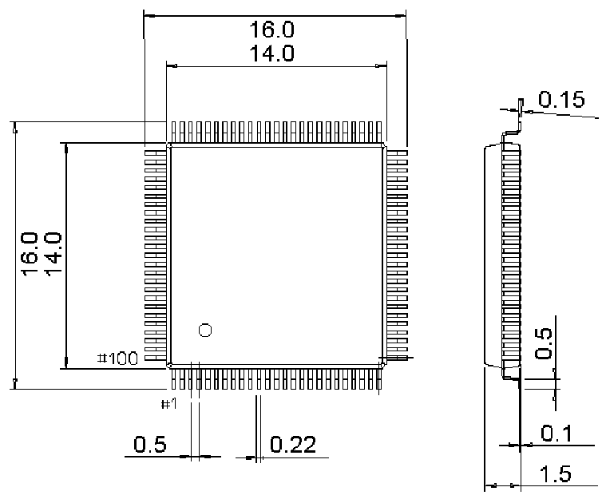

<!-- source-page: 97 -->

[← p.96](0096.md) · [index](../README.md) · [PDF p.97](https://ch32-riscv-ug.github.io/CH32V307/datasheet_en/CH32V20x_30xDS0.PDF#page=97) · [p.98 →](0098.md)

<!-- header: CH32V303/305/307/317 Datasheet https://wch-ic.com -->

## 5.6 LQFP100 Package

 <!-- p97-draw-image-00002 rendered from the PDF -->

<!-- image: p97-draw-image-00001 bbox=[500.28, 779.4, 522.0, 789.6] -->
<!-- footer: V3.9 95 -->
