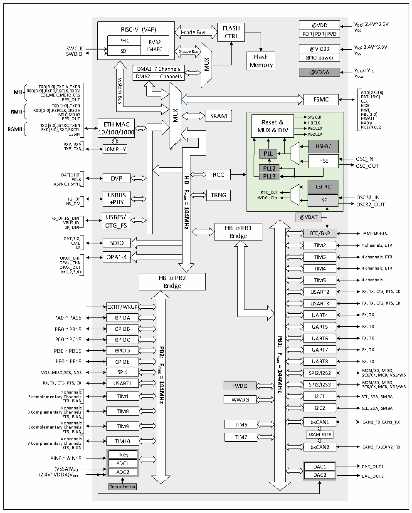

<!-- source-page: 7 -->

[← p.6](0006.md) · [index](../README.md) · [PDF p.7](https://ch32-riscv-ug.github.io/CH32V307/datasheet_zh/CH32V20x_30xDS0.PDF#page=7) · [p.8 →](0008.md)

<!-- header: CH32V303/305/307/317数据手册 https://wch.cn -->

## 2.2 系统架构

微控制器基于RISC-V指令集设计，其架构中将内核、仲裁单元、DMA模块、SRAM存储等部分通过  
多组总线实现交互。设计中集成通用DMA控制器以减轻CPU负担、提高访问效率，应用多级时钟管理  
机制降低了外设的运行功耗，同时兼有数据保护机制，时钟自动切换保护等措施增加了系统稳定性。  
下图是系列产品内部总体架构框图。  

图2-1-1 CH32V303/305/307系统框图  
 <!-- rendered from the PDF; verify at https://ch32-riscv-ug.github.io/CH32V307/datasheet_zh/CH32V20x_30xDS0.PDF#page=7 -->

🖼 Text parsed from the figure above

@VDD VDD: 2.4V~3.6V PORPDRPVD VSS  
<!-- image: p7-draw-image-00002 inside the figure -->
RISC-V (V4F) FLASH I-code Bus CTRL  
RISC-V (V4F)  PFICSDI  RV32IMAFC  
SWCLK @VIO33 VIO: 2.4V~3.6V SWDIO VSS GPIO power  
SDI IMAFC D-code Bus Flash  
MUX  
Memory  
DMA1 7 Channels  DMA1 7 Channels DMA2 11 Channels  
DMA1 7 Channels @VDDA VDDA: VIO  
DMA2 11 Channels VSSA  
System  
<!-- image: p7-draw-image-00006 inside the figure -->
<!-- image: p7-draw-image-00003 inside the figure -->
TXD[3:0],TXCLK,TXEN  
MII RXD[3:0 C ] O ,R L X ,M ER D ,R C X ,M C P L D P K S I , O _ R , O X C D U R V T S FSMC A D CL D A K D T[ [ 1 2 5 3 : : 0 1 ] 6]  
Bus  
<!-- image: p7-draw-image-00004 inside the figure -->
TXD[1:0],TXEN NOE  
RMII RXD[1:0],REFCLK,CRSDV NWE  
MUX  
RGMII T R X X D D [ [ 3 3 : : 0 0 ] ] , M , G R T X D P X C P C C , S , R , M _ T X O X D C E U T IO N T L 10 E / T 1 H 0 0 M /1 A 0 C 00 M R U e X s e &amp; t D &amp; IV S H P Y B B S 1 C C C L L L K K K N N N N B W A E1 L D A [ / V 1 N IT :0 C ] E2  
SRAM  
SYSCLK Reset &amp; HBCLK MUX &amp; DIV PB1CLKPB2CLKHSI-RCPLLHSEPLL2PLL3LSI-RCRTC_CLK IWDG_CLK LSE  SYSCLKHBCLKPB1CLKPB2CLKHSI-RC  HSI-RCHSE  
<!-- image: p7-draw-image-00005 inside the figure -->
125IN PB2CLK  
RXP, RXN HSI-RC  
TXP, TXN 10M PHY  
OSC_OUT  
DAT[1 P 1 C : L 0 K ] DVP RCC  
<strong>HB</strong>  
VSYNC,HSYNC LSI-RC  
<strong>Fmax</strong>  
USBHS TRNG RTC_CLK  
HS_DP +PHY IWDG_CLK LSE OSC32_IN HS_DM OSC32_OUT  
<strong>=</strong>  
<strong>144MHz</strong>  
FS_DP,FS_DM USBFS/  
@VBAT  
VBUS,ID OTG_FS DP, DM  
HB to PB1  
RTC/BKP TAMPER-RTC  
Bridge  
DAT[7:0]  
CM C D K SDIO TIM2 4 channels, ETR  
OPAx_CHP OPA1-4 TIM3 4 channels, ETR  
OPAx_CHN  
OPAx_OUT TIM4 4 channels, ETR  
(x=1,2,3,4)  
HB to PB2  
TIM5 4 channels  
Bridge  
USART2 RX, TX, CTS, RTS, CK  
USART3 RX, TX, CTS, RTS, CK  
EXTIT/WKUP  
PA0 ~ PA15 GPIOA UART4 RX, TX  
PB0 ~ PB15 UART5 RX, TX  
GPIOB  
<strong>PB1:</strong>  
PC0 ~ PC15 UART6 RX, TX  
GPIOC  
PD0 ~ PD15PB2: UART7 RX, TX  
GPIOD  
<strong>Fmax</strong>  
PE0 ~ PE15 GPIOE UART8 RX, TX  
<strong>Fmax</strong>  
<strong>=</strong>  
MOSI,MISO,SCK, NSS SPI1 SPI2/I2S2 M SC O K S /C I/ K S , D M , M CK IS , O N , S S/WS  
<strong>144MHz</strong>  
<strong>=</strong>  
RX, TX, CTS, RTS, CK USART1 IWDG SPI3/I2S3 M SC O K S /C I/ K S , D M , M CK IS , O N , S S/WS  
<strong>144MHz</strong>  
4 channels  
3 complementary Channels TIM1 I2C1 SCL, SDA, SMBA  
ETR, BIKN WWDG  
3 Complementary 4 C c h h a an n n n e el l s s TIM8 I2C2 SCL, SDA, SMBA  
ETR, BIKN  
3 complementary 4 C c h h a an n n n e el l s s TIM9 TIM6 bxCAN1 CAN1_TX,CAN1_RX  
ETR, BIKN  
3 Complementary 4 C c h h a an n n n e el l s s TIM10 TIM7 SRAM 512B  
ETR, BIKN bxCAN2 CAN2_TX,CAN2_RX  
Tkey  
AIN0 ~ AIN15  
ADC1  
(2.4V~V (V D S D S A A ) ) V V R R E E F F + - ADC2 D D A A C C 2 1 D D A A C C _ _ O O U U T T 1 2  
Temp Sensor  

<!-- image: p7-draw-image-00001 bbox=[513.72, 779.28, 533.16, 789.6] -->
<!-- footer: V3.9 6 -->
