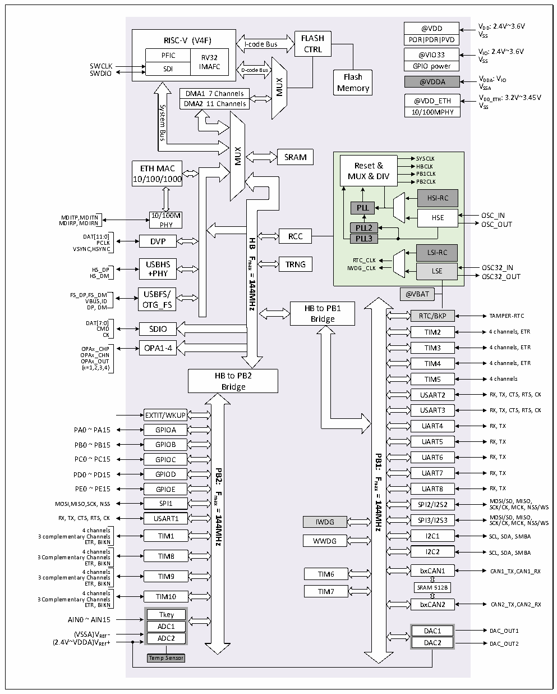

<!-- source-page: 8 -->

[← p.7](0007.md) · [index](../README.md) · [PDF p.8](https://ch32-riscv-ug.github.io/CH32V307/datasheet_zh/CH32V20x_30xDS0.PDF#page=8) · [p.9 →](0009.md)

<!-- header: CH32V303/305/307/317数据手册 https://wch.cn -->

图2-1-2 CH32V317系统框图  
 <!-- rendered from the PDF; verify at https://ch32-riscv-ug.github.io/CH32V307/datasheet_zh/CH32V20x_30xDS0.PDF#page=8 -->

🖼 Text parsed from the figure above

@VDD  @VDDPORPDRPVD  @VIO33  GPIO power  @VDDA  
@VDD VDD: 2.4V~3.6V  
RISC-V (V4F)  PFIC  RV32IMAFC  SDI  
RISC-V (V4F) FLASH  
<!-- image: p8-draw-image-00002 inside the figure -->
I-code Bus  
CTRL PFIC RV32  
@VIO33 VIO: 2.4V~3.6V VSS  
SWCLK GPIO power SWDIO @VDDA VDDA: VIO  
SDI IMAFC D-code Bus Flash  
MUX  
VSSA  
Memory  
DMA1 7 Channels  DMA1 7 Channels DMA2 11 Channels  
@VDD_ETH VDD_ETH: 3.2V~3.45V VSS  
@VDD_ETH  10/100MPHY  
System  
Bus  
MUX  
SRAM  
SYSCLK Reset &amp; HBCLK MUX &amp; DIV PB1CLKPB2CLKHSI-RCPLLHSEPLL2PLL3LSI-RCRTC_CLK IWDG_CLK LSE  @VBAT  
ETH MAC Reset &amp; HBCLK  
10/100/1000 MUX &amp; DIV PB1CLK  
HSE OSC_IN  
MDITP,MDITN 10/100M  
MDIRP, MDIRN PHY PLL2  
OSC_OUT  
DAT[1 P 1 C : L 0 K ] DVP RCC  
<strong>HB</strong>  
VSYNC,HSYNC LSI-RC  
<strong>Fmax</strong>  
USBHS TRNG RTC_CLK  
HS_DP +PHY IWDG_CLK LSE OSC32_IN HS_DM OSC32_OUT  
<strong>=</strong>  
<strong>144MHz</strong>  
FS_DP,FS_DM USBFS/  
VBUS,ID OTG_FS DP, DM  
HB to PB1  
RTC/BKP TAMPER-RTC  
Bridge  
DAT[7:0]  
CM C D K SDIO TIM2 4 channels, ETR  
OPAx_CHP OPA1-4 TIM3 4 channels, ETR  
OPAx_CHN  
OPAx_OUT TIM4 4 channels, ETR  
(x=1,2,3,4)  
HB to PB2  
TIM5 4 channels  
Bridge  
USART2 RX, TX, CTS, RTS, CK  
USART3 RX, TX, CTS, RTS, CK  
EXTIT/WKUP  
PA0 ~ PA15 GPIOA UART4 RX, TX  
PB0 ~ PB15 UART5 RX, TX  
GPIOB  
<strong>PB1:</strong>  
PC0 ~ PC15 UART6 RX, TX  
GPIOC  
PD0 ~ PD15PB2: UART7 RX, TX  
GPIOD  
<strong>Fmax</strong>  
PE0 ~ PE15 GPIOE UART8 RX, TX  
<strong>Fmax</strong>  
<strong>=</strong>  
MOSI,MISO,SCK, NSS SPI1 SPI2/I2S2 M SC O K S /C I/ K S , D M , M CK IS , O N , S S/WS  
<strong>144MHz</strong>  
<strong>=</strong>  
RX, TX, CTS, RTS, CK USART1 IWDG SPI3/I2S3 M SC O K S /C I/ K S , D M , M CK IS , O N , S S/WS  
<strong>144MHz</strong>  
4 channels  
3 complementary Channels TIM1 I2C1 SCL, SDA, SMBA  
ETR, BIKN WWDG  
3 Complementary 4 C c h h a an n n n e el l s s TIM8 I2C2 SCL, SDA, SMBA  
ETR, BIKN  
3 complementary 4 C c h h a an n n n e el l s s TIM9 TIM6 bxCAN1 CAN1_TX,CAN1_RX  
ETR, BIKN  
3 Complementary 4 C c h h a an n n n e el l s s TIM10 TIM7 SRAM 512B  
ETR, BIKN bxCAN2 CAN2_TX,CAN2_RX  
Tkey  
AIN0 ~ AIN15  
ADC1  
DAC1 DAC_OUT1  
(VSSA)VREF -  
ADC2  
(2.4V~VDDA)VREF+ DAC2 DAC_OUT2  
Temp Sensor  

<!-- image: p8-draw-image-00001 bbox=[507.72, 779.28, 527.16, 789.6] -->
<!-- footer: V3.9 7 -->
