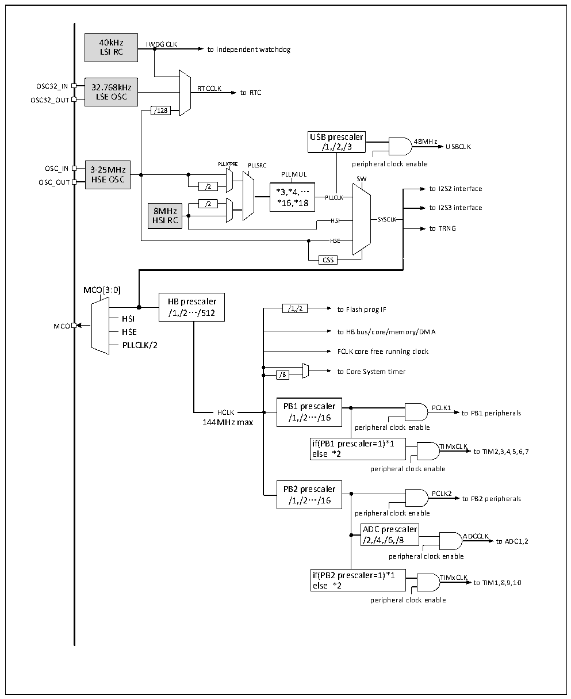

<!-- source-page: 11 -->

[← p.10](0010.md) · [index](../README.md) · [PDF p.11](https://ch32-riscv-ug.github.io/CH32V307/datasheet_zh/CH32V20x_30xDS0.PDF#page=11) · [p.12 →](0012.md)

<!-- header: CH32V303/305/307/317数据手册 https://wch.cn -->

图2-4 CH32V303时钟树框图  
 <!-- rendered from the PDF; verify at https://ch32-riscv-ug.github.io/CH32V307/datasheet_zh/CH32V20x_30xDS0.PDF#page=11 -->

🖼 Text parsed from the figure above

40kHz IWDGCLK  
LSI RC to independent watchdog  
OSC32_IN 32.768kHz RTCCLK  
LSE OSC to RTC  
OSC32_OUT  
/128  
USB prescaler  
48MHz  
/1,/2,/3 USBCLK  
OSC_IN 3-25MHz PLLXTPRE PLLSRC peripheral clock enable  
3-25MHz HSE OSC  
PLLMUL  
OSC_OUT HSE OSC SW  
/2 *3,*4,… to I2S2 interface  
PLLCLK  
/2 *16,*18  
8MHz to I2S3 interface  
HSI RC HSI SYSCLK  
to TRNG  
HSE  HSE  
CSS  
MCO[3:0]  
HB prescaler  
/1,/2…/512 /1,/2 to Flash prog IF  
HSI  
MCO  
HSE to HB bus/core/memory/DMA  
PLLCLK/2  
FCLK core free running clock  
to Core System timer  
/8  
PB1 prescaler PCLK1  
HCLK  HCLK  
HCLK /1,/2…/16 to PB1 peripherals  
144MHz max  
peripheral clock enable  
if(PB1 prescaler=1)*1 TIMxCLK  
else *2 to TIM2,3,4,5,6,7  
peripheral clock enable  
PB2 prescaler  
PCLK2  
/1,/2…/16 to PB2 peripherals  
peripheral clock enable  
ADC prescaler  
/2,/4,/6,/8 ADCCLK to ADC1,2  
peripheral clock enable  
if(PB2 prescaler=1)*1 TIMxCLK  
else *2 to TIM1,8,9,10  
peripheral clock enable  

注：当使用USB功能时，CPU的频率必须是48MHz或96MHz或144MHz。当系统从停机或待机状态唤醒  
时，系统会自动切换为HSI做主频。  
<!-- image: p11-draw-image-00001 bbox=[512.28, 779.28, 531.72, 789.6] -->
<!-- footer: V3.9 10 -->
