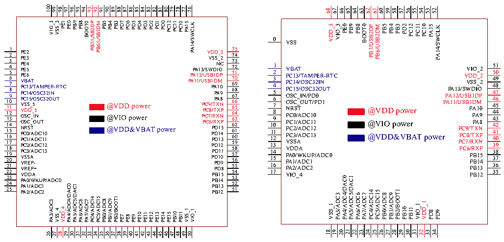
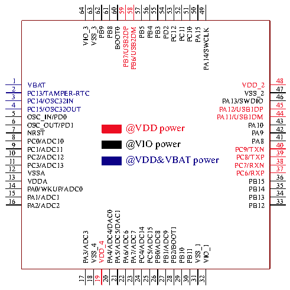

<!-- source-page: 20 -->

[← p.19](0019.md) · [index](../README.md) · [PDF p.20](https://ch32-riscv-ug.github.io/CH32V307/datasheet_zh/CH32V20x_30xDS0.PDF#page=20) · [p.21 →](0021.md)

<!-- header: CH32V303/305/307/317数据手册 https://wch.cn -->

# 第 3 章 引脚信息

## 3.1 引脚排列

### 3.1.1 互联型V307

# CH32V307VCT6 CH32V307WCU6

 <!-- p20-cluster-01 uncaptioned graphics, rendered from the PDF; verify at https://ch32-riscv-ug.github.io/CH32V307/datasheet_zh/CH32V20x_30xDS0.PDF#page=20 -->

🖼 Text parsed from the figure above

100 99  
98 97  
96 95 94 93 92 91 90 89  
88 87 86 85 84  
83  
82 81  
80 79 78 77 76  
68  
67  
66  
65  
64  
63  
62  
61  
60  
59  
58  
57  
56  
55  
54  
53  
52  
PE1 PE0  
1 0 D D P P 1 VBAT 2 PC13/TAMPER-RTC 3 PC14/OSC32IN 4 PC15/OSC32OUT 5 OSC_IN/PD0 6 OSC_OUT/PD1 @VDD power 7 NRST 8 @VIO power 9 PC0/ADC10 PC1/ADC11 10 @VDD&amp;VBAT power 11 PC2/ADC12 PC3/ADC13 12 VSSA 13 VDDA 14 PA0/WKUP/ADC0 15 PA1/ADC1 16 PA2/ADC2  
22 11 10 10 54321 VV VV PPPPP RR DS EEEEE EF+EF- D_5S_5 65432 PE7 PE8 PE9 PE10 PE11 PE12 PE13 PE14 PE15 PC12 PC11 PC10 PA15 PA14/SWCLK  
PB9 PB8 BOOT0 PB7/USB2DP PB6/USB2DM PB5 PB4 PB3  
PD7 PD6 PD5 PD4 PD3  
VIO_3 VSS_3  
PD2  
VDD_3  
PB3  
PC11  
PB8  
PB5  
0EP 0 VSS @VDD power @VIO power  
PB9  
PB4  
PD2  
PC12  
BOOT0  
PC10  
PB7/USB2DP  
PB6/USB2DM  
PA15  
KLCWS/41AP @VDD&amp;VBAT power  
V V D S D S_ _ 2 2 7 7 5 4 P P A P A 1 A 1 1 1 2 /U 3 P / P P P U / C S C S C C S B 7 W 9 6 8 B / / 1 P / / R T R 1 D T D A P P X X D A X A X I 1 M O N N P 9 0 8 P P 6 6 6 6 6 6 6 7 7 7 3 4 5 6 7 8 9 0 1 2 P P P P B B B B 1 1 1 1 2 4 5 3 5 5 5 5 1 2 3 4  
NC 73 P P P P P P P P D D D D D D D D 1 1 1 1 1 1 0 2 4 9 5 8 3 1 5 5 5 5 5 6 6 6 5 6 7 8 9 0 1 2  
1_DDV 51 VIO_2 50 VDD_2 48 PA13/SWDIO 47 PA12/USB1DP 46 PA11/USB1DM 45 PA10 44 PA9 43 PA8 42 PC9/TXN 41 PC8/TXP 40 PC7/RXN 39 PC6/RXP 38 PB15 37 PB14 36 PB13 35 PB12  
6 7 9 8 V P P P C C C B 1 1 1 A 3 4 5 T / / / T O O A S S M C C 3 3 P 2 2 E I O N R U -R T TC 1 1 1 1 1 1 1 1 2 4 6 7 9 5 8 3 O O N P P P P V C C C C S S R S 0 1 2 3 C C S S / / / / A _ _ T A A A A I O D D D D N U C C C C T 1 1 1 1 1 0 2 3 2 2 2 2 2 4 5 3 V P P P A A A D 0 1 2 D / / / W A A A D D K C C U 1 2 P/ADC0  
8DP 49 VSS_2  
1 7 V IO _ 4 PA3/ADC3  
PA4/ADC4/DAC0  
PA5/ADC5/DAC1  
PA3/ADC3 VSS_4 VDD_4 PA4/ADC4/DAC0 PA5/ADC5/DAC1 PA6/ADC6 PA7/ADC7 PC4/ADC14 PC5/ADC15 PB0/ADC8 PB1/ADC9 PB2/BOOT1  
PB2/BOOT1  
PC4/ADC14  
PC5/ADC15  
PB0/ADC8  
PB1/ADC9  
PA6/ADC6  
PA7/ADC7  
VSS_1  
VIO_1  
PB10  
PB11  
PB10 PB11 VSS_1 VIO_1  
PD9  
21  
31  
18  
23  
25  
28  
33  
19  
20  
22  
24  
26  
27  
29  
30  
32  
34  
26 27 28 29 30 31 32 33 34 35 36 37  
38 39 40 41 42 43 44 45 46  
47 48 49 50  

# CH32V307RCT6

 <!-- p20-cluster-02 uncaptioned graphics, rendered from the PDF; verify at https://ch32-riscv-ug.github.io/CH32V307/datasheet_zh/CH32V20x_30xDS0.PDF#page=20 -->

🖼 Text parsed from the figure above

64  
63  
62  
61  
60  
59  
58  
57  
56  
55  
54  
53  
52  
51  
50  
49  
PB3  
PC11  
VIO_3  
PB8  
PB5  
VSS_3  
PB9  
PB4  
PD2  
PC12  
BOOT0  
PC10  
PB7/USB2DP  
PB6/USB2DM  
PA15  
PA14/SWCLK  
1  
48  
VBAT  
VDD_2  
2  
47  
PC13/TAMPER-RTC  
VSS_2  
3  
46  
PC14/OSC32IN  
PA13/SWDIO  
4  
45  
PC15/OSC32OUT  
PA12/USB1DP  
5  
44  
OSC_IN/PD0  
PA11/USB1DM  
6  
43  
OSC_OUT/PD1 7  
PA10 42  
@VDD power  
NRST  
PA9  
8  
41  
PC0/ADC10 9  
PA8 40  
@VIO power  
PC1/ADC11  
PC9/TXN  
10  
39  
PC2/ADC12 11  
PC8/TXP 38  
@VDD&amp;VBAT power  
PC3/ADC13  
PC7/RXN  
12  
37  
VSSA  
PC6/RXP  
13  
36  
VDDA  
PB15  
14  
35  
PA0/WKUP/ADC0  
PB14  
15  
34  
PA1/ADC1  
PB13  
16  
33  
PA2/ADC2  
PB12  
PA4/ADC4/DAC0  
PA5/ADC5/DAC1  
PB2/BOOT1  
PC4/ADC14  
PC5/ADC15  
PB0/ADC8  
PB1/ADC9  
PA3/ADC3  
PA6/ADC6  
PA7/ADC7  
VDD_4  
VSS_4  
VSS_1  
VIO_1  
PB10  
PB11  
21  
31  
18  
23  
25  
28  
17  
19  
20  
22  
24  
26  
27  
29  
30  
32  

<!-- image: p20-draw-image-00001 bbox=[500.88, 779.28, 520.32, 789.6] -->
<!-- footer: V3.9 19 -->
