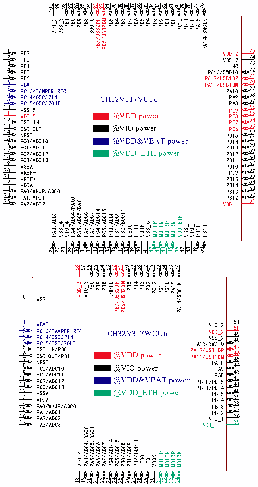

<!-- source-page: 23 -->

[← p.22](0022.md) · [index](../README.md) · [PDF p.23](https://ch32-riscv-ug.github.io/CH32V307/datasheet_zh/CH32V20x_30xDS0.PDF#page=23) · [p.24 →](0024.md)

<!-- header: CH32V303/305/307/317数据手册 https://wch.cn -->

### 3.1.4 互联型V317

 <!-- p23-cluster-01 uncaptioned graphics, rendered from the PDF; verify at https://ch32-riscv-ug.github.io/CH32V307/datasheet_zh/CH32V20x_30xDS0.PDF#page=23 -->

🖼 Text parsed from the figure above

99  
98  
97  
96  
95  
94  
93  
92  
91  
90  
89  
88  
87  
86  
85  
84  
83  
82  
81  
80  
79  
78  
77  
76  
100  
VIO_3  
VSS_3  
PE1  
PE0  
PB9  
PB8  
BOOT0  
PB7/USB2DP  
PB6/USB2DM  
PB5  
PB4  
PB3  
PD7  
PD6  
PD5  
PD4  
PD3  
PD2  
PD1  
PD0  
PC12  
PC11  
PC10  
PA15  
PA14/SWCLK  
75  
1 PE2  
VDD_2  
74  
2  
PE3  
VSS_2  
73  
3  
PE4  
NC  
72  
4 PE5  
PA13/SWDIO  
71  
5 PE6  
PA12/USB1DP  
70  
6  
VBAT  
PA11/USB1DM  
69  
7  
PC13/TAMPER-RTC  
PA10  
68 67  
8 9 P P C C 1 1 4 5 / / O O S S C C 3 3 2 2 I O N UT CH32V317VCT6  
PA9 PA8  
66  
10  
VSS_5  
PC9  
65  
11 VDD_5 @VDD power  
PC8  
64  
12 OSC_IN  
PC7  
63  
13 OSC_OUT @VIO power  
PC6  
62  
14  
NRST  
PD15  
61  
15 PC0/ADC10 @VDD&amp;VBAT power  
PD14  
60  
16 PC1/ADC11  
PD13  
59  
17 PC2/ADC12 @VDD_ETH power  
PD12  
58  
18  
PC3/ADC13  
PD11  
57  
19  
VSSA  
PD10  
56  
20 VREF-  
PD9  
55  
21  
VREF+  
PB15  
54  
22  
VDDA  
PB14  
53  
23  
PA0/WKUP/ADC0  
PB13  
52 51  
24 PA1/ADC1 25  
PB12  
PA4/ADC4/DAC0 PA5/ADC5/DAC1  
PA2/ADC2  
VDD_1  
PC4/ADC14 PC5/ADC15  
PB2/BOOT1  
PA3/ADC3  
PA6/ADC6 PA7/ADC7  
PB0/ADC8 PB1/ADC9  
VDD_ETH  
VSS_4 VIO_4  
VSS_6 MDITP MDITN MDIRP MDIRN  
VSS_1 VIO_1  
LED0 LED1 VDDK  
PB10 PB11  
26 27 28 29 30 31 32 33 34 35 36 37 38 39 40 41 42 43 44 45 46 47 48 49 50  
68 67 65 64 63 62 61 60 59 58 57 56 55 54 53 52  
66  
VDD_3 VIO_3 PE0 PB9 PB8 BOOT0 PB7/USB2DP PB6/USB2DM PB5 PB4 PB3 PD2 PC12 PC11 PC10 PA15 PA14/SWCLK  
0  
VSS  
51  
1 VBAT  
VIO_2  
50  
2  
3 PC13/TAMPER-RTC CH32V317WCU6  
VDD_2  
49  
PC14/OSC32IN 4  
VSS_2  
48  
PC15/OSC32OUT  
PA13/SWDIO  
47  
5 OSC_IN/PD0  
PA12/USB1DP  
46 45  
6 OSC_OUT/PD1 @VDD power 7  
PA11/USB1DM  
NRST 8 PC0/ADC10 @VIO power  
PA10 PA9  
44  
43  
9 PC1/ADC11  
PA8  
42 41  
10 PC2/ADC12 @VDD&amp;VBAT power 11  
PB10/PD15  
PC3/ADC13  
PB11/PD14  
40  
12 VSSA @VDD_ETH power  
PB15  
39  
13 VDDA  
PB14  
38  
14  
PA0/WKUP/ADC0 15  
PB13  
37  
PA1/ADC1  
PB12  
16 PA2/ADC2 36  
VIO_1  
17 PA3/ADC3 35  
VDD_ETH  
PA4/ADC4/DAC0  
PA5/ADC5/DAC1  
PC4/ADC14  
PC5/ADC15  
PB2/BOOT1  
PA6/ADC6 PA7/ADC7  
PB0/ADC8 PB1/ADC9  
VIO_4  
MDITP  
MDITN MDIRP  
MDIRN  
LED0 LED1  
VDDK  
18 19  
20  
21  
22 23  
24  
25  
26 27  
28  
29  
30 31  
32  
33  
34  

注：引脚图中复用功能均为缩写。  
示例：USB2DP:USBHS_DP  
USB2DM:USBHS_DM  
USB1DP:OTG_FS_DP  
USB1DM:OTG_FS_DM  
<!-- image: p23-draw-image-00001 bbox=[500.88, 779.28, 520.32, 789.6] -->
<!-- footer: V3.9 22 -->
