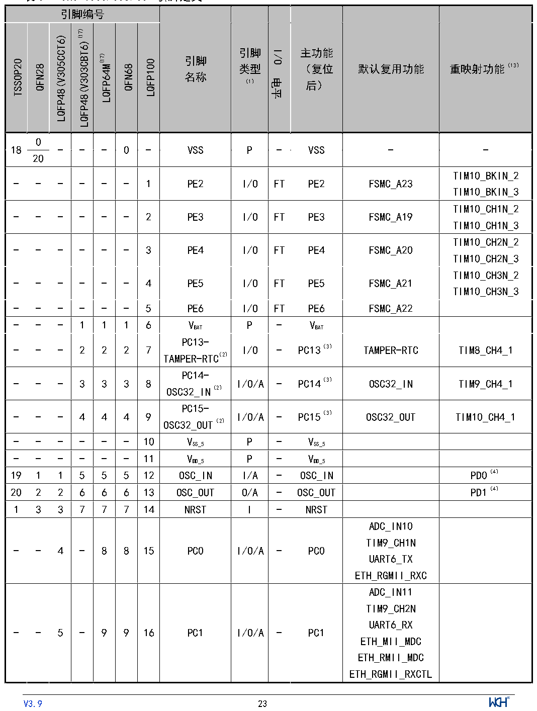

<!-- source-page: 24 -->

[← p.23](0023.md) · [index](../README.md) · [PDF p.24](https://ch32-riscv-ug.github.io/CH32V307/datasheet_zh/CH32V20x_30xDS0.PDF#page=24) · [p.25 →](0025.md)

<!-- header: CH32V303/305/307/317数据手册 https://wch.cn -->

## 3.2 引脚定义

注意，下表中的引脚功能描述针对的是所有功能，不涉及具体型号产品。不同型号之间外设资源有差  
异，查看前请先根据产品型号资源表确认是否有此功能。  

 <!-- p24-cluster-01 uncaptioned graphics, rendered from the PDF; verify at https://ch32-riscv-ug.github.io/CH32V307/datasheet_zh/CH32V20x_30xDS0.PDF#page=24 -->

🖼 Text parsed from the figure above

<!-- p24-table-001 (table-3-1@1) -->
<table><caption>表3-1 CH32V303/305/307引脚定义</caption><tr><th colspan="7">引脚编号</th><th rowspan="2" style="text-align:left">引脚名称</th><th rowspan="2" style="text-align:left">引脚类型 （1）</th><th rowspan="2">I/O电平</th><th rowspan="2" style="text-align:left">主功能 （复位后）</th><th rowspan="2">默认复用功能</th><th rowspan="2">重映射功能（13）</th></tr><tr><td>TSSOP20</td><td>QFN28</td><td>LQFP48(V305CCT6)</td><td>LQFP48(V303CBT6)(17)</td><td>LQFP64M(17)</td><td>QFN68</td><td>LQFP100</td></tr><tr><td rowspan="2">18</td><td>0</td><td rowspan="2">-</td><td rowspan="2">-</td><td rowspan="2">-</td><td rowspan="2">0</td><td rowspan="2">-</td><td rowspan="2">VSS</td><td rowspan="2">P</td><td rowspan="2">-</td><td rowspan="2">VSS</td><td rowspan="2">-</td><td rowspan="2">-</td></tr><tr><td>20</td></tr><tr><td>-</td><td>-</td><td>-</td><td>-</td><td>-</td><td>-</td><td>1</td><td>PE2</td><td>I/O</td><td>FT</td><td>PE2</td><td>FSMC_A23</td><td style="text-align:left">TIM10_BKIN_2TIM10_BKIN_3</td></tr><tr><td>-</td><td>-</td><td>-</td><td>-</td><td>-</td><td>-</td><td>2</td><td>PE3</td><td>I/O</td><td>FT</td><td>PE3</td><td>FSMC_A19</td><td style="text-align:left">TIM10_CH1N_2TIM10_CH1N_3</td></tr><tr><td>-</td><td>-</td><td>-</td><td>-</td><td>-</td><td>-</td><td>3</td><td>PE4</td><td>I/O</td><td>FT</td><td>PE4</td><td>FSMC_A20</td><td style="text-align:left">TIM10_CH2N_2TIM10_CH2N_3</td></tr><tr><td>-</td><td>-</td><td>-</td><td>-</td><td>-</td><td>-</td><td>4</td><td>PE5</td><td>I/O</td><td>FT</td><td>PE5</td><td>FSMC_A21</td><td style="text-align:left">TIM10_CH3N_2TIM10_CH3N_3</td></tr><tr><td>-</td><td>-</td><td>-</td><td>-</td><td>-</td><td>-</td><td>5</td><td>PE6</td><td>I/O</td><td>FT</td><td>PE6</td><td>FSMC_A22</td><td></td></tr><tr><td>-</td><td>-</td><td>-</td><td>1</td><td>1</td><td>1</td><td>6</td><td style="text-align:left">VBAT</td><td>P</td><td>-</td><td style="text-align:left">VBAT</td><td></td><td></td></tr><tr><td>-</td><td>-</td><td>-</td><td>2</td><td>2</td><td>2</td><td>7</td><td style="text-align:left">PC13- TAMPER-RTC（2）</td><td>I/O</td><td>-</td><td>PC13（3）</td><td>TAMPER-RTC</td><td>TIM8_CH4_1</td></tr><tr><td>-</td><td>-</td><td>-</td><td>3</td><td>3</td><td>3</td><td>8</td><td style="text-align:left">PC14- OSC32_IN（2）</td><td>I/O/A</td><td>-</td><td>PC14（3）</td><td>OSC32_IN</td><td>TIM9_CH4_1</td></tr><tr><td>-</td><td>-</td><td>-</td><td>4</td><td>4</td><td>4</td><td>9</td><td style="text-align:left">PC15- OSC32_OUT（2）</td><td>I/O/A</td><td>-</td><td>PC15（3）</td><td>OSC32_OUT</td><td>TIM10_CH4_1</td></tr><tr><td>-</td><td>-</td><td>-</td><td>-</td><td>-</td><td>-</td><td>10</td><td style="text-align:left">VSS_5</td><td>P</td><td>-</td><td style="text-align:left">VSS_5</td><td></td><td></td></tr><tr><td>-</td><td>-</td><td>-</td><td>-</td><td>-</td><td>-</td><td>11</td><td style="text-align:left">VDD_5</td><td>P</td><td>-</td><td style="text-align:left">VDD_5</td><td></td><td></td></tr><tr><td>19</td><td>1</td><td>1</td><td>5</td><td>5</td><td>5</td><td>12</td><td>OSC_IN</td><td>I/A</td><td>-</td><td>OSC_IN</td><td></td><td>PD0（4）</td></tr><tr><td>20</td><td>2</td><td>2</td><td>6</td><td>6</td><td>6</td><td>13</td><td>OSC_OUT</td><td>O/A</td><td>-</td><td>OSC_OUT</td><td></td><td>PD1（4）</td></tr><tr><td>1</td><td>3</td><td>3</td><td>7</td><td>7</td><td>7</td><td>14</td><td>NRST</td><td>I</td><td>-</td><td>NRST</td><td></td><td></td></tr><tr><td>-</td><td>-</td><td>4</td><td>-</td><td>8</td><td>8</td><td>15</td><td>PC0</td><td>I/O/A</td><td>-</td><td>PC0</td><td style="text-align:left">ADC_IN10TIM9_CH1NUART6_TXETH_RGMII_RXC</td><td></td></tr><tr><td>-</td><td>-</td><td>5</td><td>-</td><td>9</td><td>9</td><td>16</td><td>PC1</td><td>I/O/A</td><td>-</td><td>PC1</td><td style="text-align:left">ADC_IN11TIM9_CH2NUART6_RXETH_MII_MDCETH_RMII_MDCETH_RGMII_RXCTL</td><td></td></tr></table>

- - 1 1 1 6 VBAT P - VBAT  
<!-- image: p24-draw-image-00001 inside the figure -->
<!-- footer: V3.9 23 -->

