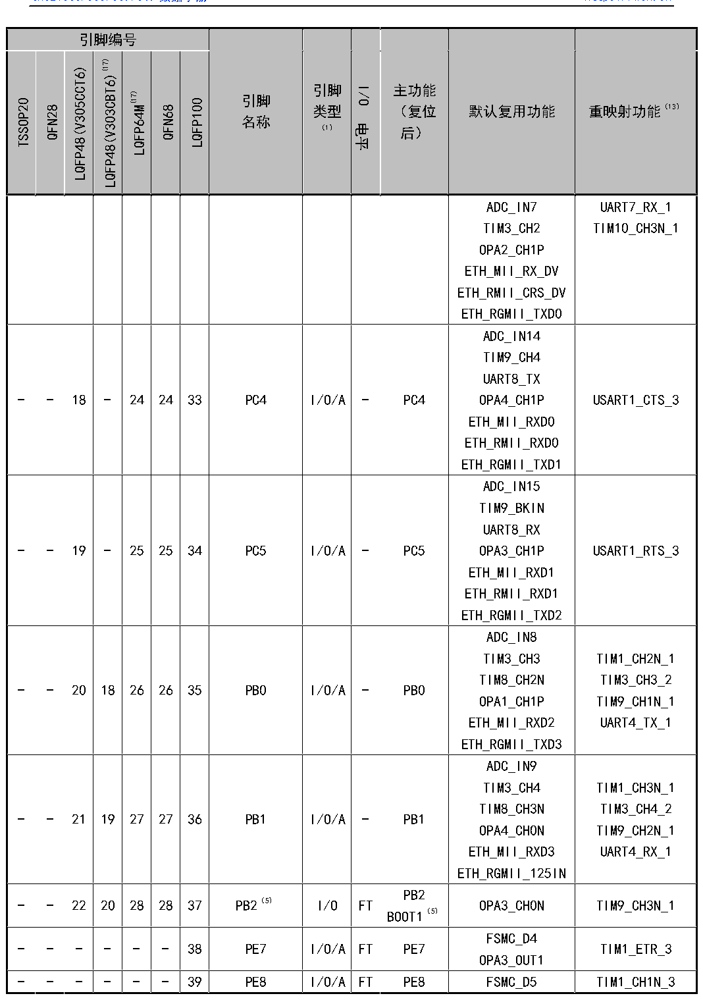

<!-- source-page: 27 -->

[← p.26](0026.md) · [index](../README.md) · [PDF p.27](https://ch32-riscv-ug.github.io/CH32V307/datasheet_zh/CH32V20x_30xDS0.PDF#page=27) · [p.28 →](0028.md)

<!-- header: CH32V303/305/307/317数据手册 https://wch.cn -->

 <!-- p27-cluster-01 uncaptioned graphics, rendered from the PDF; verify at https://ch32-riscv-ug.github.io/CH32V307/datasheet_zh/CH32V20x_30xDS0.PDF#page=27 -->

🖼 Text parsed from the figure above

<!-- p27-table-001 (table-3-1@1) -->
<table><tr><th colspan="7">引脚编号</th><th rowspan="2" style="text-align:left">引脚名称</th><th rowspan="2" style="text-align:left">引脚类型 （1）</th><th rowspan="2">I/O电平</th><th rowspan="2" style="text-align:left">主功能 （复位后）</th><th rowspan="2">默认复用功能</th><th rowspan="2">重映射功能（13）</th></tr><tr><td>TSSOP20</td><td>QFN28</td><td>LQFP48(V305CCT6)</td><td>LQFP48(V303CBT6)(17)</td><td>LQFP64M(17)</td><td>QFN68</td><td>LQFP100</td></tr><tr><td></td><td></td><td></td><td></td><td></td><td></td><td></td><td></td><td></td><td></td><td></td><td style="text-align:left">ADC_IN7TIM3_CH2OPA2_CH1PETH_MII_RX_DVETH_RMII_CRS_DVETH_RGMII_TXD0</td><td style="text-align:left">UART7_RX_1TIM10_CH3N_1</td></tr><tr><td>-</td><td>-</td><td>18</td><td>-</td><td>24</td><td>24</td><td>33</td><td>PC4</td><td>I/O/A</td><td>-</td><td>PC4</td><td style="text-align:left">ADC_IN14TIM9_CH4UART8_TXOPA4_CH1PETH_MII_RXD0ETH_RMII_RXD0ETH_RGMII_TXD1</td><td>USART1_CTS_3</td></tr><tr><td>-</td><td>-</td><td>19</td><td>-</td><td>25</td><td>25</td><td>34</td><td>PC5</td><td>I/O/A</td><td>-</td><td>PC5</td><td style="text-align:left">ADC_IN15TIM9_BKINUART8_RXOPA3_CH1PETH_MII_RXD1ETH_RMII_RXD1ETH_RGMII_TXD2</td><td>USART1_RTS_3</td></tr><tr><td>-</td><td>-</td><td>20</td><td>18</td><td>26</td><td>26</td><td>35</td><td>PB0</td><td>I/O/A</td><td>-</td><td>PB0</td><td style="text-align:left">ADC_IN8TIM3_CH3TIM8_CH2NOPA1_CH1PETH_MII_RXD2ETH_RGMII_TXD3</td><td style="text-align:left">TIM1_CH2N_1TIM3_CH3_2TIM9_CH1N_1UART4_TX_1</td></tr><tr><td>-</td><td>-</td><td>21</td><td>19</td><td>27</td><td>27</td><td>36</td><td>PB1</td><td>I/O/A</td><td>-</td><td>PB1</td><td style="text-align:left">ADC_IN9TIM3_CH4TIM8_CH3NOPA4_CH0NETH_MII_RXD3ETH_RGMII_125IN</td><td style="text-align:left">TIM1_CH3N_1TIM3_CH4_2TIM9_CH2N_1UART4_RX_1</td></tr><tr><td>-</td><td>-</td><td>22</td><td>20</td><td>28</td><td>28</td><td>37</td><td>PB2（5）</td><td>I/O</td><td>FT</td><td style="text-align:left">PB2BOOT1（5）</td><td>OPA3_CH0N</td><td>TIM9_CH3N_1</td></tr><tr><td>-</td><td>-</td><td>-</td><td>-</td><td>-</td><td>-</td><td>38</td><td>PE7</td><td>I/O/A</td><td>FT</td><td>PE7</td><td style="text-align:left">FSMC_D4OPA3_OUT1</td><td>TIM1_ETR_3</td></tr><tr><td>-</td><td>-</td><td>-</td><td>-</td><td>-</td><td>-</td><td>39</td><td>PE8</td><td>I/O/A</td><td>FT</td><td>PE8</td><td>FSMC_D5</td><td>TIM1_CH1N_3</td></tr></table>

<!-- image: p27-draw-image-00001 bbox=[500.88, 779.28, 520.32, 789.6] -->
<!-- footer: V3.9 26 -->
