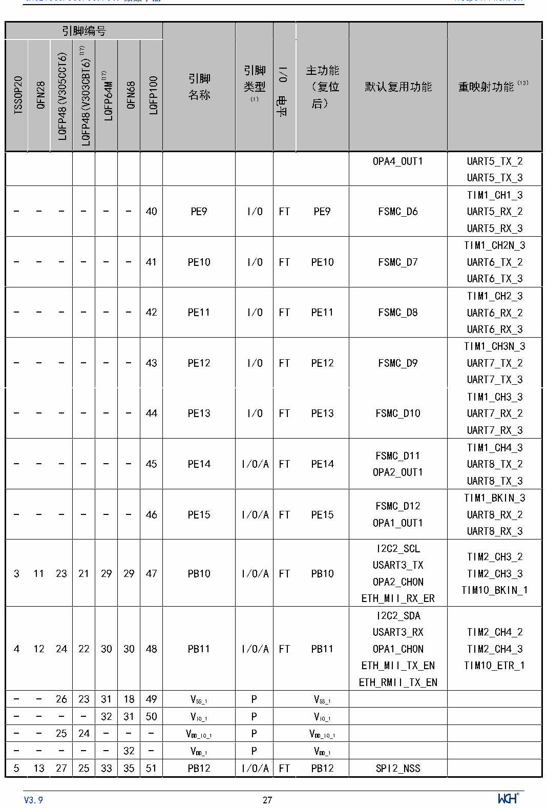

<!-- source-page: 28 -->

[← p.27](0027.md) · [index](../README.md) · [PDF p.28](https://ch32-riscv-ug.github.io/CH32V307/datasheet_zh/CH32V20x_30xDS0.PDF#page=28) · [p.29 →](0029.md)

<!-- header: CH32V303/305/307/317数据手册 https://wch.cn -->

 <!-- p28-cluster-01 uncaptioned graphics, rendered from the PDF; verify at https://ch32-riscv-ug.github.io/CH32V307/datasheet_zh/CH32V20x_30xDS0.PDF#page=28 -->

🖼 Text parsed from the figure above

<!-- p28-table-001 (table-3-1@1) -->
<table><tr><th colspan="7">引脚编号</th><th rowspan="2" style="text-align:left">引脚名称</th><th rowspan="2" style="text-align:left">引脚类型 （1）</th><th rowspan="2">I/O电平</th><th rowspan="2" style="text-align:left">主功能 （复位后）</th><th rowspan="2">默认复用功能</th><th rowspan="2">重映射功能（13）</th></tr><tr><td>TSSOP20</td><td>QFN28</td><td>LQFP48(V305CCT6)</td><td>LQFP48(V303CBT6)(17)</td><td>LQFP64M(17)</td><td>QFN68</td><td>LQFP100</td></tr><tr><td></td><td></td><td></td><td></td><td></td><td></td><td></td><td></td><td></td><td></td><td></td><td>OPA4_OUT1</td><td style="text-align:left">UART5_TX_2UART5_TX_3</td></tr><tr><td>-</td><td>-</td><td>-</td><td>-</td><td>-</td><td>-</td><td>40</td><td>PE9</td><td>I/O</td><td>FT</td><td>PE9</td><td>FSMC_D6</td><td style="text-align:left">TIM1_CH1_3UART5_RX_2UART5_RX_3</td></tr><tr><td>-</td><td>-</td><td>-</td><td>-</td><td>-</td><td>-</td><td>41</td><td>PE10</td><td>I/O</td><td>FT</td><td>PE10</td><td>FSMC_D7</td><td style="text-align:left">TIM1_CH2N_3UART6_TX_2UART6_TX_3</td></tr><tr><td>-</td><td>-</td><td>-</td><td>-</td><td>-</td><td>-</td><td>42</td><td>PE11</td><td>I/O</td><td>FT</td><td>PE11</td><td>FSMC_D8</td><td style="text-align:left">TIM1_CH2_3UART6_RX_2UART6_RX_3</td></tr><tr><td>-</td><td>-</td><td>-</td><td>-</td><td>-</td><td>-</td><td>43</td><td>PE12</td><td>I/O</td><td>FT</td><td>PE12</td><td>FSMC_D9</td><td style="text-align:left">TIM1_CH3N_3UART7_TX_2UART7_TX_3</td></tr><tr><td>-</td><td>-</td><td>-</td><td>-</td><td>-</td><td>-</td><td>44</td><td>PE13</td><td>I/O</td><td>FT</td><td>PE13</td><td>FSMC_D10</td><td style="text-align:left">TIM1_CH3_3UART7_RX_2UART7_RX_3</td></tr><tr><td>-</td><td>-</td><td>-</td><td>-</td><td>-</td><td>-</td><td>45</td><td>PE14</td><td>I/O/A</td><td>FT</td><td>PE14</td><td style="text-align:left">FSMC_D11OPA2_OUT1</td><td style="text-align:left">TIM1_CH4_3UART8_TX_2UART8_TX_3</td></tr><tr><td>-</td><td>-</td><td>-</td><td>-</td><td>-</td><td>-</td><td>46</td><td>PE15</td><td>I/O/A</td><td>FT</td><td>PE15</td><td style="text-align:left">FSMC_D12OPA1_OUT1</td><td style="text-align:left">TIM1_BKIN_3UART8_RX_2UART8_RX_3</td></tr><tr><td>3</td><td>11</td><td>23</td><td>21</td><td>29</td><td>29</td><td>47</td><td>PB10</td><td>I/O/A</td><td>FT</td><td>PB10</td><td style="text-align:left">I2C2_SCLUSART3_TXOPA2_CH0NETH_MII_RX_ER</td><td style="text-align:left">TIM2_CH3_2TIM2_CH3_3TIM10_BKIN_1</td></tr><tr><td>4</td><td>12</td><td>24</td><td>22</td><td>30</td><td>30</td><td>48</td><td>PB11</td><td>I/O/A</td><td>FT</td><td>PB11</td><td style="text-align:left">I2C2_SDAUSART3_RXOPA1_CH0NETH_MII_TX_ENETH_RMII_TX_EN</td><td style="text-align:left">TIM2_CH4_2TIM2_CH4_3TIM10_ETR_1</td></tr><tr><td>-</td><td>-</td><td>26</td><td>23</td><td>31</td><td>18</td><td>49</td><td style="text-align:left">VSS_1</td><td>P</td><td></td><td style="text-align:left">VSS_1</td><td></td><td></td></tr><tr><td>-</td><td>-</td><td>-</td><td>-</td><td>32</td><td>31</td><td>50</td><td style="text-align:left">VIO_1</td><td>P</td><td></td><td style="text-align:left">VIO_1</td><td></td><td></td></tr><tr><td>-</td><td>-</td><td>25</td><td>24</td><td>-</td><td>-</td><td>-</td><td style="text-align:left">VDD_IO_1</td><td>P</td><td></td><td style="text-align:left">VDD_IO_1</td><td></td><td></td></tr><tr><td>-</td><td>-</td><td>-</td><td>-</td><td>-</td><td>32</td><td>-</td><td style="text-align:left">VDD_1</td><td>P</td><td></td><td style="text-align:left">VDD_1</td><td></td><td></td></tr><tr><td>5</td><td>13</td><td>27</td><td>25</td><td>33</td><td>35</td><td>51</td><td>PB12</td><td>I/O/A</td><td>FT</td><td>PB12</td><td>SPI2_NSS</td><td></td></tr></table>

<!-- image: p28-draw-image-00001 inside the figure -->
<!-- footer: V3.9 27 -->

