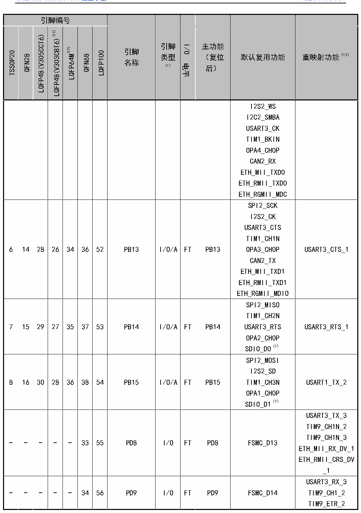

<!-- source-page: 29 -->

[← p.28](0028.md) · [index](../README.md) · [PDF p.29](https://ch32-riscv-ug.github.io/CH32V307/datasheet_zh/CH32V20x_30xDS0.PDF#page=29) · [p.30 →](0030.md)

<!-- header: CH32V303/305/307/317数据手册 https://wch.cn -->

 <!-- p29-cluster-01 uncaptioned graphics, rendered from the PDF; verify at https://ch32-riscv-ug.github.io/CH32V307/datasheet_zh/CH32V20x_30xDS0.PDF#page=29 -->

🖼 Text parsed from the figure above

<!-- p29-table-001 (table-3-1@1) -->
<table><tr><th colspan="7">引脚编号</th><th rowspan="2" style="text-align:left">引脚名称</th><th rowspan="2" style="text-align:left">引脚类型 （1）</th><th rowspan="2">I/O电平</th><th rowspan="2" style="text-align:left">主功能 （复位后）</th><th rowspan="2">默认复用功能</th><th rowspan="2">重映射功能（13）</th></tr><tr><td>TSSOP20</td><td>QFN28</td><td>LQFP48(V305CCT6)</td><td>LQFP48(V303CBT6)(17)</td><td>LQFP64M(17)</td><td>QFN68</td><td>LQFP100</td></tr><tr><td></td><td></td><td></td><td></td><td></td><td></td><td></td><td></td><td></td><td></td><td></td><td style="text-align:left">I2S2_WSI2C2_SMBAUSART3_CKTIM1_BKINOPA4_CH0PCAN2_RXETH_MII_TXD0ETH_RMII_TXD0ETH_RGMII_MDC</td><td></td></tr><tr><td>6</td><td>14</td><td>28</td><td>26</td><td>34</td><td>36</td><td>52</td><td>PB13</td><td>I/O/A</td><td>FT</td><td>PB13</td><td style="text-align:left">SPI2_SCKI2S2_CKUSART3_CTSTIM1_CH1NOPA3_CH0PCAN2_TXETH_MII_TXD1ETH_RMII_TXD1ETH_RGMII_MDIO</td><td>USART3_CTS_1</td></tr><tr><td>7</td><td>15</td><td>29</td><td>27</td><td>35</td><td>37</td><td>53</td><td>PB14</td><td>I/O/A</td><td>FT</td><td>PB14</td><td style="text-align:left">SPI2_MISOTIM1_CH2NUSART3_RTSOPA2_CH0PSDIO_D0（7）</td><td>USART3_RTS_1</td></tr><tr><td>8</td><td>16</td><td>30</td><td>28</td><td>36</td><td>38</td><td>54</td><td>PB15</td><td>I/O/A</td><td>FT</td><td>PB15</td><td style="text-align:left">SPI2_MOSII2S2_SDTIM1_CH3NOPA1_CH0PSDIO_D1（7）</td><td>USART1_TX_2</td></tr><tr><td>-</td><td>-</td><td>-</td><td>-</td><td>-</td><td>33</td><td>55</td><td>PD8</td><td>I/O</td><td>FT</td><td>PD8</td><td>FSMC_D13</td><td style="text-align:left">USART3_TX_3TIM9_CH1N_2TIM9_CH1N_3ETH_MII_RX_DV_1ETH_RMII_CRS_DV _1</td></tr><tr><td>-</td><td>-</td><td>-</td><td>-</td><td>-</td><td>34</td><td>56</td><td>PD9</td><td>I/O</td><td>FT</td><td>PD9</td><td>FSMC_D14</td><td style="text-align:left">USART3_RX_3TIM9_CH1_2TIM9_ETR_2</td></tr></table>

<!-- image: p29-draw-image-00001 bbox=[500.88, 779.28, 520.32, 789.6] -->
<!-- footer: V3.9 28 -->
